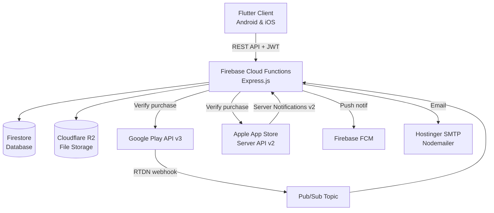

# Arsitektur Sistem

## Overview



## Request Flow

Setiap request dari Flutter melewati flow ini:

```
Flutter → POST /api/<route>
  → verifyToken middleware (JWT decode + Firestore user lookup)
  → Route handler (validasi input)
  → Service layer (business logic)
  → Firestore / R2 / External API
  → Response JSON
```

## Auth Strategy

- JWT token di-generate saat login, berisi: `email (id)`, `deviceId`, `fcmTokens`
- Setiap request wajib kirim `Authorization: Bearer <token>`
- Middleware `verifyToken` lookup user doc di Firestore (`users/{email}`)
- Company device lock opsional — dikontrol via `companies/{id}.deviceLockEnabled`

## Data Model Utama

```
users/{email}
  ├── uid, username, role, idCompany
  ├── paid_credits_remaining      ← AI token credits
  └── log_token/ (subcollection)
      └── {logId}
          ├── amount, type, transactionId
          └── createdAt, timestamp, receivedTo

companies/{companyId}
  ├── maxStorage, max_devices
  └── subscriptions/ (subcollection)
      └── {subscriptionId}
          ├── productId, productType, platform
          ├── status, expiresAt, autoRenewing
          └── addedStorage, maxDevices

subscription_tokens/{purchaseToken}   ← Fraud prevention registry (Google Play)
iap_tokens/{platform_transactionId}   ← Fraud prevention registry (IAP)
```
