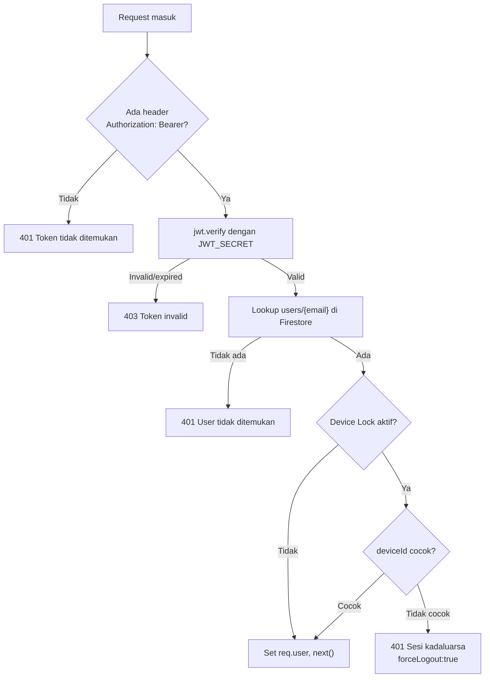

# JWT Auth Middleware — `verifyToken`

## Tujuan

Setiap request ke endpoint protected harus melewati middleware `verifyToken`. Middleware ini memastikan:
1. Token JWT valid dan belum expired
2. User yang bersangkutan ada di Firestore
3. *(Opsional)* Device yang dipakai sesuai dengan device yang terikat ke akun

---

## Flow Autentikasi



---

## Yang Tersimpan di `req.user`

Setelah middleware berhasil, field ini tersedia di semua route handler:

| Field | Sumber | Contoh |
|---|---|---|
| `email` | JWT payload (`decoded.id`) | `user@example.com` |
| `role` | Firestore `users/{email}.role` | `admin`, `karyawan` |
| `idCompany` | Firestore `users/{email}.idCompany` | `company123` |
| `status` | Firestore `users/{email}.status` | `active` |
| `nama` | Firestore `users/{email}.username` | `Budi Santoso` |
| `deviceId` | JWT payload | `device-uuid-xxx` |

---

## JWT Payload Structure

Token dibuat saat login dan berisi:

```json
{
  "id": "user@example.com",
  "deviceId": "device-uuid-xxx",
  "fcmTokens": ["fcm-token-1"],
  "iat": 1700000000,
  "exp": 1700086400
}
```

---

## Device Lock

Fitur opsional per company. Jika `companies/{id}.deviceLockEnabled = true`:
- User hanya bisa login dari 1 device yang sudah terdaftar
- Jika login dari device lain → session lama otomatis di-kick dengan `forceLogout: true`
- Device binding disimpan di `companies/{id}.deviceBindings.{safeEmail}`

> `safeEmail` = email dengan titik (`.`) diganti underscore (`_`)

---

## Standar Respons API (Autentikasi)

Saat memanggil endpoint yang di-protect oleh `verifyToken`, client (Frontend/Mobile) harus menangani kemungkinan respons berikut:

- **`200 OK` / `201 Created`**: Transaksi berhasil (token valid dan aman, request berhasil diproses).
- **`401 Unauthorized`**:
  - Gagal karena token tidak disediakan: `{ message: "Akses ditolak. Token tidak ditemukan." }`
  - Gagal karena user tidak ditemukan di database (terhapus): `{ message: "Token tidak valid. User tidak ditemukan." }`
  - Gagal karena fitur *Device Lock* aktif dan login di perangkat lain: `{ message: "Sesi kadaluarsa. Akun Anda telah login di perangkat lain.", forceLogout: true }`
- **`403 Forbidden`**:
  - Gagal karena token kedaluwarsa (*expired*) atau formatnya salah/diubah: `{ message: "Token Invalid atau Kadaluarsa", error: "..." }`

---

## Decision Making

**Kenapa user di-lookup ke Firestore setiap request?**
Untuk mendapatkan `role` dan `idCompany` terbaru — ini bisa berubah kapan saja (misal admin mengubah role karyawan). Jika hanya dari JWT, data bisa stale.

**Kenapa `email` sebagai doc ID di Firestore (bukan uid)?**
Sistem ini menggunakan email sebagai primary identifier dari awal. Email juga lebih human-readable untuk debugging.
