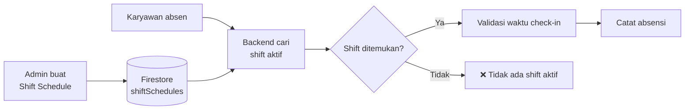
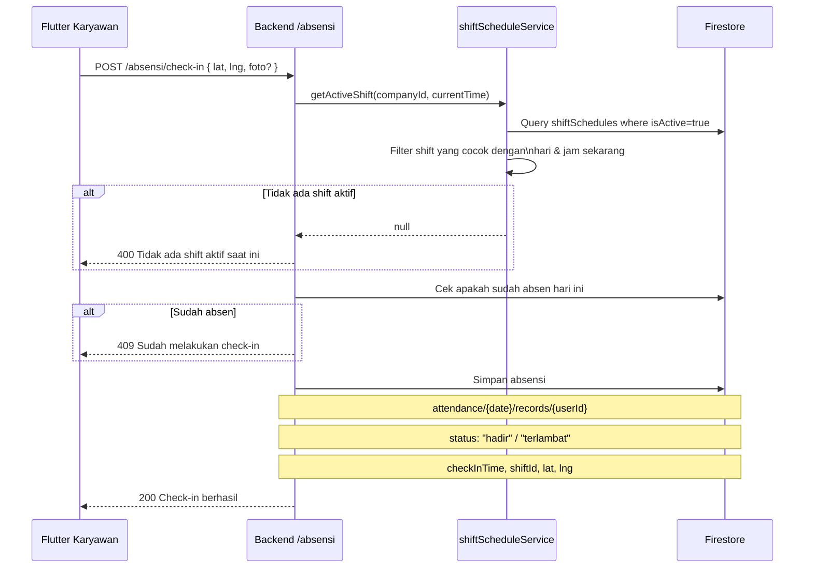

# Absensi & Shift Schedule

## Tujuan

Sistem absensi Vorce memungkinkan karyawan check-in/check-out berdasarkan **shift schedule yang ditentukan admin**. Absensi divalidasi terhadap jadwal shift (bukan server time statis), sehingga fleksibel untuk berbagai pola kerja.

---

## Konsep Utama



---

## Data Model Shift Schedule

```
companies/{companyId}/shiftSchedules/{shiftId}
  ├── name          — "Shift Pagi"
  ├── startTime     — "08:00"
  ├── endTime       — "17:00"
  ├── days          — ["monday", "tuesday", "wednesday", "thursday", "friday"]
  ├── isActive      — true
  └── createdAt     — Timestamp
```

---

## Flow Absensi



---

## Status Absensi

| Status | Kondisi |
|---|---|
| `hadir` | Check-in dalam toleransi waktu shift |
| `terlambat` | Check-in melewati waktu toleransi |
| `izin` | Ada pengajuan izin yang disetujui |
| `sakit` | Ada pengajuan sakit yang disetujui |
| `alpha` | Tidak ada absensi hingga akhir shift |

---

## Manual Override

Admin dapat menginput shift secara manual per-absensi (tidak terikat shift schedule). Ini berguna untuk karyawan dengan jadwal tidak reguler atau event khusus. Field `isManualShift: true` pada record absensi menandakan ini.

---

## shiftScheduleService

Logic untuk mencari shift aktif diextract ke `helper/shiftScheduleService.js`:

```js
// Contoh penggunaan
const shift = await getActiveShift(companyId, new Date());
if (!shift) return res.status(400).json({ message: "Tidak ada shift aktif" });
```

Service ini mengembalikan shift yang:
1. `isActive: true`
2. Hari ini termasuk dalam `shift.days`
3. Jam sekarang berada dalam window `startTime` – `endTime`
