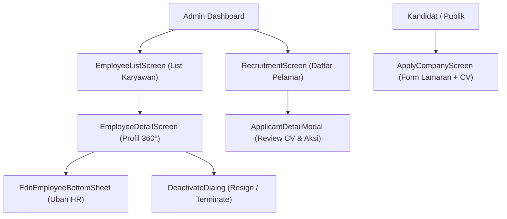

# Panduan Integrasi Flutter — Core HR V2 & Rekrutmen

Panduan komprehensif untuk tim **Frontend Flutter** dalam mengimplementasikan modul **Core HR V2**, manajemen data karyawan, siklus hidup pegawai (*lifecycle*), dan alur rekrutmen kandidat.

---

## 1. Daftar Layar & Komponen UI Flutter

Untuk mendukung penuh alur Core HR V2, aplikasi Flutter (khususnya panel Admin / HR) membutuhkan layar (*screens*) dan komponen dialog berikut:



### 1. `EmployeeListScreen` (Daftar Pegawai)
- **Komponen:** Search bar (nama / email), filter chips untuk status (`active`, `resigned`, `terminated`) dan role (`owner`, `admin`, `staff`).
- **Pagination:** Infinite scrolling / lazy loading memanfaatkan objek `pagination` dari API.
- **Card Item:** Menampilkan foto profil, nama lengkap, teks **Jabatan** (misal: *"Senior Flutter Dev"*), badge **Role** (*"Admin"* / *"Staff"*), dan badge status (*"Active"*, *"Resigned"*, dll).

### 2. `EmployeeDetailScreen` (Tampilan Profil 360°)
- **Header:** Foto, nama, email, role, status, tanggal bergabung (`joinedAt`).
- **HR Information Card:** Jabatan, Gaji (terformat IDR), sisa cuti (`leaveBalance`), kuota shift (`shiftQuota`).
- **Ringkasan Performa (Tabs / Accordion):**
  - Tab Absensi: Total hadir, total terlambat, dan daftar 5 absensi terakhir.
  - Tab Cuti: Jatah cuti dan daftar 5 riwayat perizinan terakhir.
  - Tab Reimbursement: Daftar 5 pengajuan klaim biaya terakhir beserta nominal dan statusnya.
  - Tab Tugas: Total tugas aktif (`pending` / `in_progress`) dan 5 tugas terkini.
- **Action Buttons (Khusus Admin):**
  - Tombol **"Edit Data HR"** ➜ Membuka `EditEmployeeBottomSheet`.
  - Tombol **"Nonaktifkan Karyawan"** ➜ Membuka dialog konfirmasi resign/terminate.
  - *Catatan UI:* Jika karyawan adalah **Owner**, sembunyikan atau nonaktifkan tombol deactivasi dan edit role!

### 3. `EditEmployeeBottomSheet` (Form Edit HR)
- **Input Fields:**
  - Role dropdown: `admin` atau `staff` (Disabled jika target adalah Owner).
  - Jabatan input: Text field bebas (cth: *"Lead UI/UX Designer"*).
  - Gaji input: Number field (format otomatis Rupiah saat user mengetik).
  - Jatah Cuti: Number input (angka integer $\ge 0$).
  - Kuota Shift: Number input (angka integer $\ge 0$).

### 4. `DeactivateEmployeeDialog` (Dialog Offboarding)
- **Opsi Aksi (Radio / Segmented Button):**
  - `resign` : Karyawan mengundurkan diri secara sukarela.
  - `terminate` : Pemutusan hubungan kerja / pemecatan dari pihak perusahaan.
- **Alasan (Text Area):** Wajib/opsional diisi untuk audit log perusahaan.

### 5. `RecruitmentScreen` (Daftar Pelamar Kerja)
- Menampilkan daftar kandidat dengan `status: "applicant"`.
- Menampilkan nama, email, deskripsi surat pengantar (`applicantDesc`), dan tombol **"Buka CV"** (membuka `cvUrl` di PDF viewer / in-app browser).
- Tombol aksi: **"Terima"** (menjalankan verify approve) & **"Tolak"** (menjalankan verify reject).

### 6. `ApplyCompanyScreen` (Layar Lamaran Kandidat)
- Form kandidat saat membuka link publik perusahaan (`/apply-company/:idCompany`).
- Input deskripsi lamaran (`applicantDesc`).
- **Pemilihan CV:**
  - Opsi A: Memilih dokumen yang sudah ada dari **Personal Storage** kandidat (`users/{email}/storage`). Kirim `cvFileId`.
  - Opsi B: Mengirimkan tautan berkas CV langsung (`cvUrl`).

---

## 2. Spesifikasi Endpoint & Kontrak Payload API

Seluruh endpoint memerlukan Header standar berikut (kecuali dinyatakan publik):
```http
Authorization: Bearer <Firebase_ID_Token>
Content-Type: application/json
```

---

### Endpoint 1: Mengambil Daftar Karyawan (`GET /api/company/employees`)

Digunakan pada `EmployeeListScreen` untuk mengambil daftar pegawai dengan paginasi dan filter.

- **Method & Path:** `GET /api/company/employees` (atau `/api/company/:companyId/employees`)
- **Role:** Admin / Owner
- **Query Parameters:**
  - `page` *(optional, number, default: 1)*
  - `limit` *(optional, number, default: 10)*
  - `status` *(optional, string: `active` | `applicant` | `resigned` | `terminated`)*
  - `role` *(optional, string: `owner` | `admin` | `staff`)*
  - `search` *(optional, string: filter nama atau email)*

#### Success Response (HTTP 200)
```json
{
  "ok": true,
  "data": {
    "employees": [
      {
        "email": "budi.santoso@example.com",
        "role": "staff",
        "jabatan": "Senior Mobile Developer",
        "status": "active",
        "gaji": 9500000,
        "leaveBalance": 12,
        "shiftQuota": 0,
        "joinedAt": "2026-01-15T08:00:00.000Z",
        "nama": "Budi Santoso",
        "fotoUrl": "https://cdn.vorce.id/user_storage/profile_budi.jpg",
        "telepon": "081234567890"
      },
      {
        "email": "siti.aminah@example.com",
        "role": "admin",
        "jabatan": "HR Operations Manager",
        "status": "active",
        "gaji": 12000000,
        "leaveBalance": 10,
        "shiftQuota": 0,
        "joinedAt": "2025-11-01T08:00:00.000Z",
        "nama": "Siti Aminah",
        "fotoUrl": null,
        "telepon": "081987654321"
      }
    ],
    "pagination": {
      "page": 1,
      "limit": 10,
      "total": 24,
      "totalPages": 3,
      "hasNext": true
    }
  }
}
```

---

### Endpoint 2: Detail 360° Karyawan (`GET /api/company/employees/:email`)

Digunakan pada `EmployeeDetailScreen` untuk menampilkan profil komprehensif beserta agregasi aktivitas.

- **Method & Path:** `GET /api/company/employees/:email`
- **Role:** Admin / Owner
- **URL Param:** `email` (email karyawan yang ditargetkan)

#### Success Response (HTTP 200)
```json
{
  "ok": true,
  "data": {
    "employee": {
      "email": "budi.santoso@example.com",
      "role": "staff",
      "jabatan": "Senior Mobile Developer",
      "status": "active",
      "gaji": 9500000,
      "leaveBalance": 12,
      "shiftQuota": 0,
      "joinedAt": "2026-01-15T08:00:00.000Z",
      "config": {}
    },
    "userProfile": {
      "nama": "Budi Santoso",
      "email": "budi.santoso@example.com",
      "fotoUrl": "https://cdn.vorce.id/user_storage/profile_budi.jpg",
      "telepon": "081234567890",
      "status": "active"
    },
    "summary": {
      "totalKehadiran": 42,
      "totalTerlambat": 3,
      "sisaCuti": 12,
      "totalTugasAktif": 2
    },
    "recentAttendance": [
      {
        "id": "absensi_001",
        "tanggal": "2026-09-14",
        "waktuCheckIn": "2026-09-14T08:02:15.000Z",
        "waktuCheckOut": "2026-09-14T17:05:10.000Z",
        "status": "hadir",
        "isLate": false
      }
    ],
    "recentLeaves": [
      {
        "id": "leave_001",
        "type": "Cuti Tahunan",
        "startDate": "2026-08-20",
        "endDate": "2026-08-21",
        "status": "approved",
        "alasan": "Keperluan keluarga"
      }
    ],
    "recentReimbursements": [
      {
        "id": "reimburse_001",
        "nominal": 350000,
        "kategori": "Transportasi Klien",
        "status": "approved",
        "createdAt": "2026-09-02T10:00:00.000Z"
      }
    ],
    "recentTasks": [
      {
        "id": "task_001",
        "title": "Migrasi State Management Flutter",
        "status": "in_progress",
        "dueDate": "2026-09-20T23:59:59.000Z"
      }
    ]
  }
}
```

#### Error Responses
- **404 Not Found:** Karyawan tidak terdaftar di perusahaan.
  ```json
  { "ok": false, "message": "Data karyawan tidak ditemukan di perusahaan ini." }
  ```
- **403 Forbidden:** Requester bukan Admin / mencoba akses lintas company.
  ```json
  { "ok": false, "message": "Forbidden: Akses ditolak untuk perusahaan ini." }
  ```

---

### Endpoint 3: Update Data HR Karyawan (`PATCH /api/company/employees/:email`)

Dipanggil dari `EditEmployeeBottomSheet` untuk memperbarui atribut HR.

- **Method & Path:** `PATCH /api/company/employees/:email`
- **Role:** Admin / Owner
- **URL Param:** `email` (email karyawan yang diedit)

#### Request Body Payload (JSON)
```json
{
  "role": "admin",
  "jabatan": "Mobile Lead Engineer",
  "gaji": 11500000,
  "leaveBalance": 14,
  "shiftQuota": 2,
  "config": {
    "allowRemote": true
  }
}
```
*Catatan:* Seluruh field bersifat opsional (hanya kirim field yang ingin diubah).

#### Success Response (HTTP 200)
```json
{
  "ok": true,
  "message": "Data karyawan berhasil diperbarui",
  "data": {
    "email": "budi.santoso@example.com",
    "role": "admin",
    "jabatan": "Mobile Lead Engineer",
    "gaji": 11500000,
    "leaveBalance": 14,
    "shiftQuota": 2,
    "updatedAt": "2026-09-14T05:20:00.000Z"
  }
}
```

#### Error Responses
- **403 Forbidden (Proteksi Owner):**
  ```json
  { "ok": false, "message": "DILARANG: Anda tidak dapat menurunkan jabatan Pemilik Perusahaan (Owner)." }
  ```
- **400 Bad Request (Validasi Input):**
  ```json
  { "ok": false, "message": "leaveBalance harus berupa angka bernilai 0 atau lebih." }
  ```

---

### Endpoint 4: Deaktivasi Karyawan Non-Destruktif (`POST /api/company/employees/:email/deactivate`)

Dipanggil dari `DeactivateEmployeeDialog` saat karyawan resign atau diberhentikan.

- **Method & Path:** `POST /api/company/employees/:email/deactivate`
- **Role:** Admin / Owner
- **URL Param:** `email` (email karyawan yang dinonaktifkan)

#### Request Body Payload (JSON)
```json
{
  "action": "resign",
  "reason": "Mendapatkan kesempatan karier di tempat lain."
}
```
*Pilihan `action`:* `"resign"` (mengundurkan diri) atau `"terminate"` (pemecatan/PHK).

#### Success Response (HTTP 200)
```json
{
  "ok": true,
  "message": "Karyawan budi.santoso@example.com berhasil dinonaktifkan dengan status 'resigned'.",
  "data": {
    "email": "budi.santoso@example.com",
    "status": "resigned",
    "deactivatedAt": "2026-09-14T05:25:00.000Z",
    "deactivatedBy": "admin@example.com",
    "reason": "Mendapatkan kesempatan karier di tempat lain."
  }
}
```

#### Error Responses
- **403 Forbidden (Proteksi Owner):**
  ```json
  { "ok": false, "message": "TINDAKAN ILEGAL: Anda tidak dapat menonaktifkan Pemilik Perusahaan (Owner)." }
  ```
- **400 Bad Request:** Action tidak valid:
  ```json
  { "ok": false, "message": "Status deactivasi tidak valid. Pilihan: 'resigned' atau 'terminated'." }
  ```

---

### Endpoint 5: Mengambil Daftar Pelamar Kerja (`GET /api/company/applicants`)

Dipanggil pada `RecruitmentScreen` untuk menampilkan antrean pelamar.

- **Method & Path:** `GET /api/company/applicants`
- **Role:** Admin / Owner

#### Success Response (HTTP 200)
```json
{
  "ok": true,
  "data": {
    "applicants": [
      {
        "email": "calon.kandidat@example.com",
        "nama": "Andi Pratama",
        "fotoUrl": "https://cdn.vorce.id/user_storage/profile_andi.jpg",
        "telepon": "085678901234",
        "status": "applicant",
        "cvUrl": "https://cdn.vorce.id/user_storage/cv_andi_2026.pdf",
        "applicantDesc": "Flutter Developer berpengalaman 2 tahun, terbiasa dengan BLoC dan Clean Architecture.",
        "createdAt": "2026-09-12T14:30:00.000Z"
      }
    ],
    "total": 1
  }
}
```

---

### Endpoint 6: Mengajukan Lamaran Kerja (`POST /api/company/apply`)

Dipanggil pada `ApplyCompanyScreen` saat kandidat melamar ke perusahaan via tautan publik.

- **Method & Path:** `POST /api/company/apply`
- **Auth:** Mengirim `idToken` Firebase Auth langsung di Request Body
- **Role:** Kandidat Publik

#### Request Body Payload (JSON)
```json
{
  "idCompany": "comp_abc123",
  "idToken": "eyJhbGciOiJSUzI1NiIs...",
  "cvFileId": "storage_file_xyz789",
  "applicantDesc": "Halo, saya tertarik bergabung sebagai Mobile Engineer di perusahaan Anda."
}
```
*Catatan:*
- `cvFileId`: Jika pelamar memilih file dari Personal Storage mereka (`users/{email}/storage`). Backend otomatis me-resolve URL publiknya.
- Jika tidak memiliki file di Personal Storage, pelamar dapat mengirim `cvUrl` langsung (string URL berkas PDF/Docx).

#### Success Response (HTTP 200)
```json
{
  "ok": true,
  "message": "Lamaran berhasil diajukan",
  "data": {
    "email": "calon.kandidat@example.com",
    "idCompany": "comp_abc123",
    "cvUrl": "https://cdn.vorce.id/user_storage/cv_andi_2026.pdf",
    "status": "applicant"
  }
}
```

---

### Endpoint 7: Verifikasi Penerimaan / Penolakan Pelamar (`POST /api/company/verify-employee`)

Dipanggil dari `RecruitmentScreen` saat Admin menekan tombol **Terima** atau **Tolak**.

- **Method & Path:** `POST /api/company/verify-employee`
- **Role:** Admin / Owner

#### Request Body Payload (JSON)
```json
{
  "targetEmail": "calon.kandidat@example.com",
  "approved": true,
  "role": "staff",
  "jabatan": "Junior Flutter Developer",
  "gaji": 6500000,
  "leaveBalance": 12,
  "shiftQuota": 0
}
```
*Catatan:* Field `role`, `jabatan`, `gaji`, `leaveBalance`, dan `shiftQuota` hanya diperlukan jika `approved: true`. Jika `approved: false`, cukup kirim `{ "targetEmail": "...", "approved": false }`.

#### Success Response (HTTP 200)
```json
{
  "ok": true,
  "message": "Pegawai berhasil diterima",
  "data": {
    "email": "calon.kandidat@example.com",
    "status": "active",
    "role": "staff"
  }
}
```

---

## 3. Rekomendasi Dart Data Models

Berikut adalah contoh model Dart yang disarankan untuk mempermudah deserialisasi JSON di Flutter:

### `EmployeeModel`
```dart
class EmployeeModel {
  final String email;
  final String role; // 'owner' | 'admin' | 'staff'
  final String jabatan;
  final String status; // 'active' | 'applicant' | 'resigned' | 'terminated'
  final int gaji;
  final int leaveBalance;
  final int shiftQuota;
  final DateTime? joinedAt;
  final String? nama;
  final String? fotoUrl;
  final String? telepon;

  EmployeeModel({
    required this.email,
    required this.role,
    required this.jabatan,
    required this.status,
    required this.gaji,
    required this.leaveBalance,
    required this.shiftQuota,
    this.joinedAt,
    this.nama,
    this.fotoUrl,
    this.telepon,
  });

  factory EmployeeModel.fromJson(Map<String, dynamic> json) {
    return EmployeeModel(
      email: json['email'] ?? '',
      role: json['role'] ?? 'staff',
      jabatan: json['jabatan'] ?? '',
      status: json['status'] ?? 'active',
      gaji: (json['gaji'] as num?)?.toInt() ?? 0,
      leaveBalance: (json['leaveBalance'] as num?)?.toInt() ?? 0,
      shiftQuota: (json['shiftQuota'] as num?)?.toInt() ?? 0,
      joinedAt: json['joinedAt'] != null ? DateTime.tryParse(json['joinedAt']) : null,
      nama: json['nama'],
      fotoUrl: json['fotoUrl'],
      telepon: json['telepon'],
    );
  }

  bool get isOwner => role == 'owner';
  bool get isActive => status == 'active';
}
```

### `ApplicantModel`
```dart
class ApplicantModel {
  final String email;
  final String? nama;
  final String? fotoUrl;
  final String? telepon;
  final String? cvUrl;
  final String? applicantDesc;
  final DateTime? createdAt;

  ApplicantModel({
    required this.email,
    this.nama,
    this.fotoUrl,
    this.telepon,
    this.cvUrl,
    this.applicantDesc,
    this.createdAt,
  });

  factory ApplicantModel.fromJson(Map<String, dynamic> json) {
    return ApplicantModel(
      email: json['email'] ?? '',
      nama: json['nama'],
      fotoUrl: json['fotoUrl'],
      telepon: json['telepon'],
      cvUrl: json['cvUrl'],
      applicantDesc: json['applicantDesc'],
      createdAt: json['createdAt'] != null ? DateTime.tryParse(json['createdAt']) : null,
    );
  }
}
```

---

## 4. Tips & Best Practices untuk Tim Flutter

1. **Format Mata Uang Gaji:**
   Gunakan package `intl` untuk menampilkan gaji ke pengguna:
   ```dart
   import 'package:intl/intl.dart';

   final formatCurrency = NumberFormat.currency(
     locale: 'id_ID',
     symbol: 'Rp ',
     decimalDigits: 0,
   );

   String formattedGaji = formatCurrency.format(employee.gaji); // "Rp 9.500.000"
   ```

2. **Perlindungan UI Akun Owner:**
   Di layar `EmployeeDetailScreen`, lakukan pengecekan `employee.isOwner`. Jika bernilai `true`:
   - Sembunyikan tombol **"Nonaktifkan Karyawan"**.
   - Di modal edit, kunci atau nonaktifkan pilihan dropdown **Role** agar admin tidak sengaja mencoba menurunkan role pemilik perusahaan.

3. **Penyajian Visual Role vs Jabatan:**
   - **Jabatan** adalah gelar pekerjaan sehari-hari (tampilkan sebagai teks tebal / judul posisi: *"Senior Flutter Engineer"*).
   - **Role** adalah hak akses sistem (tampilkan sebagai chip kecil atau badge: *"Admin"* warna ungu / *"Staff"* warna biru).

4. **Handling File CV Pelamar:**
   - Ketika tombol **"Buka CV"** ditekan, buka `applicant.cvUrl` menggunakan plugin `url_launcher` atau tampilkan di in-app PDF viewer (`flutter_pdfview` / `syncfusion_flutter_pdfviewer`).
   - Berikan peringatan jika `applicant.cvUrl` bernilai `null` (*"Pelamar tidak menyertakan berkas CV"*).
