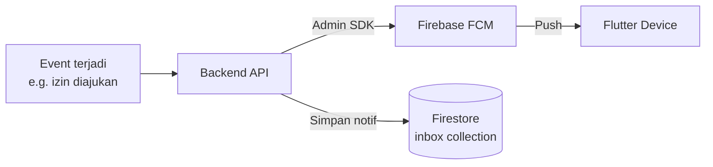
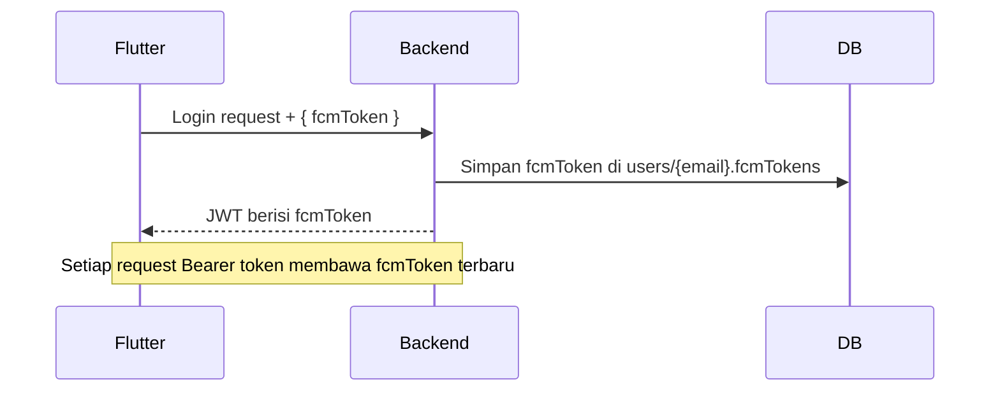

# Push Notifications — Firebase Cloud Messaging (FCM)

## Tujuan

Backend mengirimkan push notification ke Flutter client untuk berbagai event: pengajuan izin, persetujuan, penugasan, dll. Menggunakan **Firebase Cloud Messaging (FCM)** via Firebase Admin SDK.

---

## Arsitektur



Notifikasi disimpan juga ke Firestore (`inbox/{userId}/messages`) sebagai **in-app inbox** — agar user bisa lihat history notif meskipun app tidak aktif saat notif dikirim.

---

## FCM Token Management

Token FCM disimpan di JWT payload dan Firestore:



Jika user login di multiple device, semua FCM token disimpan sebagai array.

---

## Kirim Notifikasi

Notifikasi dikirim via `helper/emailHelper.js` dan FCM SDK:

```js
// Contoh struktur notif
{
  token: "fcm-device-token",
  notification: {
    title: "Pengajuan Izin Baru",
    body: "Budi Santoso mengajukan izin sakit"
  },
  data: {
    type: "izin",
    docId: "izin-doc-id"
  }
}
```

`data` payload digunakan Flutter untuk routing langsung ke halaman yang relevan saat notif ditap.

---

## Inbox (In-App Notification)

Selain push notif, setiap notifikasi disimpan ke Firestore:

```
inbox/{userId}/messages/{msgId}
  ├── title, body
  ├── type (izin, tugas, absensi, dll)
  ├── isRead: false
  ├── createdAt: Timestamp
  └── data: { docId, ... }
```

Flutter menampilkan badge count dari `isRead: false` documents.
