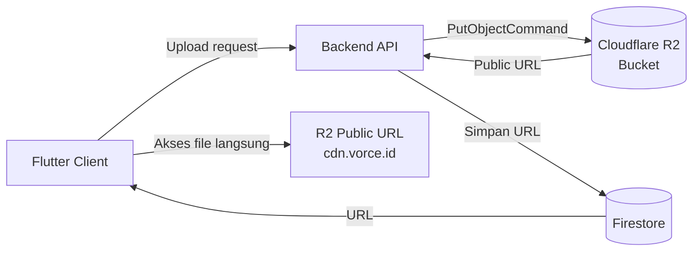
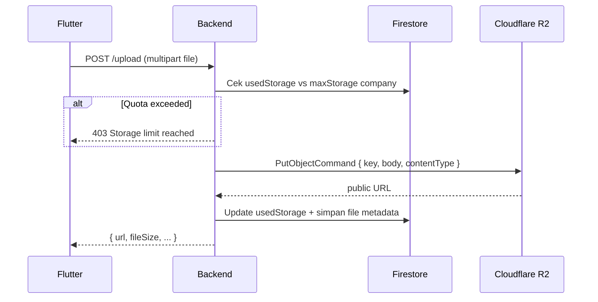

# Storage — Cloudflare R2

## Tujuan

Semua file upload (dokumen, foto profil, arsip karyawan, dll) disimpan di **Cloudflare R2** — bukan Firebase Storage. Ini dilakukan sejak migrasi untuk mengurangi biaya storage secara signifikan.

---

## Arsitektur



File **tidak** pernah diproksikan melalui backend — Flutter langsung mengakses file via public URL R2.

---

## Quota & Limit

Setiap company punya limit storage yang dihitung dari subscription aktif:

| Kondisi | maxStorage |
|---|---|
| Free (tidak ada subscription) | 100 MB |
| Basic Plan monthly | 1 GB |
| Basic Plan yearly | 12 GB |
| Team Plan monthly | 3 GB |
| + Storage Addon 3GB | +3 GB |

`maxStorage` dikalkulasi ulang setiap kali subscription berubah via `recalculateLimits()`.

---

## Upload Flow



---

## Delete Flow

Ketika file dihapus, backend menghapus dari R2 **dan** mengurangi `usedStorage` di Firestore secara atomik:

```
1. DeleteObjectCommand(key) → R2
2. Firestore update: usedStorage -= fileSize
3. Hapus metadata dari collection
```

---

## File Metadata di Firestore

Setiap file disimpan metadata-nya di Firestore:

```json
{
  "url": "https://cdn.vorce.id/companies/abc/dokumen.pdf",
  "key": "companies/abc/dokumen.pdf",
  "fileName": "dokumen.pdf",
  "fileSize": 204800,
  "contentType": "application/pdf",
  "uploadedBy": "user@example.com",
  "createdAt": "Timestamp"
}
```

---

## Decision Making

**Kenapa pindah dari Firebase Storage ke R2?**
Firebase Storage (Google Cloud Storage) dikenakan biaya per operasi dan egress. Cloudflare R2 tidak mengenakan biaya egress (bandwidth gratis) — ideal untuk file yang sering diakses user.

**Kenapa tidak ada signed URL?**
File disimpan sebagai public — semua file diasumsikan bisa diakses oleh siapapun yang punya URL. Untuk private files di masa depan, perlu implementasi R2 presigned URL.
