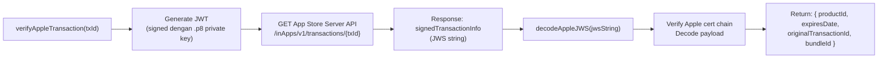

# Helper — `applestore.js`

## Tujuan

Wrapper untuk **Apple App Store Server API v2** dan decoder **JWS (JSON Web Signature)**. Semua komunikasi dengan Apple untuk verifikasi transaksi iOS dilakukan melalui helper ini.

## Exports

| Export | Tipe | Keterangan |
|---|---|---|
| `verifyAppleTransaction(transactionId)` | async function | Ambil & decode detail transaksi dari App Store Server API |
| `decodeAppleJWS(jwsString)` | async function | Decode JWS payload (digunakan juga untuk decode webhook) |
| `getNotificationAction(notificationType)` | function | Map Apple notification type string → action string |
| `APPLE_BUNDLE_ID` | const string | Bundle ID app iOS, dari env `APPLE_BUNDLE_ID` |

## Notification Type → Action Mapping

| Notification Type | Action Return |
|---|---|
| `SUBSCRIBED`, `DID_RENEW`, `OFFER_REDEEMED` | `activate` / `renew` |
| `EXPIRED` | `expire` |
| `REFUND`, `REVOKE` | `revoke` |
| `DID_FAIL_TO_RENEW` | `billing_issue` |
| `DID_CHANGE_RENEWAL_STATUS` | `status_change` |
| `GRACE_PERIOD_EXPIRED` | `expire` |
| `PRICE_INCREASE`, `RENEWAL_EXTENDED` | `extend` |

## Digunakan Oleh

- `helper/appleSubscriptionService.js` — verify transaksi + decode webhook
- `routes/subscription.js` (via appleSubscriptionService)

## Config

Membutuhkan:
- `APPLE_KEY_ID` — Key ID dari App Store Connect
- `APPLE_ISSUER_ID` — Issuer ID dari App Store Connect
- `APPLE_PRIVATE_KEY_PATH` — Path ke `.p8` private key file
- `APPLE_BUNDLE_ID` — e.g. `com.vorce.app`

## Flow Internal

