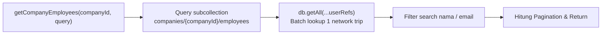
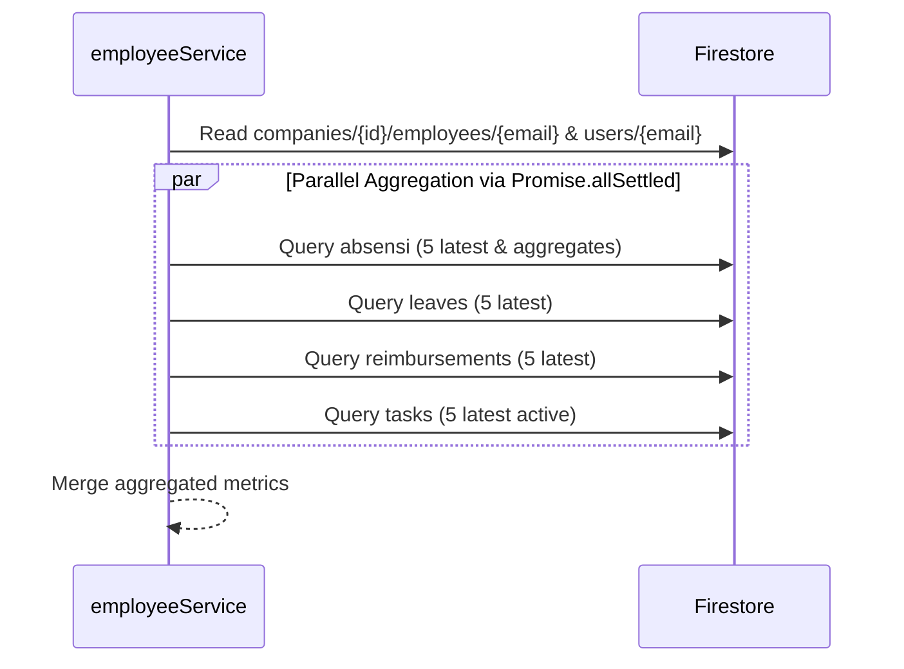

# Helper — `employeeService.js`

## Tujuan

Centralized business logic untuk Core HR V2. Bertanggung jawab mengelola *lifecycle* karyawan dan pelamar di subkoleksi `companies/{companyId}/employees/{email}`, agregasi performa karyawan (absensi, izin, reimburse, tugas), mutasi data pegawai, non-destructive deactivation (resign/terminate), dan dual-write sinkronisasi ke dokumen `users/{email}` demi kompatibilitas penuh.

---

## Exports

| Export | Signature | Keterangan |
|---|---|---|
| `getCompanyEmployees` | `async (companyId, { page, limit, status, role, search })` → `{ employees, pagination }` | Mengambil daftar karyawan terpaginasi dengan enrich profil via `db.getAll` |
| `getEmployeeDetail` | `async (companyId, email)` → `{ employee, userProfile, summary, recentAttendance, recentLeaves, recentReimbursements, recentTasks }` | Detail lengkap satu karyawan + agregasi data lintas subkoleksi |
| `updateEmployee` | `async (companyId, email, updates, requesterEmail)` → `updatedData` | Update data HR (role, jabatan, gaji, cuti, shift quota, config) dengan proteksi Owner |
| `deactivateEmployee` | `async (companyId, email, { reason, requesterEmail, action })` → `deactivatedRecord` | Soft deactivation (resigned/terminated), decrement `totalEmployees`, preservasi audit |
| `syncUserToEmployee` | `async (companyId, email, employeeData)` → `boolean` | Dual-write bridge untuk sinkronisasi subkoleksi saat user register/join/accept-invite |

---

## Method Details

### 1. `getCompanyEmployees`

Mengambil data dari `companies/{companyId}/employees` dengan filter dan paginasi:
- **Filtering:** Status (`active`, `applicant`, `resigned`, `terminated`) dan/atau Role (`owner`, `admin`, `staff`).
- **Batch Profile Enrichment:** Membaca data pelengkap dari koleksi induk `users/{email}` menggunakan `db.getAll(...)` dalam satu network trip.
- **In-Memory Search:** Mendukung pencarian case-insensitive berdasarkan nama atau email.

### 2. `getEmployeeDetail`

Agregasi komprehensif data satu karyawan. Menggunakan `Promise.allSettled` untuk membaca 4 subkoleksi sekaligus secara paralel tanpa risiko cascading failure jika salah satu subkoleksi kosong/bermasalah:
1. `companies/{companyId}/absensi` — Menghitung total kehadiran, keterlambatan, dan 5 log absensi terbaru.
2. `companies/{companyId}/leaves` — Mengambil sisa cuti dan 5 riwayat izin terbaru.
3. `companies/{companyId}/reimbursements` — Mengambil 5 pengajuan reimburse terbaru.
4. `companies/{companyId}/tasks` — Menghitung tugas aktif (`pending` / `in_progress`) dan 5 tugas terbaru.

### 3. `updateEmployee`

Memperbarui data karyawan dengan aturan validasi ketat:
- **HR-Editable Fields:** Hanya mengizinkan field yang sah (`role`, `jabatan`, `leaveBalance`, `shiftQuota`, `gaji`, `config`).
- **Owner Demotion Protection:** Mencegah penurunan role atau mutasi ilegal terhadap akun Owner perusahaan.
- **Dual-Write Bridge:** Perubahan pada `role` atau `jabatan` otomatis disinkronkan ke dokumen `users/{email}` agar sesi login dan route legasi tetap konsisten.

### 4. `deactivateEmployee`

Menggantikan metode pemecatan destruktif lama (yang me-nullkan `idCompany` dan menghapus histori):
- Mengubah status karyawan menjadi `"resigned"` atau `"terminated"`.
- Menyimpan audit trail: `deactivatedAt`, `deactivatedBy`, dan `reason`.
- Menurunkan `totalEmployees` perusahaan via Firestore `FieldValue.increment(-1)`.
- Mengosongkan `idCompany` pada dokumen `users/{email}` agar karyawan dapat mendaftar/bergabung ke perusahaan lain, namun rekam jejak kerja di perusahaan lama tetap tersimpan rapi.

---

## Decision Making

**Kenapa menggunakan `Promise.allSettled` bukan `Promise.all` pada `getEmployeeDetail`?**  
Jika seorang karyawan baru belum memiliki dokumen absensi, perizinan, atau reimburse sama sekali, `Promise.all` rentan gagal secara total jika salah satu query mengalami timeout atau permission edge-case. Dengan `Promise.allSettled`, kegagalan pada satu subkoleksi ditoleransi secara *graceful* dan fallback ke array kosong tanpa mengorbankan halaman detail karyawan.

**Kenapa profil karyawan di-enrich via `db.getAll`?**  
Subkoleksi `employees` berfokus pada data operasional HR (role, jabatan, gaji, kuota cuti). Data profil personal seperti foto profil, nama lengkap, dan nomor telepon tersimpan di `users/{email}`. Penggunaan `db.getAll` memproses hingga puluhan referensi dokumen sekaligus secara efisien dalam satu network call Firestore.
