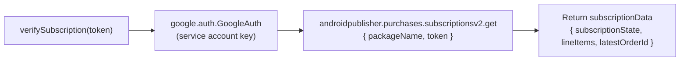

# Helper — `playstore.js`

## Tujuan

Wrapper untuk **Google Play Developer API v3** (via `googleapis`). Digunakan untuk memverifikasi dan men-acknowledge subscription yang dibeli user di Android.

## Exports

| Export | Tipe | Keterangan |
|---|---|---|
| `verifySubscription(purchaseToken)` | async function | Verifikasi subscription ke Google Play API, return data subscription |
| `acknowledgeSubscription(purchaseToken, productId)` | async function | Acknowledge pembelian (wajib dalam 3 hari) |
| `BASE_MAX_STORAGE` | const (number) | Storage default free plan = 100MB dalam bytes |
| `BASE_MAX_DEVICES` | const (number) | Max devices default = 0 (fitur premium) |

## Digunakan Oleh

- `helper/googlePlayService.js` — verify + acknowledge saat user checkout
- `scheduler/rtdn.js` — re-verify saat menerima Pub/Sub notification

## Flow Internal

## Config

Membutuhkan:
- `GOOGLE_API_KEY_PATH` — path ke service account JSON
- `GOOGLE_PLAY_PACKAGE_NAME` — e.g. `com.vorce.app`

## Decision Making

**Kenapa re-verify setiap request, tidak cache?**  
Subscription state bisa berubah kapan saja (user cancel, payment gagal). Cache bisa menyebabkan akses granted ke user yang seharusnya sudah expired.
