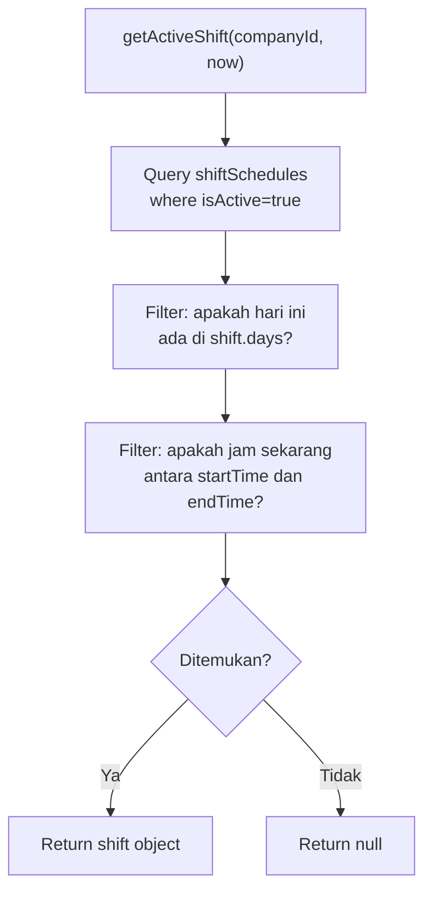

# Helper — `shiftScheduleService.js`

## Tujuan

Service untuk mencari shift kerja yang aktif berdasarkan waktu sekarang. Digunakan oleh sistem absensi untuk memvalidasi apakah karyawan sedang dalam jam kerja yang valid.

## Exports

| Export | Signature | Keterangan |
|---|---|---|
| `getActiveShift(companyId, currentDate)` | async → shift object \| null | Cari shift yang aktif saat ini |
| `isLate(shift, checkInTime)` | function → boolean | Cek apakah check-in melewati toleransi |

## Digunakan Oleh

- `routes/absensi.js` — validasi sebelum proses check-in

## Flow Pencarian Shift



## Shift Object Structure

```js
{
  id: "shift-doc-id",
  name: "Shift Pagi",
  startTime: "08:00",      // format HH:mm
  endTime: "17:00",
  days: ["monday", "tuesday", "wednesday", "thursday", "friday"],
  toleranceMinutes: 15,    // menit toleransi keterlambatan
  isActive: true,
}
```

## Manual Override

Jika admin memilih **tidak menggunakan shift schedule** (manual input), route absensi langsung menerima `customStartTime` dan `customEndTime` dari request body dan meng-skip pemanggilan `getActiveShift`.

Field `isManualShift: true` di record absensi menandakan override ini.

## Decision Making

**Kenapa logic shift di-extract ke service terpisah?**  
Agar route handler tetap thin. Logic "apakah jam ini termasuk dalam shift?" cukup kompleks (perlu handle edge case jam malam cross-midnight, dll) sehingga lebih rapi di service layer dan mudah ditest secara unit.
