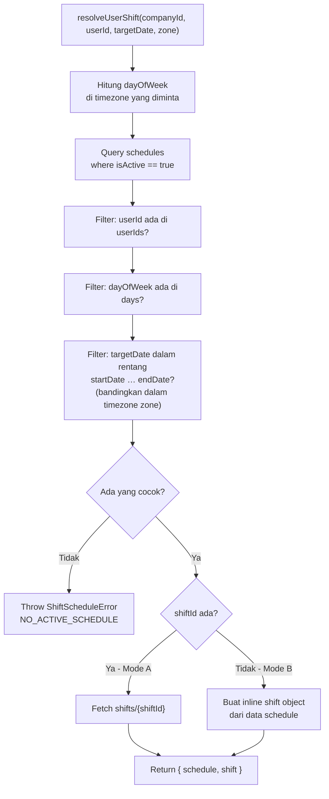

# Helper — `shiftScheduleService.js`

## Tujuan

Service untuk mencari shift kerja yang aktif untuk seorang karyawan pada tanggal tertentu.
Mendukung dua mode jadwal (**Master Shift** dan **Inline Shift**) dan digunakan oleh
`routes/absensi.js` sebelum proses check-in dijalankan.

---

## Exports

| Export | Signature | Keterangan |
|---|---|---|
| `resolveUserShift` | `async (companyId, userId, targetDate, zone?)` → `{ schedule, shift }` | Cari schedule aktif + resolve data shift-nya |
| `calculateLateness` | `(shift, checkInTime, zone?)` → `{ isLate, lateMinutes }` | Hitung apakah check-in terlambat |
| `ShiftScheduleError` | `class extends Error` | Error custom dengan field `code` |

### Error Codes (`ShiftScheduleError`)

| `code` | HTTP Status di Route | Penyebab |
|---|---|---|
| `NO_ACTIVE_SCHEDULE` | 403 | Tidak ada schedule yang cocok untuk user hari ini |
| `SHIFT_NOT_FOUND` | 500 | `shiftId` di schedule mengarah ke master shift yang tidak ada |

---

## Firestore Structure

```
companies/{companyId}/
  ├── shifts/{shiftId}          ← MASTER SHIFT (opsional, dibuat admin)
  │     name: "Shift Pagi"
  │     startTime: "07:00"
  │     endTime: "16:00"
  │     lateTolerance: 15
  │     isActive: true
  │     createdAt: Timestamp
  │
  └── schedules/{scheduleId}    ← JADWAL UNIFIED
        type: "shift" | "manual" | "event"
        title: "Rapat Bulanan"  ← untuk event/manual
        isActive: true

        # Tanggal
        dateMode: "single" | "range"
        startDate: Timestamp    ← midnight waktu lokal, disimpan sebagai Timestamp UTC
        endDate: Timestamp      ← null kalau single
        days: [0,1,2,3,4,5,6]  ← hari aktif (0=Minggu … 6=Sabtu)

        # Waktu inline (TIDAK perlu master shift)
        startTime: "08:00"
        endTime: "17:00"
        lateTolerance: 0

        # Referensi master shift (OPSIONAL)
        shiftId: "xxx" | null   ← null → pakai inline startTime/endTime di atas

        # Assignment
        userIds: ["uid1", "uid2"]
        collaborators: [{ id, name, email, profileUrl }]
        companyId: "CTD96L"

        createdAt: Timestamp
        updatedAt: Timestamp
```

---

## Dua Mode Shift

### Mode A — Master Shift (`shiftId` ada)

Service fetch dokumen `shifts/{shiftId}` dan menggunakan `startTime`, `endTime`,
serta `lateTolerance` dari dokumen tersebut.

### Mode B — Inline Shift (`shiftId = null`)

Tidak perlu ada master shift. `startTime`, `endTime`, dan `lateTolerance` dibaca
langsung dari dokumen `schedules/{scheduleId}`. Mode ini cocok untuk jadwal ad-hoc
atau event tanpa perlu buat master shift terlebih dahulu.

---

## Flow `resolveUserShift`



---

## ⚠️ Decision Making: Timezone-Safe Date Comparison

Firestore Timestamp untuk `startDate` / `endDate` disimpan sebagai **UTC**.
Ketika FE membuat jadwal `9 Agustus 2026 00:00 WIB`, Firestore menyimpannya
sebagai `2026-08-08T17:00:00Z`.

**Bug yang pernah terjadi:** menggunakan `.toISOString().slice(0, 10)` menghasilkan
`"2026-08-08"` (tanggal UTC), sehingga tanggal target `9 Agustus` selalu dianggap
di luar range → error `NO_ACTIVE_SCHEDULE`.

**Fix yang diterapkan:** seluruh perbandingan tanggal dilakukan menggunakan
`toLocaleDateString("en-CA", { timeZone: zone })` sehingga semua nilai (`targetOnly`,
`startOnly`, `endOnly`) berada di timezone yang sama.

```js
// ✅ BENAR — pakai timezone yang sama (zone dari request)
const startOnly = new Date(start.toLocaleDateString("en-CA", { timeZone: zone }) + "T00:00:00");
const endOnly   = new Date(end.toLocaleDateString("en-CA", { timeZone: zone }) + "T00:00:00");

// ❌ SALAH — toISOString() selalu UTC, tanggal jadi meleset
const startOnly = new Date(start.toISOString().slice(0, 10) + "T00:00:00");
```

---

## Digunakan Oleh

- [`routes/absensi.js`](../routes/absensi) — `resolveUserShift` + `calculateLateness` dipanggil di `POST /absensi`
