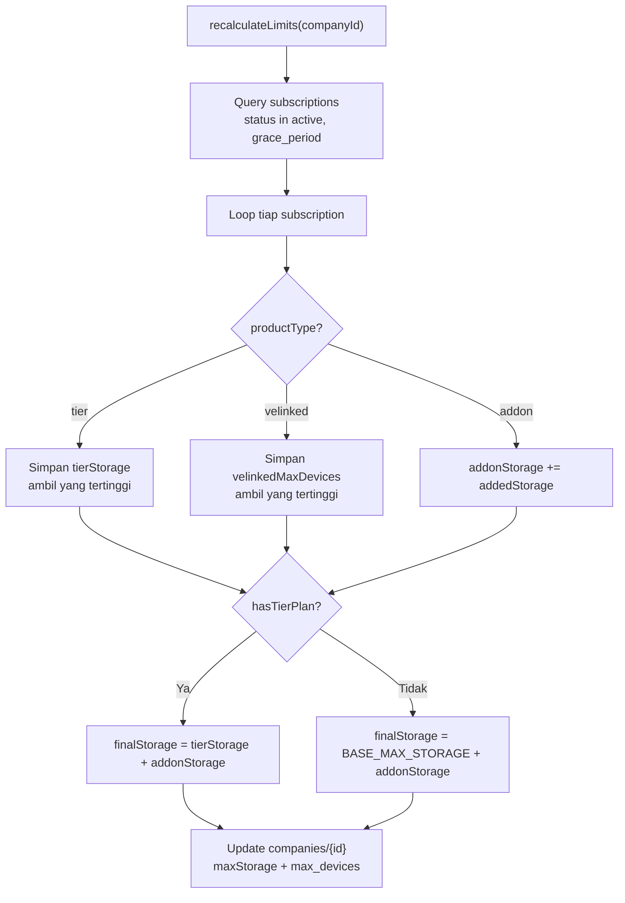

# Helper — `subscriptionService.js`

## Tujuan

Kumpulan fungsi utility yang dipakai bersama oleh semua komponen subscription. Dibuat agar tidak ada duplikasi logic antar `googlePlayService`, `appleSubscriptionService`, dan `rtdn.js`.

## Exports

| Export | Signature | Keterangan |
|---|---|---|
| `resolveBenefits(productId, basePlanId)` | → benefit object \| null | Map product ID + billing period ke storage/devices benefit |
| `mapSubscriptionState(googleState)` | → status string | Konversi Google Play state ke status internal |
| `isActiveState(status)` | → boolean | Cek apakah status dianggap aktif (termasuk grace_period) |
| `recalculateLimits(companyId)` | async → void | Hitung ulang maxStorage + max_devices dari semua subs aktif |

## Digunakan Oleh

- `helper/googlePlayService.js`
- `helper/appleSubscriptionService.js`
- `routes/subscription.js`

## `recalculateLimits` — Formula



## `isActiveState`

```js
// Status yang dianggap AKTIF (user masih dapat benefit):
["active", "grace_period"]

// Grace period = payment gagal tapi masih diberi waktu bayar.
// User tidak langsung kehilangan akses.
```

## Decision Making

**Kenapa `recalculateLimits` idempotent?**  
Function ini bisa dipanggil berkali-kali tanpa efek samping karena selalu menghitung ulang dari **semua subscription aktif saat ini**, bukan incremental. Ini aman meskipun ada race condition atau function dipanggil 2x untuk event yang sama.
