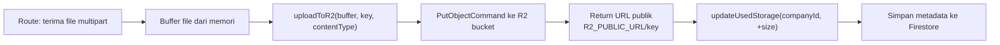
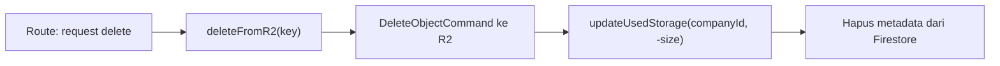

# Helper — `uploadFile.js`

## Tujuan

Abstraksi untuk upload, delete, dan update quota file ke **Cloudflare R2**. Semua operasi file di backend wajib melalui helper ini — tidak boleh akses R2 langsung dari route.

## Exports

| Export | Signature | Keterangan |
|---|---|---|
| `uploadToR2(buffer, key, contentType)` | async → `{ url, key, size }` | Upload buffer ke R2, return URL publik |
| `deleteFromR2(key)` | async → void | Hapus object dari R2 bucket |
| `updateUsedStorage(companyId, deltaBytes)` | async → void | Tambah/kurangi `usedStorage` di Firestore atomically |

## Digunakan Oleh

- `routes/berkas.js` — upload & delete berkas karyawan
- `routes/arsip.js` — upload & delete arsip perusahaan
- `routes/profile.js` — upload foto profil
- `scheduler/scheduler.js` — delete orphan uploads

## Flow Upload



## Flow Delete



## Quota Check

Pengecekan quota dilakukan di **route handler** sebelum memanggil `uploadToR2`:

```js
// Di route handler — cek quota dulu
const company = await db.collection("companies").doc(companyId).get();
const { usedStorage, maxStorage } = company.data();
if (usedStorage + fileSize > maxStorage) {
  return res.status(403).json({ message: "Storage limit reached." });
}
// Baru upload
const result = await uploadToR2(buffer, key, contentType);
```

## Decision Making

**Kenapa `updateUsedStorage` menggunakan `FieldValue.increment()`?**  
Atomic — aman dari race condition jika ada 2 request upload bersamaan. Tanpa ini, read-modify-write bisa menyebabkan nilai `usedStorage` tidak akurat.
