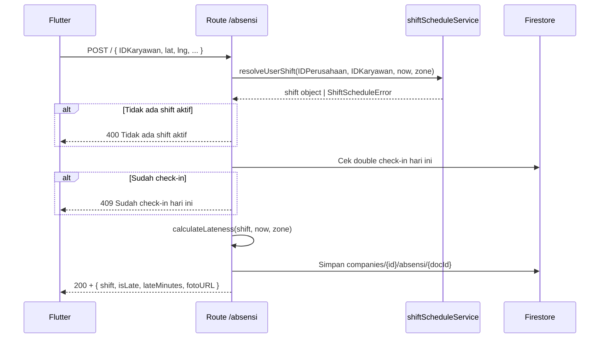

# Route — `absensi.js`

## Tujuan

Mengelola data absensi karyawan per perusahaan. Check-in otomatis mendeteksi shift aktif via `shiftScheduleService`, menghitung keterlambatan, dan menyimpan lokasi GPS karyawan.

---

## Endpoints

| Method | Path | Auth | Role |
|---|---|---|---|
| `GET` | `/absensi/HomeA` | ✅ | Admin |
| `GET` | `/absensi/indie` | ✅ | Semua |
| `POST` | `/absensi/` | ❌ (legacy) | Karyawan |
| `POST` | `/absensi/checkout` | ✅ | Karyawan |

---

## POST `/` — Check-In

### Request Body

```json
{
  "IDKaryawan": "user@example.com",
  "NamaKaryawan": "Budi Santoso",
  "AlamatLatitude": -6.2088,
  "AlamatLongtitude": 106.8456,
  "AlamatLoc": "Jl. Sudirman No.1",
  "IDPerusahaan": "company-id",
  "NamaPerusahaan": "PT Vorce",
  "zone": "Asia/Jakarta",
  "idBerkasFoto": "foto-doc-id"
}
```

### Alur Check-In



### Firestore — Record Absensi

```
companies/{companyId}/absensi/{autoId}
  ├── idKaryawan, namaKaryawan
  ├── alamatLatitude, alamatLongtitude, alamatLoc
  ├── idPerusahaan, namaPerusahaan
  ├── tanggal (Timestamp)
  ├── waktuCheckIn (string HH:mm)
  ├── shift (object: { id, name, startTime })
  ├── isLate (boolean)
  ├── lateMinutes (number)
  ├── status: "hadir" | "terlambat"
  ├── fotoURL (string, dari R2)
  └── createdAt (Timestamp)
```

---

## GET `/HomeA` — Absensi Per Perusahaan (Admin)

### Query Params
```
?IDPerusahaan=company-id&tglstart=2026-01-01&tglend=2026-01-31
```

Mengembalikan semua data absensi dalam rentang tanggal untuk seluruh karyawan. Admin menggunakan ini untuk rekap harian/bulanan.

---

## GET `/indie` — Absensi Individu

### Query Params
```
?idkaryawan=user@example.com&idPerusahaan=company-id&tglstart=2026-01-01
```

Riwayat absensi per karyawan. Bisa diakses oleh karyawan itu sendiri maupun admin.

---

## Decision Making

**Kenapa check-in tidak pakai `verifyToken`?**
Legacy endpoint — ada perangkat lama yang belum kirim Bearer token. Endpoint baru (`/checkout`) sudah wajib auth.

**Kenapa latitude/longitude disimpan, bukan divalidasi?**
Validasi lokasi (geofencing) dilakukan di sisi Flutter, bukan backend. Backend hanya menyimpan data — ini memungkinkan fleksibilitas konfigurasi radius per company di masa depan.
