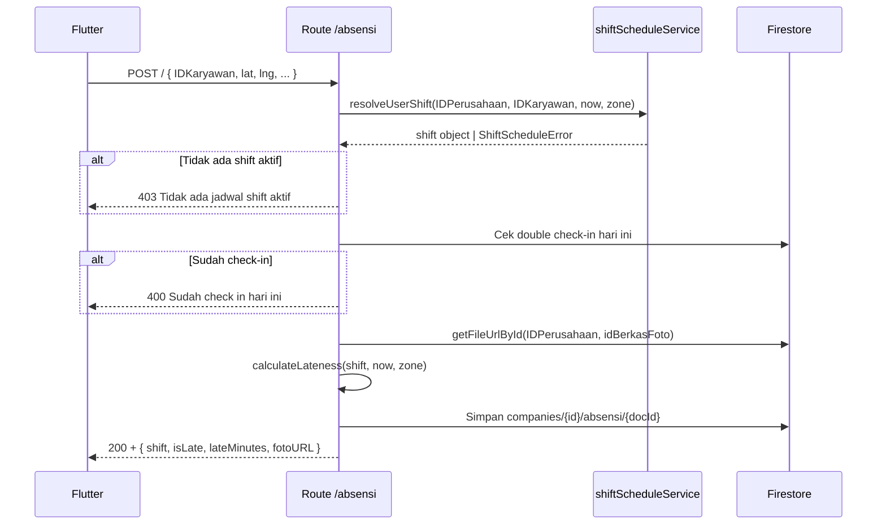
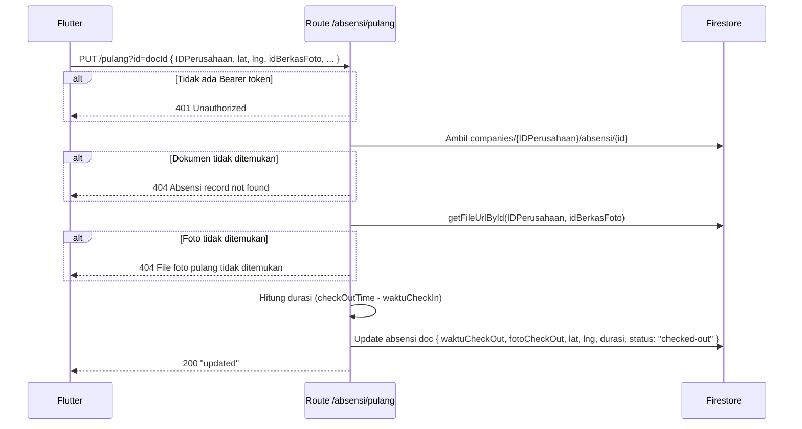

# Route — `absensi.js`

## Tujuan

Mengelola data absensi karyawan per perusahaan. Check-in otomatis mendeteksi shift aktif via `shiftScheduleService`, menghitung keterlambatan, dan menyimpan lokasi GPS karyawan. Check-out memperbarui record yang sama dengan waktu pulang, foto, lokasi, dan durasi kerja.

---

## Endpoints

| Method | Path | Auth | Role |
|---|---|---|---|
| `GET` | `/absensi/HomeA` | ✅ | Admin |
| `GET` | `/absensi/indie` | ✅ | Semua |
| `POST` | `/absensi/` | ❌ (legacy) | Karyawan |
| `PUT` | `/absensi/pulang` | ✅ (manual) | Karyawan |

---

## POST `/` — Check-In

### Request Body

```json
{
  "IDKaryawan": "user@example.com",
  "NamaKaryawan": "Budi Santoso",
  "AlamatLatitude": -6.2088,
  "AlamatLongtitude": 106.8456,
  "AlamatLoc": "Jl. Sudirman No.1",
  "IDPerusahaan": "company-id",
  "NamaPerusahaan": "PT Vorce",
  "zone": "Asia/Jakarta",
  "idBerkasFoto": "foto-doc-id"
}
```

### Alur Check-In



### Response Sukses

```json
{
  "message": "Absensi Berhasil (Shift Pagi)",
  "id": "absensi-doc-id",
  "fotoURL": "https://r2.example.com/foto.jpg",
  "shift": "Pagi",
  "isLate": false,
  "lateMinutes": 0
}
```

### Firestore — Record Absensi (setelah Check-In)

```
companies/{companyId}/absensi/{autoId}
  ├── idKaryawan, namaKaryawan
  ├── idPerusahaan, namaPerusahaan
  ├── alamatLatitude, alamatLongtitude, alamatLoc
  ├── shift (string: nama shift)
  ├── shiftId, scheduleId
  ├── telat (string "X menit" | null)
  ├── tanggal (Timestamp)
  ├── waktuCheckIn (Timestamp)
  ├── waktuCheckOut: null
  ├── fotoCheckIn (string URL R2)
  ├── fotoCheckOut: null
  ├── latitudeCheckOut, longtitudeCheckOut: null
  ├── durasi: null
  ├── alamatLocCheckOut: null
  ├── zone (string)
  ├── status: "checked-in"
  └── createdAt (Timestamp)
```

### Error Codes (ShiftScheduleError)

| Code | HTTP | Keterangan |
|---|---|---|
| `NO_ACTIVE_SCHEDULE` | 403 | Tidak ada jadwal shift untuk karyawan ini hari ini |
| `SHIFT_NOT_FOUND` | 500 | Shift ID ditemukan di schedule tapi dokumen shift tidak ada |
| `MULTIPLE_SHIFTS` | 409 | Ada lebih dari satu shift aktif yang cocok |

---

## PUT `/pulang` — Check-Out

### Query Params
```
?id=absensi-doc-id
```

`id` adalah ID dokumen absensi check-in yang sudah tersimpan (dikembalikan saat check-in sukses).

### Request Headers
```
Authorization: Bearer <firebase-id-token>
```

> Auth di endpoint ini dilakukan secara manual (cek header `Authorization`, bukan via middleware `verifyToken`).

### Request Body

```json
{
  "IDPerusahaan": "company-id",
  "LatitudePulang": -6.2100,
  "LongtitudePulang": 106.8460,
  "AlamatPulang": "Jl. Merdeka No.5",
  "NamaKaryawan": "Budi Santoso",
  "zone": "Asia/Jakarta",
  "idBerkasFoto": "foto-checkout-doc-id"
}
```

| Field | Tipe | Wajib | Keterangan |
|---|---|---|---|
| `IDPerusahaan` | string | ✅ | Digunakan untuk menemukan path dokumen di sub-collection |
| `LatitudePulang` | number | ✅ | Koordinat GPS saat pulang |
| `LongtitudePulang` | number | ✅ | Koordinat GPS saat pulang |
| `AlamatPulang` | string | ✅ | Alamat teks saat pulang |
| `NamaKaryawan` | string | ❌ | Opsional, tidak disimpan |
| `zone` | string | ❌ | Default: `"Asia/Jakarta"` |
| `idBerkasFoto` | string | ✅ | ID dokumen foto di `companies/{id}/files/{idBerkasFoto}` |

### Alur Check-Out



### Firestore — Field yang Diupdate saat Check-Out

```
companies/{companyId}/absensi/{docId}
  ├── waktuCheckOut (Timestamp)        ← diisi
  ├── fotoCheckOut (string URL R2)     ← diisi
  ├── latitudeCheckOut (number)        ← diisi
  ├── longtitudeCheckOut (number)      ← diisi
  ├── alamatLocCheckOut (string)       ← diisi
  ├── durasi (string, jam desimal)     ← dihitung otomatis, e.g. "8.50"
  ├── status: "checked-out"            ← diupdate
  └── updatedAt (Timestamp)            ← diisi
```

### Kalkulasi Durasi

Durasi dihitung dalam **jam desimal** (bukan HH:mm):

```
durationMs  = checkOutTime - waktuCheckIn (milliseconds)
durationHours = (durationMs / 3_600_000).toFixed(2)
```

Contoh: masuk jam 08:00, pulang jam 16:30 → `durasi = "8.50"`.

---

## GET `/HomeA` — Absensi Per Perusahaan (Admin)

### Query Params
```
?IDPerusahaan=company-id&tglstart=2026-01-01&tglend=2026-01-31
```

Mengembalikan semua data absensi dalam rentang tanggal untuk seluruh karyawan. Admin menggunakan ini untuk rekap harian/bulanan. Response menyertakan field `waktuCheckOut`, `FotoCheckOut`, `durasi`, dan koordinat checkout bila karyawan sudah pulang.

---

## GET `/indie` — Absensi Individu

### Query Params
```
?idkaryawan=user@example.com&idPerusahaan=company-id&tglstart=2026-01-01&tglend=2026-01-31
```

Riwayat absensi per karyawan dalam rentang tanggal. Bisa diakses oleh karyawan itu sendiri maupun admin.

---

## Decision Making

**Kenapa check-in tidak pakai `verifyToken`?**  
Legacy endpoint — ada perangkat lama yang belum kirim Bearer token. Endpoint baru (`/pulang`) sudah wajib auth.

**Kenapa check-out pakai `PUT /pulang`, bukan `POST /checkout`?**  
Check-out bukan membuat record baru, melainkan memperbarui dokumen absensi yang sudah ada (dibuat saat check-in). Semantik HTTP `PUT` lebih tepat untuk operasi update parsial pada resource yang sudah diketahui ID-nya.

**Kenapa `IDPerusahaan` wajib dikirim di body `/pulang`?**  
Dengan struktur sub-collection `companies/{id}/absensi/{docId}`, backend butuh `IDPerusahaan` untuk mengkonstruksi path dokumen. Tanpanya, tidak mungkin menemukan dokumen hanya dari `id` absensi.

**Kenapa latitude/longitude disimpan, bukan divalidasi?**  
Validasi lokasi (geofencing) dilakukan di sisi Flutter, bukan backend. Backend hanya menyimpan data — ini memungkinkan fleksibilitas konfigurasi radius per company di masa depan.

