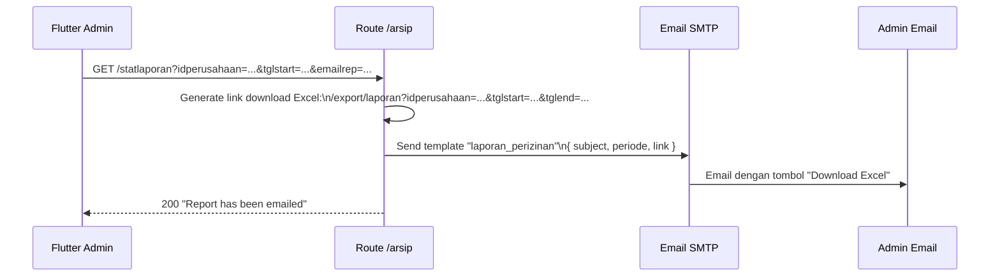
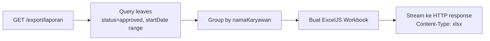

# Route — `arsip.js`

## Tujuan

Modul pelaporan dan arsip perusahaan. Mengagregasi data absensi dan izin untuk laporan kinerja, mengirim laporan via email, dan mengekspor data ke **Excel** secara langsung (HTTP stream).

---

## Endpoints

| Method | Path | Auth | Deskripsi |
|---|---|---|---|
| `GET` | `/arsip/Kinerja` | ✅ | Total jam kerja karyawan per bulan |
| `GET` | `/arsip/statlaporan` | ✅ | Kirim email laporan perizinan + link download |
| `GET` | `/arsip/statkehadiran` | ✅ | Kirim email laporan kehadiran + link download |
| `GET` | `/arsip/export/laporan` | ✅ | Download Excel perizinan (stream) |
| `GET` | `/arsip/export/kehadiran` | ✅ | Download Excel kehadiran (stream) |

---

## GET `/Kinerja` — Total Jam Kerja

Menghitung total jam kerja dan jumlah kehadiran tiap karyawan dalam rentang bulan tertentu. Data dihitung dari `companies/{id}/absensi` yang memiliki `waktuCheckIn` + `waktuCheckOut`.

### Query Params
```
?idperusahaan=company-id&month=2026-08
```

### Response

```json
[
  {
    "namaKaryawan": "Budi Santoso",
    "totalKehadiran": 21,
    "totalDurasiKinerja": "168:30:00"
  }
]
```

---

## GET `/statlaporan` — Email Laporan Perizinan



Endpoint ini **tidak langsung return Excel**, melainkan kirim email berisi link download. Admin klik link di email untuk download file.

---

## GET `/export/laporan` — Download Excel (Stream)

Mengekspor data izin karyawan yang disetujui ke format Excel menggunakan **ExcelJS**. File di-stream langsung ke HTTP response — tidak ada file temp yang disimpan.

### Struktur Excel
- **Sheet 1:** Summary per karyawan (jumlah hari izin per tipe)
- Header dibuat dengan template dan warna dari `helper/excel.js`



---

## Decision Making

**Kenapa export Excel di-stream, bukan disimpan ke R2 lalu return URL?**
Laporan bersifat ad-hoc dan one-time. Menyimpan ke R2 akan menghabiskan storage dan butuh cleanup job tambahan. Streaming lebih simpel dan tidak meninggalkan file sisa.

**Kenapa ada endpoint `statlaporan` yang kirim email dulu?**
Di Flutter, download file Excel dari link external lebih mudah dilakukan dari email client daripada langsung dari in-app response (perlu handle file system, permission, dll). Email sebagai "delivery channel" for report links adalah keputusan UX.
