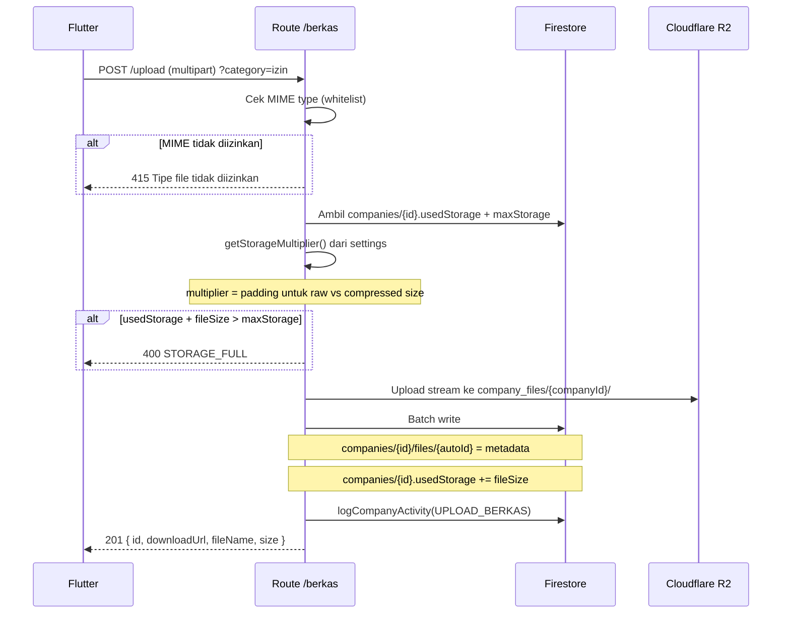
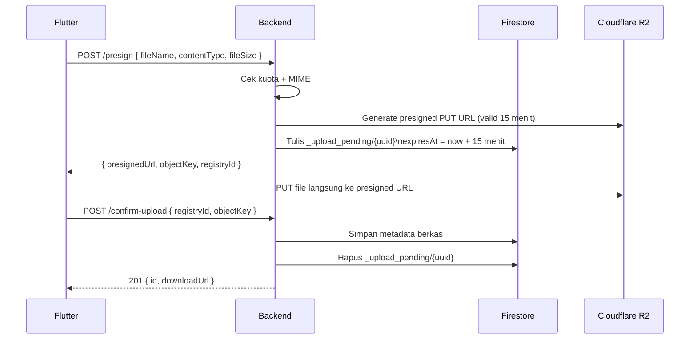

# Route — `berkas.js`

## Tujuan

Manajemen file karyawan per perusahaan. Mendukung upload langsung (stream ke R2) dan sistem presigned URL untuk upload besar langsung dari Flutter ke R2 tanpa melewati backend. Semua upload mengecek kuota storage company.

---

## Endpoints

| Method | Path | Auth | Role | Deskripsi |
|---|---|---|---|---|
| `POST` | `/berkas/upload` | ✅ | Admin, Staff | Upload file + log aktivitas |
| `POST` | `/berkas/upload-noLogs` | ✅ | Admin, Staff | Upload file tanpa log (untuk lampiran form) |
| `POST` | `/berkas/presign` | ✅ | Admin, Staff | Generate presigned URL untuk upload langsung |
| `POST` | `/berkas/confirm-upload` | ✅ | Admin, Staff | Konfirmasi upload selesai |
| `GET` | `/berkas/list` | ✅ | Semua | List berkas company |
| `GET` | `/berkas/detail/:id` | ✅ | Semua | Detail satu berkas |
| `DELETE` | `/berkas/:id` | ✅ | Admin, Staff | Hapus berkas |
| `PUT` | `/berkas/:id` | ✅ | Admin, Staff | Update metadata berkas |

---

## MIME Type Whitelist

Hanya tipe file berikut yang diizinkan. Executable dan script diblokir:

| Kategori | MIME Types |
|---|---|
| Gambar | `image/jpeg`, `image/png`, `image/gif`, `image/webp`, `image/svg+xml`, `image/bmp` |
| Dokumen | `application/pdf`, `application/msword`, `application/vnd.openxmlformats-officedocument.*` |
| Spreadsheet | `application/vnd.ms-excel`, `text/csv` |
| Arsip | `application/zip`, `application/x-rar-compressed` |
| Video | `video/mp4`, `video/quicktime` |
| Audio | `audio/mpeg`, `audio/wav` |

---

## POST `/upload` — Upload File Langsung

### Alur Upload



---

## Storage Multiplier

```js
// Dari settings Firestore: settings/storage.paddingMultiplier
// Default: 1.0 — artinya file dihitung sesuai ukuran asli
// Jika 1.2 — file 100KB dihitung 120KB di quota (padding 20%)
// Di-cache 5 menit agar tidak hit Firestore tiap upload
```

---

## Presigned Upload Flow (Upload Besar)

Untuk file besar, Flutter bisa upload **langsung ke R2** tanpa melewati backend (menghemat bandwidth dan latency).



:::tip
Orphan uploads (presign tapi gagal confirm) dibersihkan otomatis oleh scheduler setiap jam.
[→ Orphan Upload Cleanup](../scheduler/scheduler)
:::

---

## Firestore — File Document

```
companies/{companyId}/files/{fileId}
  ├── fileName, storagePath
  ├── downloadUrl    ← URL publik R2
  ├── mimeType, size (string display e.g. "2.3 MB")
  ├── sizeBytes      ← ukuran dalam bytes untuk quota tracking
  ├── category       ← "izin" | "tugas" | "reimburse" | "general"
  ├── uploadedBy (email)
  └── createdAt (Timestamp)
```
