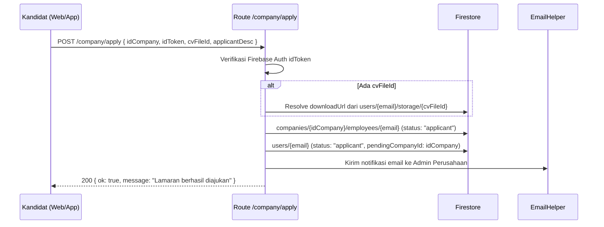
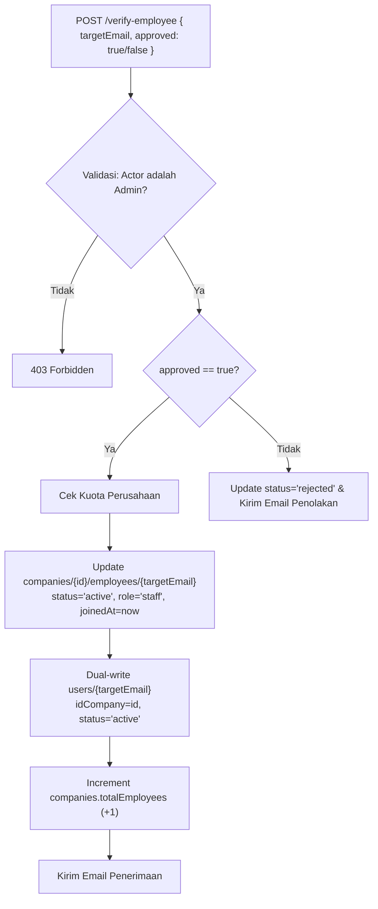
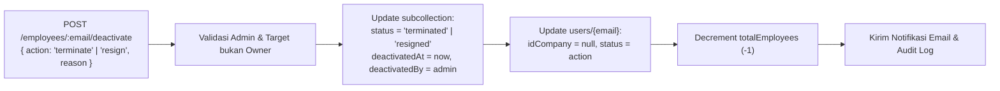

# Route — `company.js`

## Tujuan

Modul inti operasional perusahaan dan **Core HR V2**. Bertanggung jawab atas pengelolaan siklus hidup karyawan (*employee lifecycle*), rekrutmen kandidat dengan integrasi CV/Personal Storage, verifikasi pelamar, agregasi performa pegawai (absensi, cuti, tugas, reimburse), mutasi jabatan dan gaji, penonaktifan karyawan tanpa menghapus riwayat (*non-destructive deactivation*), serta fitur tata kelola perusahaan (*Device Lock*, log audit, dan *company cleanup*).

---

## Endpoints

| Method | Path | Auth | Role | Deskripsi |
|---|---|---|---|---|
| `GET` | `/company/employees` | ✅ | Admin | Mengambil daftar karyawan (paginasi, filter status, filter role, pencarian). |
| `GET` | `/company/:companyId/employees` | ✅ | Admin | Alternatif dengan parameter `companyId` eksplisit di URL. |
| `GET` | `/company/employees/:email` | ✅ | Admin | Detail satu karyawan + agregasi absensi, cuti, tugas, & reimburse. |
| `GET` | `/company/:companyId/employees/:email` | ✅ | Admin | Alternatif detail karyawan dengan `companyId` eksplisit di URL. |
| `PATCH` | `/company/employees/:email` | ✅ | Admin | Update atribut HR (`role`, `jabatan`, `gaji`, `leaveBalance`, `shiftQuota`). |
| `PATCH` | `/company/:companyId/employees/:email` | ✅ | Admin | Alternatif update HR dengan `companyId` eksplisit di URL. |
| `POST` | `/company/employees/:email/deactivate` | ✅ | Admin | Penonaktifan karyawan non-destruktif (`resigned` / `terminated`). |
| `POST` | `/company/:companyId/employees/:email/deactivate` | ✅ | Admin | Alternatif deactivasi dengan `companyId` eksplisit di URL. |
| `GET` | `/company/applicants` | ✅ | Admin | Mengambil daftar pelamar kerja (`status: applicant`). |
| `GET` | `/company/:companyId/applicants` | ✅ | Admin | Alternatif daftar pelamar dengan `companyId` eksplisit di URL. |
| `POST` | `/company/apply` | ❌* | Any | Kandidat melamar ke perusahaan (mendukung `cvUrl` & `cvFileId`). |
| `POST` | `/company/verify-employee` | ✅ | Admin | Menerima (`approved: true`) atau menolak (`approved: false`) pelamar. |
| `POST` | `/company/fire-employee` | ✅ | Admin | Legasi endpoint pemecatan (otomatis disinkronkan ke Core HR). |
| `POST` | `/company/update-role` | ✅ | Admin | Legasi endpoint promote/demote (otomatis disinkronkan ke Core HR). |
| `GET` | `/company/list` | ✅ | Any | Mengambil daftar pegawai beserta info limitasi storage & `jabatan`. |
| `POST` | `/company/send-invite` | ✅ | Admin | Mengirimkan tautan undangan bergabung ke email kandidat. |
| `POST` | `/company/accept-invite` | ❌* | Any | Memvalidasi dan menerima undangan (butuh `idToken` di body). |
| `GET` | `/company/apply-company/:idCompany` | ❌ | Any | (Publik) Mengambil info profil perusahaan untuk tampilan lamaran. |
| `GET` | `/company/public-link` | ✅ | Any | Mendapatkan tautan publik pendaftaran kerja perusahaan. |
| `POST` | `/company/toggle-device-lock` | ✅ | Admin | Mengaktifkan/menonaktifkan *Device Lock* (1 user 1 perangkat). |
| `DELETE` | `/company/delete-company` | ✅ | Owner | Menghapus perusahaan dan SELURUH data terkait secara permanen. |
| `GET` | `/company/log-activity` | ✅ | Any | Mengambil histori log aktivitas perusahaan. |
| `POST` | `/company/log-activity` | ✅ | Any | Membuat entri log aktivitas baru. |

*\*Tidak memakai middleware `verifyToken`, namun memvalidasi Firebase `idToken` secara mandiri di controller.*

---

## Struktur Data Firestore (Core HR V2)

Data karyawan dan pelamar disimpan terpusat di dalam subkoleksi perusahaan:

```
companies/{companyId}/employees/{userEmail}
```

```json
{
  "email": "karyawan@example.com",
  "role": "staff",
  "jabatan": "Backend Engineer",
  "status": "active",
  "gaji": 8500000,
  "leaveBalance": 12,
  "shiftQuota": 0,
  "joinedAt": "2026-03-01T08:00:00.000Z",
  "cvUrl": "https://cdn.vorce.id/user_storage/.../cv.pdf",
  "applicantDesc": "Software Engineer dengan pengalaman 3 tahun di Node.js",
  "deactivatedAt": null,
  "deactivatedBy": null,
  "reason": null,
  "config": {},
  "createdAt": "2026-02-28T10:00:00.000Z",
  "updatedAt": "2026-03-01T08:00:00.000Z"
}
```

### Penjelasan Field Utama
- **`role`**: Tingkat hak akses sistem di aplikasi (`owner`, `admin`, `staff`).
- **`jabatan`**: Posisi profesional di dunia nyata (contoh: `"Product Manager"`, `"Frontend Developer"`). Terpisah dari `role` agar fleksibel.
- **`status`**: Siklus hidup karyawan (`applicant` ➜ `active` ➜ `resigned` / `terminated` / `rejected`).
- **`gaji`**: Nilai numerik gaji pokok karyawan. Dipakai sebagai penanda referensi HR dan otomatis ditampilkan pada Export Rekap Kehadiran Excel.
- **`leaveBalance`**: Sisa jatah cuti tahunan pegawai.
- **`shiftQuota`**: Kuota shift atau penyesuaian jadwal dinamis.
- **`cvUrl`**: Tautan publik berkas CV pelamar.
- **`applicantDesc`**: Deskripsi singkat atau surat pengantar pelamar.

### Dual-Write Bridge (Backward Compatibility)
Untuk menjaga agar JWT session, middleware otorisasi, dan endpoint lama (`/profile`, `/users`) tetap berfungsi 100%, backend menerapkan **Dual-Write**:
- Saat status karyawan berubah menjadi `active`, field `idCompany`, `role`, dan `status` di dokumen induk `users/{email}` otomatis disinkronkan.
- Saat karyawan di-deaktivasi (`resigned` / `terminated`), field `idCompany` di `users/{email}` dilepas (`null`), tetapi dokumen riwayat di `companies/{companyId}/employees/{email}` **tetap tersimpan utuh**.

---

## 1. Rekrutmen & Pendaftaran Kandidat

Kandidat dapat melamar melalui tautan publik perusahaan (`POST /company/apply`).

### Integrasi CV & Personal Storage
Kandidat dapat menyertakan CV dengan dua cara di dalam request body `POST /company/apply`:
1. **`cvUrl`**: URL publik berkas CV yang sudah di-upload sebelumnya.
2. **`cvFileId`**: ID berkas yang ada di Personal Storage kandidat (`users/{email}/storage/{fileId}`). Backend akan secara otomatis membaca dan mengekstrak `downloadUrl` dari personal storage milik pelamar.



### Review Pelamar (`GET /company/applicants`)
Admin dapat memantau seluruh pelamar aktif melalui `GET /company/applicants`. Respon memuat profil lengkap pelamar, berkas `cvUrl`, dan `applicantDesc`.

---

## 2. Verifikasi & Onboarding Karyawan

### POST `/company/verify-employee`
Dipanggil oleh Admin untuk memutuskan penerimaan kandidat:

- **Jika Diterima (`approved: true`)**:
  - `status` di subkoleksi berubah menjadi `"active"`.
  - `role` ditetapkan (default `"staff"` atau sesuai input).
  - Menginisialisasi `leaveBalance` (default 12), `shiftQuota`, dan `joinedAt`.
  - Sinkronisasi dual-write ke `users/{email}` (`idCompany: idCompany`, `status: "active"`).
  - Menambah kuota `totalEmployees` perusahaan (+1).
  - Mengirim email konfirmasi penerimaan kerja ke kandidat.
- **Jika Ditolak (`approved: false`)**:
  - `status` di subkoleksi menjadi `"rejected"`.
  - Membersihkan penanda lamaran di akun user.
  - Mengirim email pemberitahuan penolakan.



---

## 3. Manajemen Data Karyawan (Core HR)

### GET `/company/employees`
Mengambil daftar karyawan terdaftar dengan parameter:
- `page`: Nomor halaman (default: `1`).
- `limit`: Jumlah per halaman (default: `10`).
- `status`: Filter status (`active`, `applicant`, `resigned`, `terminated`).
- `role`: Filter role (`owner`, `admin`, `staff`).
- `search`: Pencarian nama lengkap atau email.

Data diperkaya (*batch-enriched*) secara otomatis dengan nama, nomor telepon, dan foto dari koleksi `users`.

### GET `/company/employees/:email`
Mengembalikan tampilan 360 derajat data karyawan dengan **agregasi paralel** lintas subkoleksi:
1. **Profil Karyawan:** Role, jabatan, status, gaji, kuota cuti, tanggal bergabung.
2. **Statistik Absensi:** Total kehadiran, total terlambat, dan 5 log kehadiran terkini.
3. **Statistik Cuti:** Sisa cuti dan 5 riwayat perizinan terkini.
4. **Reimbursement:** 5 pengajuan klaim biaya terbaru beserta nominal dan status.
5. **Tugas Aktif:** Jumlah tugas berstatus `pending` / `in_progress` dan 5 tugas terkini.

### PATCH `/company/employees/:email`
Memperbarui data atribut HR karyawan. Hanya field yang terdaftar dalam whitelist yang dapat diubah:
- `role`: `"admin"` atau `"staff"` *(Owner dilindungi dan tidak dapat diubah)*.
- `jabatan`: Judul jabatan baru (string).
- `gaji`: Nilai numerik gaji (number).
- `leaveBalance`: Jatah sisa cuti (number).
- `shiftQuota`: Kuota shift (number).
- `config`: Objek preferensi HR kustom.

---

## 4. Offboarding & Penonaktifan Non-Destruktif

### POST `/company/employees/:email/deactivate`
Menggantikan proses pemecatan destruktif lama. Memisahkan akun karyawan dari perusahaan tanpa menghilangkan data arsip:
- **Action:** `"resign"` (mengundurkan diri) atau `"terminate"` (diberhentikan/dipecat).
- **Metadata Audit:** Mencatat `deactivatedAt` (waktu sekarang), `deactivatedBy` (email admin pengeksekusi), dan `reason` (alasan keluar).
- **Status Subkoleksi:** Berubah menjadi `"resigned"` atau `"terminated"`.
- **Status User:** `idCompany` pada dokumen `users/{email}` diset ke `null` sehingga user dapat melamar atau bergabung ke perusahaan lain.
- **Kapasitas Pegawai:** Menurunkan `totalEmployees` perusahaan secara otomatis (-1).



---

## 5. Fitur Keamanan & Administrasi Lainnya

### POST `/company/toggle-device-lock`
Mengatur kebijakan *1 User 1 HP*. Saat aktif, karyawan hanya dapat login dan absen dari perangkat yang telah didaftarkan pertama kali.

### DELETE `/company/delete-company`
Tindakan darurat (*Nuclear Option*) yang hanya bisa dipicu oleh **Owner Perusahaan**. Menghapus seluruh subkoleksi (`employees`, `files`, `logs`, `leaves`, `tasks`), menghapus file di Cloudflare R2, memutuskan hubungan semua karyawan, dan melenyapkan dokumen perusahaan.

---

## Decision Making

**Kenapa memisahkan `role` dan `jabatan`?**  
Sebelumnya, sistem memanfaatkan `role` sekaligus sebagai judul pekerjaan di UI (hanya ada Admin dan Staff). Di organisasi nyata, seorang karyawan dengan role sistem `staff` bisa memiliki jabatan beragam seperti *"Graphic Designer"*, *"Accountant"*, atau *"Field Officer"*. Memisahkan keduanya memungkinkan kontrol otorisasi sistem yang ketat sekaligus fleksibilitas struktur organisasi HR.

**Kenapa menggunakan Non-Destructive Deactivation?**  
Pada sistem lama, pemecatan karyawan me-nullkan `idCompany` tanpa meninggalkan jejak di perusahaan. Hal ini merusak integritas data historis saat HR melakukan audit kepatuhan, review log absensi lampau, atau pelaporan pajak. Dengan subkoleksi `employees`, mantan karyawan tetap tercatat dengan status `resigned` atau `terminated` beserta alasan dan tanggal keluarnya.

**Kenapa field `gaji` disimpan di Employee Subcollection?**  
Perusahaan membutuhkan penanda standar kompensasi karyawan saat melihat rekap absensi bulanan di Excel (`/arsip/export/kehadiran`). Tanpa perlu membangun modul payroll kompleks, field `gaji` berfungsi sebagai referensi data operasional HR yang ringkas dan fungsional.
