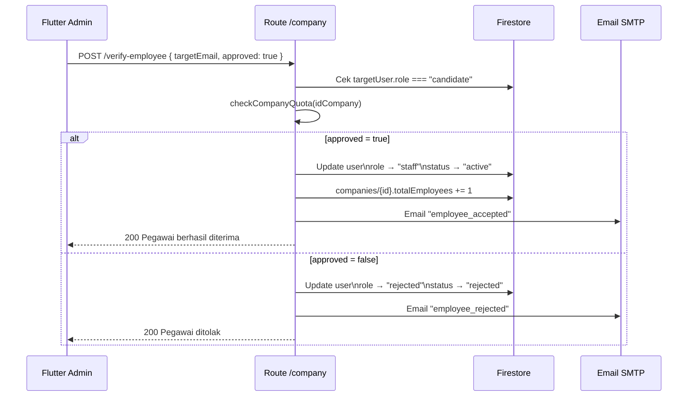
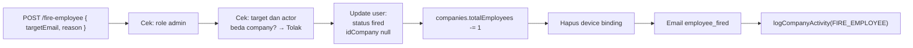

# Route — `company.js`

## Tujuan

Manajemen internal perusahaan: onboarding karyawan, pemecatan, manajemen role, device binding, shift scheduling, undangan via email, dan pengaturan perusahaan lainnya.

---

## Endpoints

| Method | Path | Auth | Role | Deskripsi |
|---|---|---|---|---|
| `POST` | `/company/verify-employee` | ✅ | Admin | Setujui/tolak kandidat |
| `POST` | `/company/fire-employee` | ✅ | Admin | Keluarkan karyawan |
| `POST` | `/company/update-role` | ✅ | Admin | Promote/demote role |
| `POST` | `/company/invite` | ✅ | Admin | Kirim undangan karyawan |
| `GET` | `/company/devices` | ✅ | Admin | List device terdaftar |
| `DELETE` | `/company/devices/:email` | ✅ | Admin | Reset binding device karyawan |
| `PUT` | `/company/device-lock` | ✅ | Admin | Toggle device lock company |
| `POST` | `/company/shift` | ✅ | Admin | Buat shift schedule |
| `GET` | `/company/shifts` | ✅ | Admin | List shift schedules |
| `PUT` | `/company/shift/:id` | ✅ | Admin | Update shift |
| `DELETE` | `/company/shift/:id` | ✅ | Admin | Hapus shift |
| `POST` | `/company/leave-quota` | ✅ | Admin | Set kuota izin per bulan |

---

## POST `/verify-employee` — Onboarding Kandidat

Karyawan yang baru register masuk dengan `role: "candidate"`. Admin harus menyetujui atau menolak.



---

## POST `/fire-employee` — Keluarkan Karyawan



Setelah dipecat:
- `idCompany` = `null` — user tidak bisa akses data company
- JWT yang ada masih valid tapi semua endpoint yang cek `idCompany` akan reject
- Device binding dihapus — kalau user ini punya binding di company, langsung bersih

---

## POST `/update-role` — Promote / Demote

| Action | Dari | Ke | Keterangan |
|---|---|---|---|
| `promote` | staff | admin | User menjadi admin |
| `demote` | admin | staff | Admin dicabut jabatannya |

Hanya ada 2 non-admin role: `admin` dan `staff`. `candidate` dan `superadmin` tidak bisa di-promote/demote via endpoint ini.

---

## Device Management

### GET `/devices`
Mengembalikan `deviceBindings` map dari company document — daftar semua device yang pernah terdaftar per email karyawan.

```json
{
  "devices": [
    { "email": "budi@example.com", "deviceId": "uuid-abc", "deviceInfo": "Samsung Galaxy S24" },
    { "email": "siti@example.com", "deviceId": "uuid-xyz", "deviceInfo": "iPhone 15" }
  ]
}
```

### DELETE `/devices/:email`
Reset binding device untuk satu karyawan. Karyawan harus login ulang dari device manapun untuk mendaftarkan device baru.

### PUT `/device-lock`
Toggle fitur device lock seluruh company:
```json
{ "enabled": true }
```
Jika `enabled: true`, karyawan yang login dari device berbeda akan di-force logout.

---

## Decision Making

**Kenapa `idCompany: null` saat dipecat, bukan hapus field?**
`null` lebih eksplisit daripada field yang tidak ada. Middleware dan route handler cek `if (!user.idCompany)` — jika field tidak ada (undefined), beberapa pengecekan bisa lolos.

**Kenapa device binding disimpan di company doc, bukan user doc?**
Admin perlu melihat dan mengelola semua binding sekaligus dari satu dokumen. Jika di user doc, admin harus query semua user — lebih mahal dan complex.
