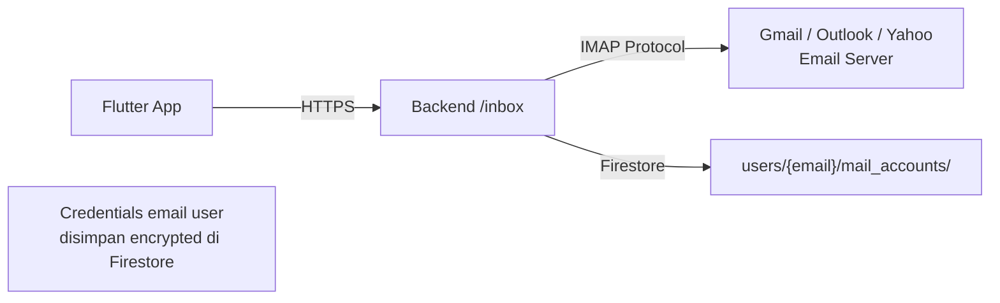
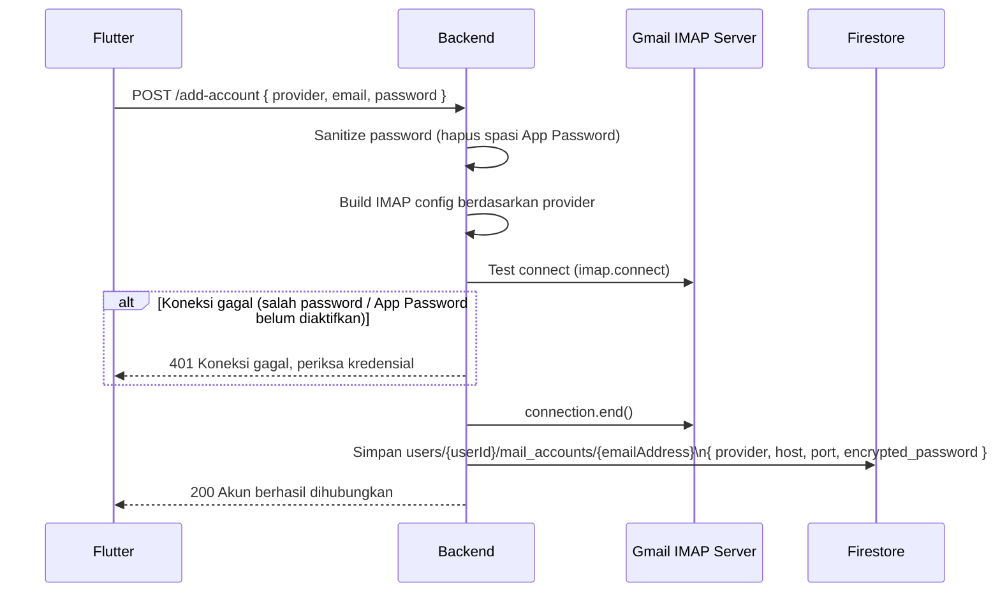

# Route — `inbox.js`

## Tujuan

**Inbox adalah fitur email client terintegrasi di dalam Vorce.** User bisa menghubungkan akun email eksternal (Gmail, Outlook, Yahoo) dan membaca/mengirim email langsung dari app, tanpa keluar ke email client lain. Koneksi menggunakan **IMAP** untuk baca dan **SMTP** untuk kirim.

---

## Arsitektur



Credentials email user (App Password / OAuth token) disimpan terenkripsi di Firestore per-user. Backend **bukan** men-cache email — setiap request buka koneksi IMAP fresh, baca header/body, lalu tutup koneksi.

---

## Endpoints

| Method | Path | Auth | Deskripsi |
|---|---|---|---|
| `POST` | `/inbox/add-account` | ✅ | Hubungkan akun email |
| `GET` | `/inbox/accounts` | ✅ | List akun email terhubung |
| `DELETE` | `/inbox/accounts/:emailAddress` | ✅ | Putus koneksi akun |
| `GET` | `/inbox/folders` | ✅ | List folder email (Inbox, Sent, dll) |
| `GET` | `/inbox/messages` | ✅ | List pesan (headers only, paginated) |
| `GET` | `/inbox/message/:uid` | ✅ | Detail pesan + attachment |
| `POST` | `/inbox/send` | ✅ | Kirim email baru |
| `POST` | `/inbox/reply` | ✅ | Balas email |
| `POST` | `/inbox/forward` | ✅ | Forward email |
| `PUT` | `/inbox/mark-read` | ✅ | Tandai email dibaca |
| `PUT` | `/inbox/star` | ✅ | Bintang email |
| `POST` | `/inbox/move` | ✅ | Pindah email ke folder lain |
| `DELETE` | `/inbox/message` | ✅ | Hapus email (pindah ke Trash) |

---

## POST `/add-account` — Hubungkan Akun Email

### Provider yang Didukung

| Provider | IMAP Host | Port |
|---|---|---|
| Gmail | imap.gmail.com | 993 |
| Outlook | outlook.office365.com | 993 |
| Yahoo | imap.mail.yahoo.com | 993 |

### Request Body

```json
{
  "provider": "gmail",
  "emailAddress": "budi@gmail.com",
  "password": "xxxx xxxx xxxx xxxx",
  "authType": "app_password"
}
```

:::important
Gmail membutuhkan **App Password** (bukan password biasa). User harus enable 2FA di Google Account terlebih dahulu.
:::

### Alur Koneksi



---

## GET `/messages` — List Pesan (Paginated)

Membaca header email dari IMAP folder dengan pagination berbasis **sequence number** (terbaru ke terlama).

### Query Params
```
?emailAccount=budi@gmail.com&folder=inbox&page=1
```

### Pagination Logic
```
totalMessages = jumlah pesan di folder
endSeq   = totalMessages - (page - 1) * limit
startSeq = max(1, endSeq - limit + 1)
→ Fetch email sequence startSeq:endSeq dari IMAP
```

### Response per Message
```json
{
  "uid": 12345,
  "from": { "name": "John Doe", "email": "john@example.com" },
  "subject": "Meeting besok",
  "date": "2026-08-03T07:00:00.000Z",
  "isRead": false,
  "isStarred": false,
  "snippet": "Tap to read..."
}
```

---

## Folder Mapping

Setiap provider menggunakan nama folder berbeda untuk folder yang sama:

| Folder | Gmail | Outlook | Yahoo |
|---|---|---|---|
| Sent | `[Gmail]/Sent Mail` | `Sent` | `Sent` |
| Trash | `[Gmail]/Trash` | `Deleted Items` | `Trash` |
| Spam | `[Gmail]/Spam` | `Junk Email` | `Bulk Mail` |

Helper `getBoxName(provider, folderType)` menangani mapping ini.

---

## Decision Making

**Kenapa pakai IMAP bukan Gmail API / Microsoft Graph?**
Satu implementasi IMAP mendukung semua provider (Gmail, Outlook, Yahoo, bahkan email custom) tanpa perlu OAuth setup yang berbeda per provider. Tradeoff: IMAP lebih lambat dan koneksinya stateful.

**Kenapa tidak cache email di Firestore?**
Email sangat dinamis (bisa ada ratusan baru per jam). Caching di Firestore akan mahal (banyak write) dan stale. IMAP sebagai source of truth memastikan data selalu fresh.

**Kenapa password disimpan di Firestore, bukan kunci sendiri?**
App Password Gmail bukan password akun — hanya memberi akses IMAP/SMTP, tidak bisa digunakan untuk login Google. Jika dicuri, user hanya perlu revoke App Password dari Google Account (tidak compromise keseluruhan akun).
