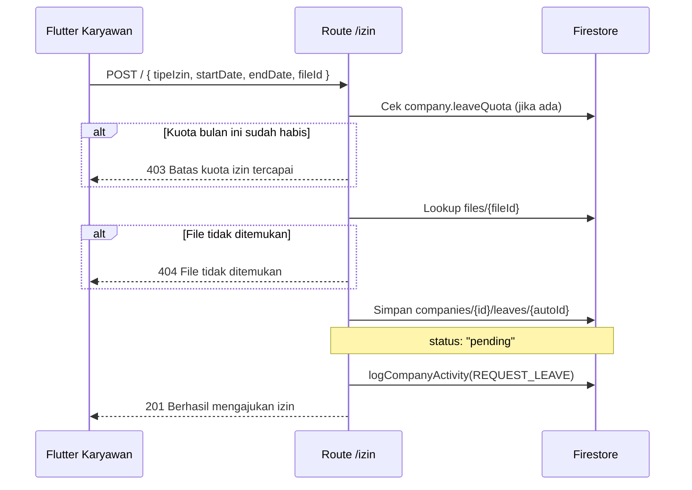
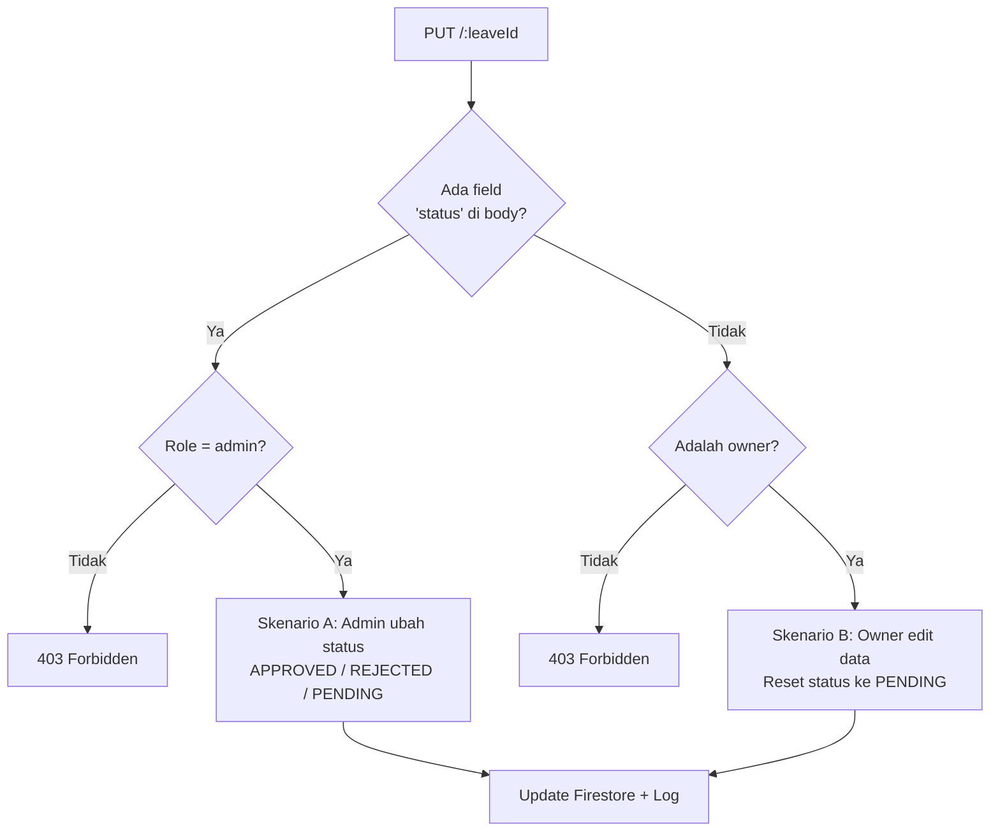

# Route — `izin.js`

## Tujuan

Mengelola pengajuan izin/sakit karyawan. Karyawan mengajukan izin dengan lampiran berkas; admin bisa mengubah status (approve/reject). Mendukung kuota izin per bulan per-company.

---

## Endpoints

| Method | Path | Auth | Role |
|---|---|---|---|
| `POST` | `/izin/` | ✅ | Karyawan |
| `GET` | `/izin/list` | ✅ | Admin (semua) / Karyawan (milik sendiri) |
| `PUT` | `/izin/:leaveId` | ✅ | Admin (ubah status) / Owner (edit data) |
| `DELETE` | `/izin/:leaveId` | ✅ | Admin / Owner |

---

## POST `/` — Ajukan Izin

Karyawan mengajukan izin. File lampiran (surat dokter dll) **harus sudah diupload** ke berkas collection terlebih dahulu, lalu kirim `fileId`-nya.

### Request Body

```json
{
  "tipeIzin": "sakit",
  "startDate": "2026-08-05",
  "endDate": "2026-08-06",
  "keterangan": "Demam tinggi",
  "fileId": "berkas-doc-id"
}
```

| tipeIzin | Keterangan |
|---|---|
| `sakit` | Izin sakit |
| `izin` | Izin keperluan pribadi |
| `cuti` | Cuti tahunan |

### Alur Pengajuan



---

## PUT `/:leaveId` — Update Status atau Edit Data

Satu endpoint menangani **2 skenario berbeda** berdasarkan role:



### Status Flow

```
pending → approved   (Admin setujui)
pending → rejected   (Admin tolak)
approved/rejected → pending  (Owner edit → otomatis reset)
```

---

## Firestore — Leave Document

```
companies/{companyId}/leaves/{leaveId}
  ├── idKaryawan, namaKaryawan
  ├── tipeIzin ("sakit" | "izin" | "cuti")
  ├── startDate, endDate (string YYYY-MM-DD)
  ├── keterangan
  ├── attachmentFileId, attachmentPath, attachmentName
  ├── status ("pending" | "approved" | "rejected")
  ├── history [ { status, by, at } ]   ← audit trail
  ├── createdAt (Timestamp)
  └── updatedAt (Timestamp)
```

---

## Decision Making

**Kenapa file harus diupload dulu, bukan bersamaan dengan form?**
Memisahkan concern upload file (async, bisa gagal) dari pembuatan record izin. Jika upload gagal, data izin tidak tersimpan setengah jadi.

**Kenapa ada `leaveQuota` per company?**
Beberapa perusahaan ingin membatasi izin karyawan per bulan (misal max 2x). Jika `leaveQuota` tidak diset di Firestore, pengecekan di-skip dan kuota tidak terbatas.

**Kenapa `history` array, bukan subcollection?**
Jumlah status change per leave document sangat sedikit (maks 3-5 kali). Array lebih efisien dari subcollection untuk kasus ini.
