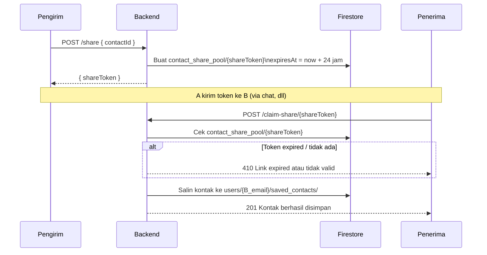

# Route — `kontak.js`

## Tujuan

Manajemen buku kontak pribadi karyawan. Setiap user punya koleksi kontak sendiri (bukan per-company). Mendukung **sinkronisasi batch** dari kontak HP, share kontak antar user, dan klaim kontak yang dibagikan.

---

## Endpoints

| Method | Path | Auth | Deskripsi |
|---|---|---|---|
| `POST` | `/kontak/sync` | ✅ | Sync batch kontak dari HP |
| `GET` | `/kontak/list` | ✅ | List semua kontak user |
| `GET` | `/kontak/detail/:contactId` | ✅ | Detail satu kontak |
| `PUT` | `/kontak/:contactId` | ✅ | Update data kontak |
| `DELETE` | `/kontak/:contactId` | ✅ | Hapus kontak |
| `POST` | `/kontak/share` | ✅ | Generate share link |
| `POST` | `/kontak/claim-share/:shareToken` | ✅ | Simpan kontak yang dibagikan |

---

## POST `/sync` — Sinkronisasi Batch

Flutter mengirim **array kontak** dari contacts HP, backend menyimpan semuanya sekaligus menggunakan Firestore batch write.

```json
{
  "contacts": [
    {
      "contactId": "contact-phone-id",
      "namaKontak": "Budi Santoso",
      "noTelp": "+628123456789"
    }
  ]
}
```

Batch dibagi tiap **400 kontak** agar tidak melebihi limit Firestore batch (500 operasi).

### Firestore Path

```
users/{email}/saved_contacts/{contactId}
  ├── namaKontak, noTelp
  ├── foto (URL R2, opsional)
  ├── lokasi (koordinat, opsional)
  ├── size (bytes — ukuran data kontak)
  └── updatedAt (Timestamp)
```

---

## Fitur Share Kontak



**Share token** adalah random `crypto.randomBytes(16).toString('hex')`. Token expired setelah 24 jam.

---

## Decision Making

**Kenapa kontak per-user, bukan per-company?**
Kontak bersifat personal — setiap karyawan punya buku kontak masing-masing. Company tidak perlu akses ke kontak pribadi karyawan.

**Kenapa ada `size` field?**
Untuk tracking storage usage kontak (foto + data teks). Berguna jika ingin limit storage per user di masa depan.
