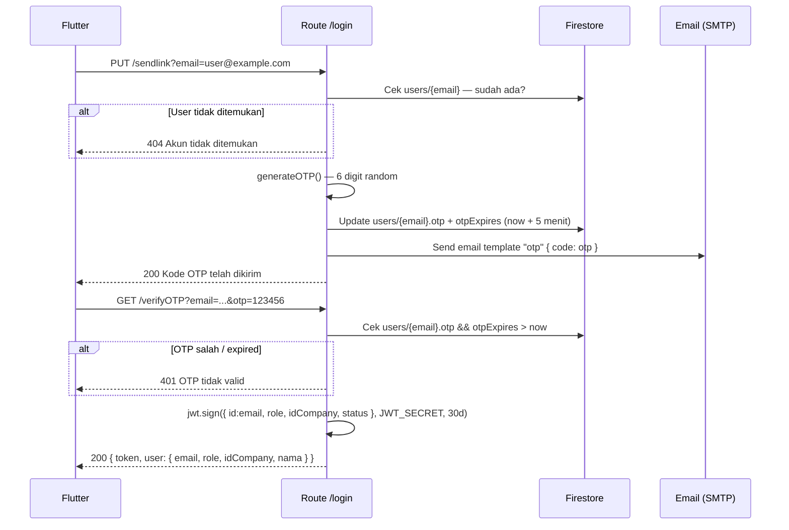
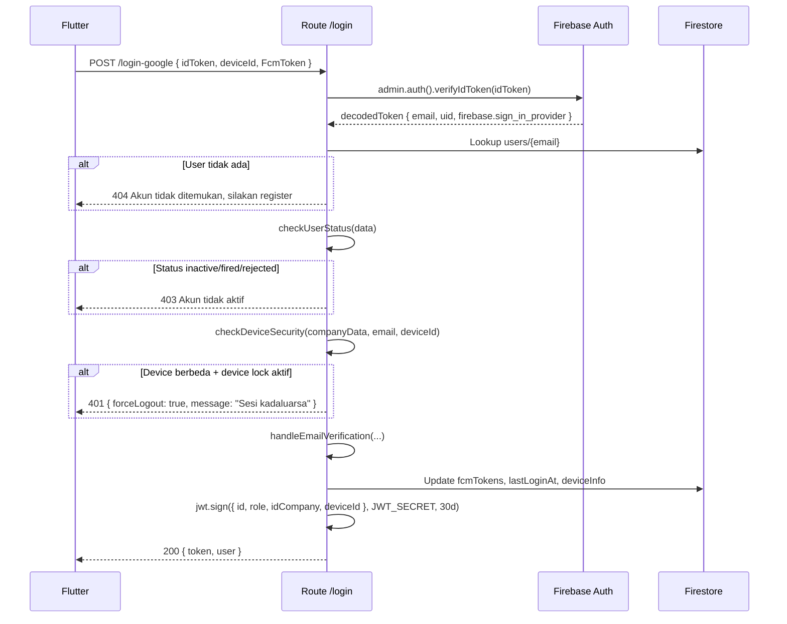

# Route — `login.js`

## Tujuan

Menangani seluruh alur autentikasi Vorce. Mendukung dua metode login: **OTP via Email** dan **Google Sign-In** (Firebase Auth). JWT di-generate setelah verifikasi berhasil, berlaku 30 hari.

---

## Endpoints

| Method | Path | Auth | Deskripsi |
|---|---|---|---|
| `PUT` | `/login/sendlink` | ❌ | Request OTP ke email |
| `GET` | `/login/verifyOTP` | ❌ | Verifikasi OTP → return JWT |
| `POST` | `/login/login-google` | ❌ | Login via Google (Firebase ID Token) |
| `POST` | `/login/register` | ❌ | Registrasi akun baru (role: candidate) |
| `POST` | `/login/register-company` | ❌ | Registrasi + buat company sekaligus |

---

## Alur Login OTP



---

## Alur Login Google



---

## Device Security (Anti-Cheat)

Jika company mengaktifkan `deviceLockEnabled = true`:

```
users/{email} login dari device A
  → deviceBindings[safeEmail] = deviceA_id disimpan di companies/{id}

Jika users/{email} login dari device B (berbeda):
  → checkDeviceSecurity() detect mismatch
  → Return: { forceLogout: true }
  → Flutter menghapus token lokal dan redirect ke login
```

`safeEmail` = email dengan `.` diganti `_` (Firestore tidak boleh ada `.` di field key).

---

## JWT Payload

```json
{
  "id": "user@example.com",
  "role": "admin",
  "idCompany": "company-id",
  "status": "active",
  "deviceId": "device-uuid",
  "iat": 1700000000,
  "exp": 1702592000
}
```

**Expiry:** 30 hari. Tidak ada refresh token — user re-login jika expired.

---

## OTP Config

| Config | Default | Env Variable |
|---|---|---|
| Durasi OTP | 5 menit | `OTP_EXPIRE_SECONDS` |
| Format | 6 digit angka | - |

---

## Decision Making

**Kenapa OTP via email, bukan SMS?**
Lebih murah (tidak ada provider SMS berbayar) dan lebih aman dari SIM-swap attack.

**Kenapa JWT berlaku 30 hari tanpa refresh?**
Tradeoff antara UX (tidak sering login ulang) dan keamanan. Jika device hilang, admin bisa reset device binding untuk invalidate sesi.
