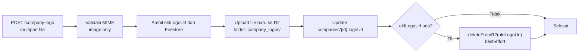

# Route — `profile.js`

## Tujuan

Mengelola profil karyawan, profil perusahaan, dan list pegawai. Mencakup update data teks maupun upload logo/foto profil ke R2.

---

## Endpoints

| Method | Path | Auth | Role | Deskripsi |
|---|---|---|---|---|
| `GET` | `/profile/list-employees` | ✅ | Admin | List semua karyawan company |
| `GET` | `/profile/company-profile` | ✅ | Semua | Data profil perusahaan |
| `PUT` | `/profile/company-profile` | ✅ | Admin | Update data teks perusahaan |
| `POST` | `/profile/company-logo` | ✅ | Admin | Upload logo perusahaan |
| `GET` | `/profile/user-profile/:email` | ✅ | Semua | Profil satu karyawan |
| `PUT` | `/profile/user-profile` | ✅ | Semua | Update profil sendiri |
| `POST` | `/profile/user-photo` | ✅ | Semua | Upload foto profil |
| `POST` | `/profile/delete-account` | ✅ | Semua | Request hapus akun |

---

## GET `/list-employees`

Mengembalikan semua user yang `idCompany` sama dengan requester. Data difilter agar tidak leak info pribadi antar karyawan.

```json
[
  {
    "email": "budi@example.com",
    "nama": "Budi Santoso",
    "role": "staff",
    "status": "active",
    "fotoUrl": "https://cdn.vorce.id/...",
    "joinedAt": "2026-01-15T00:00:00.000Z"
  }
]
```

---

## POST `/company-logo` — Upload Logo



**MIME whitelist foto:** `image/jpeg`, `image/png`, `image/webp`, `image/gif`, `image/bmp`

---

## POST `/delete-account` — Request Hapus Akun

Soft delete — akun tidak langsung dihapus. Set status ke `pending_deletion` dengan `deletionScheduledAt` = sekarang + 90 hari. Job scheduler akan menghapus permanen setelah 90 hari berjalan.

```
POST /profile/delete-account
→ users/{email}.status = "pending_deletion"
→ users/{email}.deletionScheduledAt = Timestamp(now + 90 hari)
```

User langsung kehilangan akses (token tidak valid lagi) tetapi data belum terhapus, memberi waktu untuk membatalkan.

> **Lihat:** [Account Cleanup Scheduler](../scheduler/scheduler)

---

## Decision Making

**Kenapa ada `deleteOldFileFromR2` sebagai best-effort (tidak throw)?**  
Jika file lama gagal dihapus dari R2 (sudah tidak ada, network error), proses update logo tetap berhasil. Lebih baik user punya logo baru tapi file lama "yatim" di R2 daripada update gagal karena cleanup error.

**Kenapa 90 hari sebelum delete permanen?**  
Memberi user waktu cukup untuk berubah pikiran atau backup data penting. User yang tidak sengaja request delete bisa menghubungi admin untuk batalkan.
