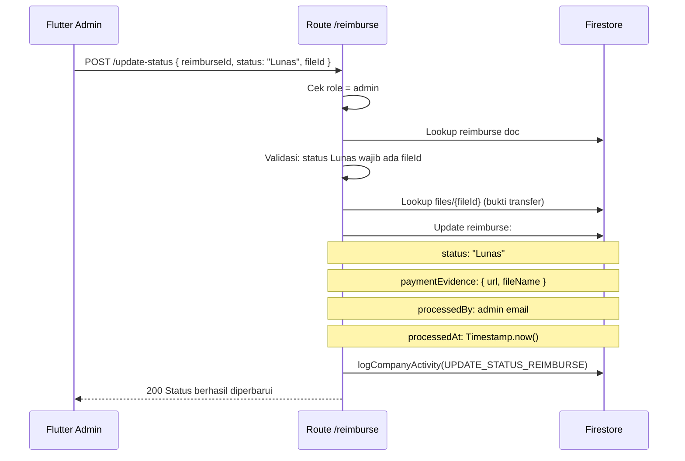

# Route — `reimburse.js`

## Tujuan

Sistem pengajuan dan pelunasan reimbursement karyawan. Karyawan mengajukan klaim biaya; admin memverifikasi dan melunasi dengan melampirkan bukti transfer.

---

## Endpoints

| Method | Path | Auth | Role |
|---|---|---|---|
| `GET` | `/reimburse/list` | ✅ | Admin (semua) / Karyawan (milik sendiri) |
| `POST` | `/reimburse/create` | ✅ | Semua role |
| `POST` | `/reimburse/update-status` | ✅ | Admin only |
| `DELETE` | `/reimburse/delete/:id` | ✅ | Admin / Owner |

---

## POST `/create` — Ajukan Reimburse

### Request Body

```json
{
  "title": "Makan Siang Client Meeting",
  "description": "Makan siang meeting dengan client PT XYZ",
  "amount": 250000,
  "date": "2026-08-03",
  "address": "Restoran ABC, Jl. Sudirman No.1",
  "category": "Konsumsi",
  "fileId": "berkas-struk-doc-id"
}
```

| Field | Wajib | Keterangan |
|---|---|---|
| `amount` | ✅ | Nominal klaim (rupiah) |
| `date` | ✅ | Tanggal pengeluaran |
| `fileId` | ✅ | ID berkas struk/bukti |
| `category` | ❌ | Default: `"Umum"` |
| `title` | ❌ | Default: `"Reimburse - [tanggal]"` |

---

## POST `/update-status` — Lunasi / Tolak (Admin)

Admin mengubah status dan **wajib lampirkan bukti transfer** jika `status = "Lunas"`.

### Request Body

```json
{
  "reimburseId": "reimburse-doc-id",
  "status": "Lunas",
  "fileId": "berkas-bukti-transfer-doc-id"
}
```

### Alur Pelunasan



---

## Status Lifecycle

```
Pengajuan baru  → status: "Tunggakan"  (default)
Admin lunasi    → status: "Lunas"      (butuh bukti transfer)
Admin reset     → status: "Tunggakan"  (hapus data paymentEvidence)
```

---

## Firestore — Reimburse Document

```
companies/{companyId}/reimbursements/{reimburseId}
  ├── title, description
  ├── amount (number — rupiah)
  ├── date (Timestamp)
  ├── address, category
  ├── attachmentFileId, attachmentPath, attachmentName
  ├── status ("Tunggakan" | "Lunas")
  ├── statusCode (0 | 1)
  ├── paymentEvidence { url, fileName }   ← saat Lunas
  ├── processedBy, processedAt           ← saat Lunas
  ├── submittedBy { email, nama, role }
  └── createdAt, updatedAt (Timestamp)
```

---

## Decision Making

**Kenapa bukti transfer wajib jika Lunas?**
Mencegah admin menandai reimburse sebagai lunas tanpa bukti nyata. Ini juga memberi karyawan dokumentasi pembayaran yang bisa diakses di app.

**Kenapa `Tunggakan` bukan `pending`?**
"Tunggakan" lebih sesuai konteks bisnis Indonesia — menggambarkan kewajiban yang belum diselesaikan, bukan sekadar "menunggu review".
