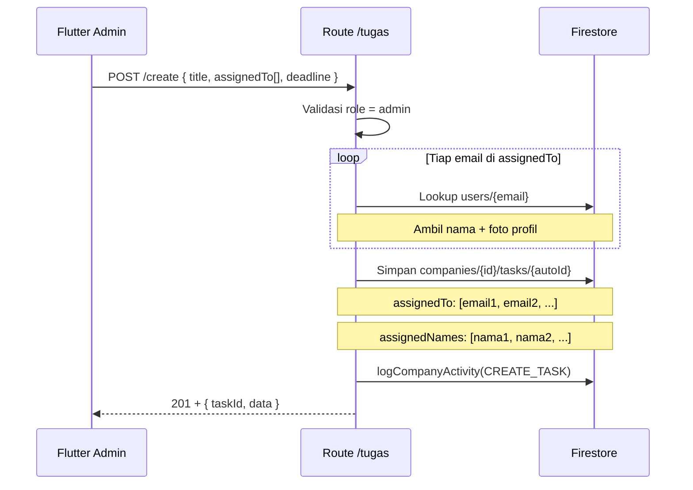

# Route — `tugas.js`

## Tujuan

Sistem manajemen tugas untuk perusahaan. Admin membuat tugas dan mengassign ke **satu atau beberapa karyawan** sekaligus (multi-assign). Karyawan memperbarui status tugas, dan sistem menghitung overdue otomatis.

---

## Endpoints

| Method | Path | Auth | Role |
|---|---|---|---|
| `GET` | `/tugas/list` | ✅ | Admin (semua) / Karyawan (yang di-assign) |
| `POST` | `/tugas/create` | ✅ | Admin only |
| `POST` | `/tugas/add-attachment` | ✅ | Semua (yang terlibat) |
| `POST` | `/tugas/update-status` | ✅ | Admin / Karyawan yang di-assign |
| `DELETE` | `/tugas/delete/:taskId` | ✅ | Admin only |

---

## POST `/create` — Buat Tugas Baru

Admin bisa assign ke **array email** karyawan.

### Request Body

```json
{
  "title": "Review Laporan Q3",
  "description": "Periksa semua dokumen laporan kuartal 3",
  "assignedTo": ["budi@example.com", "siti@example.com"],
  "deadline": "2026-08-30T17:00:00.000Z",
  "priority": "high"
}
```

### Alur Create



---

## POST `/update-status` — Perbarui Status Tugas

### Status yang Valid

| Status | Kode | Siapa |
|---|---|---|
| `Proses` | 1 | Karyawan yang di-assign |
| `Tunda` | 2 | Karyawan yang di-assign |
| `Selesai` | 3 | Karyawan yang di-assign |
| `Batal` | 4 | Admin only |

### Aturan Transisi Status

```
Proses → Tunda     ✅ OK
Proses → Selesai   ✅ OK
Tunda  → Proses    ✅ OK
Selesai → (other)  ❌ Tidak bisa mundur (sudah selesai)
* → Batal          ✅ Admin only
```

---

## GET `/list` — List Tugas

- Admin → melihat semua tugas company
- Karyawan → hanya tugas yang dia di-assign (`assignedTo` contains email)

**Overdue detection** dilakukan di backend saat map response:

```js
// Tugas dianggap overdue jika:
isOverdue = deadline < now && status !== "Selesai" && status !== "Batal"
daysOverdue = Math.ceil((now - deadline) / 86400000)
```

---

## Firestore — Task Document

```
companies/{companyId}/tasks/{taskId}
  ├── title, description
  ├── priority ("low" | "medium" | "high")
  ├── assignedTo    [ "email1", "email2" ]
  ├── assignedNames [ "Nama1", "Nama2" ]
  ├── assignedPhotos [ "url1", "url2" ]
  ├── status ("Proses" | "Tunda" | "Selesai" | "Batal")
  ├── statusCode (1 | 2 | 3 | 4)
  ├── deadline (Timestamp | null)
  ├── finishedAt (Timestamp | null)
  ├── attachments [ { text, fileId, filePath, createdBy, createdAt } ]
  ├── createdAt, updatedAt (Timestamp)
  └── createdBy (email admin)
```
