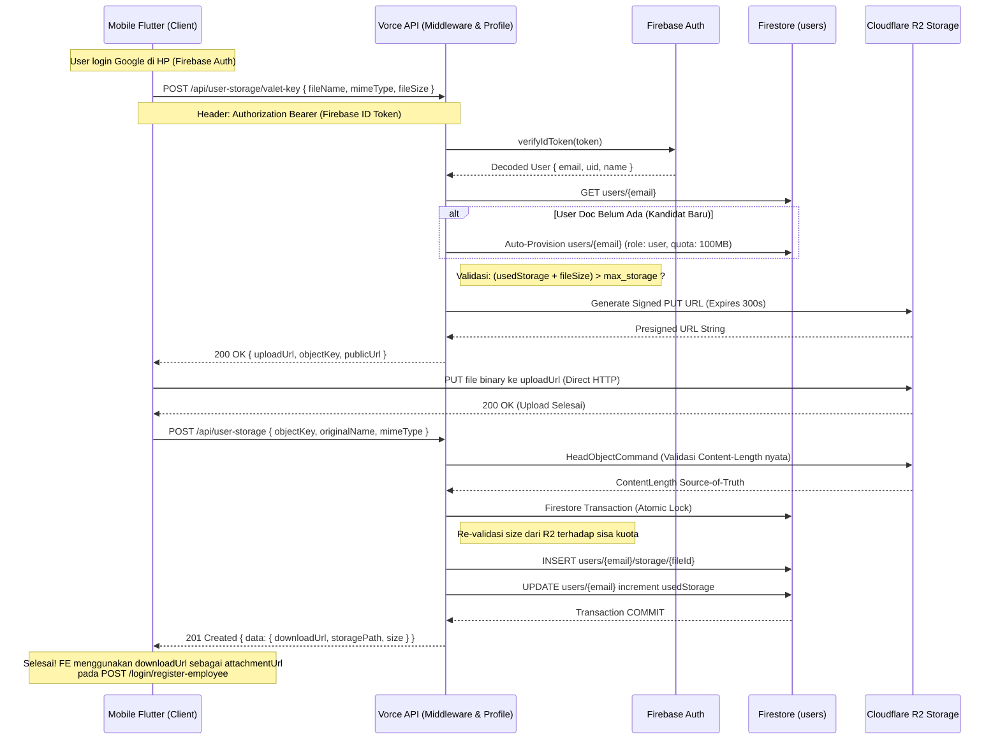

# User Profile & Storage API

## Tujuan Module

Module ini bertugas untuk memberikan *personal storage* bagi user secara independen, layaknya *company storage*. Berkas pribadi user (yang di-*upload* oleh user untuk tujuan pribadi, portofolio, atau CV lamaran kerja) disimpan secara *default* dengan kapasitas hingga 100MB (`104857600` bytes). Kapasitas tersebut dapat diperbesar melalui sistem IAP (layaknya mekanisme Company). Akses *upload* dilakukan melalui skema R2 *Valet Key* (Presigned URL) untuk efisiensi transfer data langsung dari gawai klien ke Cloudflare R2 Object Storage.

---

## Prinsip Independensi Personal Storage (Decoupled dari Perusahaan)

:::tip Prinsip Personal Storage
**Personal Storage terikat langsung pada akun individu pengguna (`users/{email}`), BUKAN pada status keanggotaan perusahaan (`idCompany`).**
:::

1. **Sebelum Mendaftar Perusahaan (Kandidat/Pelamar):**
   - Pengguna yang baru saja sign-in menggunakan Google di aplikasi mobile (Flutter) memiliki *Firebase ID Token*.
   - Pengguna belum terafiliasi dengan perusahaan (`idCompany: null`).
   - Pengguna **sudah dapat langsung menggunakan Personal Storage** untuk mengunggah berkas lamaran (CV / Portofolio), mendapatkan URL berkas, lalu menyematkan `attachmentUrl` ke payload pendaftaran `POST /login/register-employee`.
2. **Auto-Provisioning Dokumen Pengguna:**
   - Ketika pengguna terautentikasi Google mengakses API Personal Storage sebelum dokumen `users/{email}` terbentuk, backend secara otomatis melakukan inisialisasi profil dasar personal dengan `role: "user"`, `status: "active"`, `idCompany: null`, serta kuota 100MB (`max_storage: 104857600`).
3. **Preservasi Data saat Registrasi Perusahaan:**
   - Ketika kandidat kemudian memanggil `POST /login/register-employee`, pembaruan Firestore menggunakan `{ merge: true }`, sehingga dokumen berkas di `users/{email}/storage` dan kuota `usedStorage` tetap utuh.
4. **Setelah Keluar / Ditolak Perusahaan:**
   - Apabila seorang karyawan berhenti (`resigned`/`terminated`) atau lamaran ditolak oleh Admin (`rejected`), seluruh berkas di Personal Storage tetap tersimpan aman dan dapat diakses oleh pengguna.

---

## Otentikasi Dual-Token (`verifyToken`)

Endpoint Personal Storage mendukung dua jenis token pada header `Authorization: Bearer <token>`:

| Jenis Token | Tipe Signature | Pengguna Utama | Keterangan |
|---|---|---|---|
| **Firebase ID Token** | RS256 (Google) | Pelamar / Kandidat / Pengguna Baru | Didapatkan langsung dari `FirebaseAuth.instance.currentUser.getIdToken()` di aplikasi mobile. Diverifikasi menggunakan `admin.auth().verifyIdToken()`. |
| **Vorce Backend JWT** | HS256 (`JWT_SECRET`) | Staf / Admin Perusahaan Aktif | Didapatkan setelah login sukses via `POST /login/login-google` atau verifikasi OTP. |

> **Device Lock:** Pengecekan *Device Lock* hanya diberlakukan jika pengguna memiliki `idCompany` dan perusahaan tersebut mengaktifkan fitur `deviceLockEnabled`. Pengguna personal / kandidat bebas dari batasan device lock.

---

## Tabel Endpoint

API ini dapat diakses baik melalui prefix `/api/user-storage/*` maupun `/api/profile/user-storage/*`:

| Method | Path | Auth | Role Required | Deskripsi |
| --- | --- | --- | --- | --- |
| `GET` | `/api/user-storage` | Yes (Dual-Token) | Any (`user`, `candidate`, `staff`, `admin`) | Mendapatkan daftar seluruh file (metadata) milik user, beserta informasi `usedStorage` dan `maxStorage`. |
| `POST` | `/api/user-storage/valet-key` | Yes (Dual-Token) | Any | Membuat R2 pre-signed PUT url untuk upload (berlaku 5 menit). Memvalidasi sisa kuota user (default 100MB). |
| `POST` | `/api/user-storage` | Yes (Dual-Token) | Any | Mengkonfirmasi upload selesai. Melakukan validasi eksistensi file nyata di R2 (via `HeadObjectCommand`) dan mencatat kenaikan quota via transaksi Firestore. |
| `DELETE` | `/api/user-storage/:fileId` | Yes (Dual-Token) | Any | Menghapus file dari database (Firestore) dan object storage (R2) serta mengembalikan kuota `usedStorage`. |

---

## Struktur Data Firestore

Module ini berinteraksi langsung dengan koleksi utama `users`:

1. **Dokumen Induk Pengguna:** `users/{email}`
2. **Sub-koleksi Berkas Personal:** `users/{email}/storage/{fileId}`

Contoh dokumen:

```json
// Path: users/budi.santoso@gmail.com
{
  "email": "budi.santoso@gmail.com",
  "alamatEmail": "budi.santoso@gmail.com",
  "uid": "FIREBASE_UID_12345",
  "username": "Budi Santoso",
  "role": "user",
  "status": "active",
  "idCompany": null,
  "usedStorage": 1500000, 
  "max_storage": 104857600,
  "verified": true,
  "createdAt": "2026-09-20T10:00:00Z"
}

// Path: users/budi.santoso@gmail.com/storage/{fileId}
{
  "id": "file_1726743900000",
  "fileName": "Curriculum_Vitae_Budi.pdf",
  "storagePath": "user_storage/FIREBASEUID12345/1726743900000_uuid.pdf",
  "downloadUrl": "https://cdn.vorce.id/user_storage/FIREBASEUID12345/1726743900000_uuid.pdf",
  "mimeType": "application/pdf",
  "size": "1.43 MB",
  "sizeBytes": 1500000,
  "createdAt": "2026-09-20T10:05:00Z"
}
```

---

## Flowchart dan Sequence Logic Upload

Berikut merupakan sequence logic upload file kandidat/user ke Personal Storage:



---

## Penjelasan Endpoint Detail

### 1. `GET /api/user-storage`
Mendapatkan daftar berkas personal milik pengguna yang sedang login.

- **Header:** `Authorization: Bearer <token>`
- **Response `200 OK`:**
```json
{
  "message": "Success",
  "usedStorage": 1500000,
  "maxStorage": 104857600,
  "data": [
    {
      "id": "file_1726743900000",
      "fileName": "Curriculum_Vitae_Budi.pdf",
      "storagePath": "user_storage/FIREBASEUID12345/1726743900000_uuid.pdf",
      "downloadUrl": "https://cdn.vorce.id/user_storage/FIREBASEUID12345/1726743900000_uuid.pdf",
      "mimeType": "application/pdf",
      "size": "1.43 MB",
      "sizeBytes": 1500000,
      "createdAt": "2026-09-20T10:05:00Z"
    }
  ]
}
```

### 2. `POST /api/user-storage/valet-key`
Membuat Presigned URL untuk upload berkas personal.

- **Header:** `Authorization: Bearer <token>`
- **Request Body:**
```json
{
  "fileName": "CV_Budi_Santoso.pdf",
  "mimeType": "application/pdf",
  "fileSize": 1500000
}
```
- **Response `200 OK`:**
```json
{
  "uploadUrl": "https://<account-id>.r2.cloudflarestorage.com/vorce/user_storage/...",
  "objectKey": "user_storage/FIREBASEUID12345/1726743900000_uuid.pdf",
  "publicUrl": "https://cdn.vorce.id/user_storage/FIREBASEUID12345/1726743900000_uuid.pdf",
  "expiresInSeconds": 300
}
```

### 3. `POST /api/user-storage`
Mengonfirmasi bahwa berkas telah sukses terkirim ke R2 dan menyimpannya ke database.

- **Header:** `Authorization: Bearer <token>`
- **Request Body:**
```json
{
  "objectKey": "user_storage/FIREBASEUID12345/1726743900000_uuid.pdf",
  "originalName": "CV_Budi_Santoso.pdf",
  "mimeType": "application/pdf"
}
```
- **Response `201 Created`:**
```json
{
  "message": "Data file berhasil ditambahkan",
  "data": {
    "id": "file_1726743900000",
    "fileName": "CV_Budi_Santoso.pdf",
    "storagePath": "user_storage/FIREBASEUID12345/1726743900000_uuid.pdf",
    "downloadUrl": "https://cdn.vorce.id/user_storage/FIREBASEUID12345/1726743900000_uuid.pdf",
    "mimeType": "application/pdf",
    "size": "1.43 MB",
    "sizeBytes": 1500000,
    "createdAt": "2026-09-20T10:05:00Z"
  }
}
```

---

## Decision Making & Keamanan

- **R2 Valet Key (Presign) vs FormData Backend Storage:** Valet key memungkinkan pengunggahan berkas besar langsung dari aplikasi mobile ke storage tanpa membebani memori dan bandwidth server Node.js.
- **Prefix Validasi (`objectKey`):** Validasi backend memastikan `objectKey` hanya boleh dimulai dengan `user_storage/{cleanUid}/` atau `user_storage/{cleanEmail}/` milik pengguna yang sedang login untuk mencegah manipulasi direktori user lain.
- **Firestore Transaction:** Pemakaian kuota dihitung dan di-*lock* menggunakan `db.runTransaction()`, mencegah terjadinya kondisi *race condition* jika ada beberapa file yang diunggah secara bersamaan.
