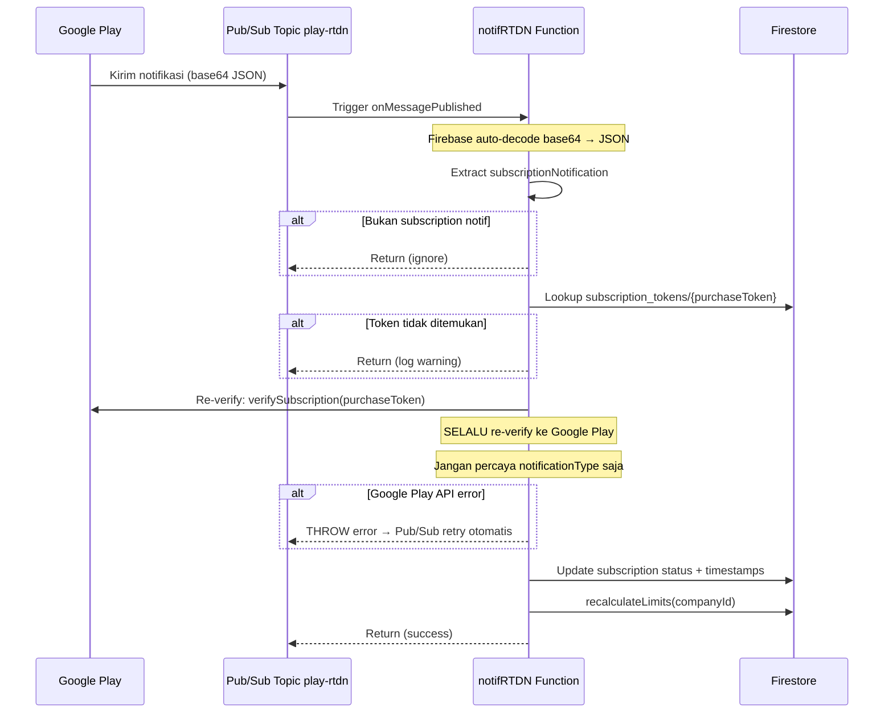

# Google Play RTDN — Real-Time Developer Notifications

## Trigger

**Pub/Sub topic:** `play-rtdn`  
**Trigger type:** Firebase Functions v2 `onMessagePublished`  
**Region:** `asia-southeast2`

Google Play mengirim notifikasi ke Pub/Sub setiap kali ada perubahan status subscription (renewal, cancel, expire, dll). Firebase Functions otomatis di-invoke ketika ada message baru.

---

## Kenapa Pub/Sub, Bukan HTTP Webhook?

| Aspek | Pub/Sub Trigger | HTTP Webhook |
|---|---|---|
| Keamanan | Hanya bisa dipanggil Google | URL publik — siapa saja bisa hit |
| Retry | Otomatis dengan exponential backoff | Harus return 200, Apple/Google retry terus |
| Scaling | Independen dari API Express | Berbagi resources dengan Express |
| Setup | Cukup deploy function | Perlu setup endpoint + auth manual |

---

## Notification Types

| Type | Nama | Aksi Backend |
|---|---|---|
| 1 | RECOVERED | Set `active`, recalculate |
| 2 | RENEWED | Set `active`, update `lastRenewedAt` |
| 3 | CANCELED | Set `cancelled`, catat `cancelledAt` |
| 4 | PURCHASED | Skip (sudah di-handle `/verify`) |
| 5 | ON_HOLD | Set `on_hold` |
| 6 | IN_GRACE_PERIOD | Set `grace_period` |
| 7 | RESTARTED | Set `active` |
| 12 | REVOKED | Set `expired`, catat `expiredAt` |
| 13 | EXPIRED | Set `expired`, catat `expiredAt` |
| 20 | PENDING_PURCHASE_CANCELED | Set `expired` |

---

## Alur RTDN



> **Kenapa re-verify ke Google Play?**  
> `notificationType` dari Pub/Sub hanya memberi tahu *jenis* event, bukan status terbaru yang akurat. Re-verify memastikan kita mendapatkan state yang paling up-to-date.

---

## Efek di Firestore

```
companies/{companyId}/subscriptions/{subDocId}
  ├── status              ← updated sesuai mapping
  ├── autoRenewing        ← updated
  ├── expiresAt           ← updated jika ada
  ├── lastRtdnAt          ← Timestamp sekarang
  ├── lastRtdnType        ← notificationType (number)
  └── cancelledAt / expiredAt / lastRenewedAt  ← sesuai event

companies/{companyId}
  ├── maxStorage          ← recalculated
  └── max_devices         ← recalculated
```

---

## Decision Making

**Kenapa throw error alih-alih return jika Google Play API gagal?**  
Dengan Pub/Sub trigger, jika function throw error, Firebase akan **retry otomatis** dengan exponential backoff. Ini memastikan tidak ada event yang hilang meskipun Google Play API sementara down.

**Kenapa ada pengecekan `!tokenDoc.exists`?**  
Race condition: RTDN bisa tiba *sebelum* client memanggil `/verify` (terutama untuk type 4 PURCHASED). Jika token belum ada, kita skip dan biarkan client handle aktivasi pertama via `/verify`.
