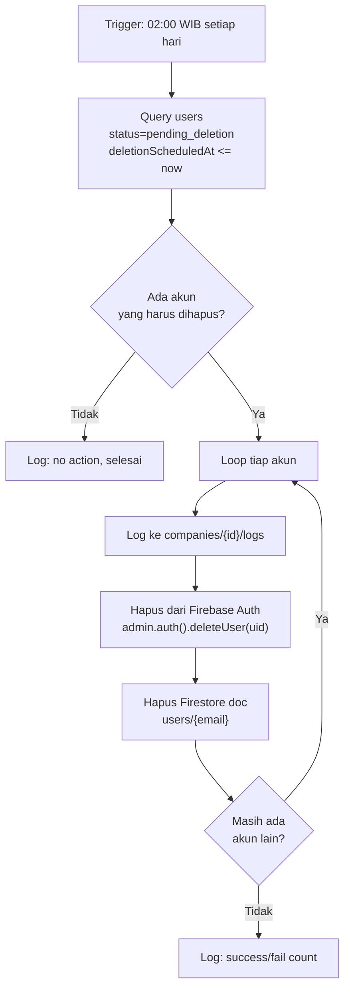
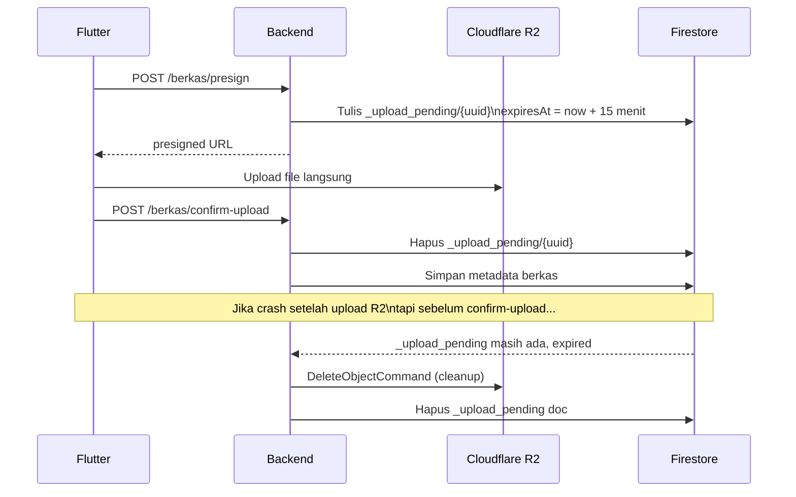
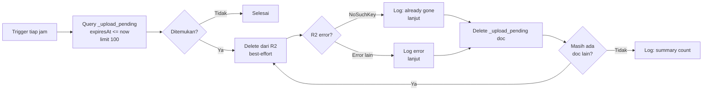

# Scheduled Jobs

File `scheduler/scheduler.js` berisi dua job otomatis yang berjalan tanpa interaksi user.

---

## 1. Account Cleanup (`scheduledAccountCleanup`)

**Schedule:** `0 19 * * *` (UTC) = setiap hari **jam 02:00 WIB**

### Tujuan
Menghapus permanen akun user yang sudah melewati **90 hari** sejak request deletion. User yang meminta delete akunnya diberi status `pending_deletion` dengan `deletionScheduledAt` = 90 hari dari sekarang.

### Alur

### Error Handling
- Jika user tidak ditemukan di Firebase Auth (`auth/user-not-found`) → **skip**, lanjut hapus Firestore (mungkin sudah dihapus manual)
- Error lain per-user → log error, lanjut ke user berikutnya (tidak stop seluruh job)

---

## 2. Orphan Upload Cleanup (`cleanupOrphanUploads`)

**Schedule:** `0 * * * *` = **setiap jam**

### Tujuan
Menghapus file R2 yang "orphaned" — file yang sudah ter-upload ke R2 tapi tidak pernah dikonfirmasi ke backend (user crash/network error antara upload ke R2 dan panggilan `/confirm-upload`).

### Mekanisme Upload Registry

### Alur Job

### Design Decisions

**Kenapa limit 100 per-run?**  
Mencegah timeout (max 120s). Sisa doc di-cleanup di run berikutnya.

**Kenapa R2 delete best-effort (tidak throw error)?**  
Jika file tidak ada di R2 (upload benar-benar gagal sebelum sampai ke R2), registry tetap harus dihapus. `NoSuchKey` = normal, bukan error.

**Kenapa polling (cron), bukan event trigger dari R2?**  
R2 Event Notification butuh Cloudflare Worker/Queue — lebih kompleks. Polling per jam acceptable karena lifecycle orphan file tidak urgent.
