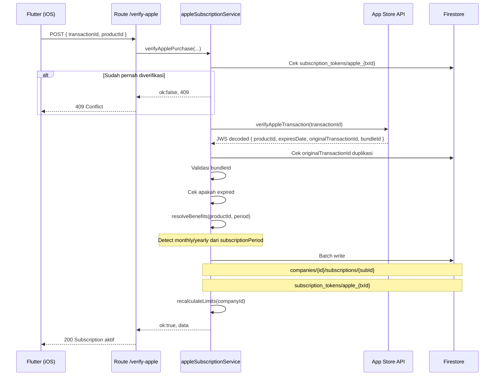
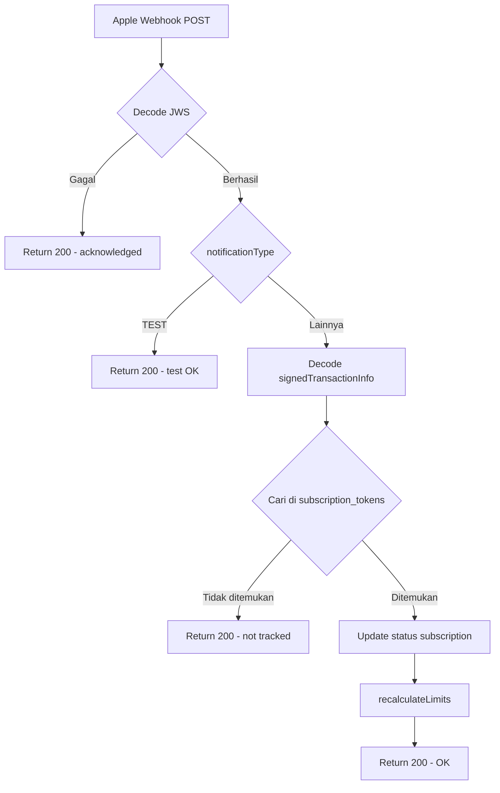

# Apple Subscription — StoreKit 2

## Tujuan

Memverifikasi subscription yang dibeli user di iOS via App Store, menggunakan **Apple App Store Server API v2**. Apple mengembalikan data dalam format **JWS (JSON Web Signature)** yang harus di-decode.

---

## Perbedaan Apple vs Google Play

| Aspek | Google Play | Apple |
|---|---|---|
| Token identifier | `purchaseToken` | `transactionId` |
| Verification API | Google Play API v3 | App Store Server API v2 |
| Data format | JSON biasa | JWS (signed JWT) |
| Renewal notification | Pub/Sub (RTDN) | HTTP Webhook |
| Acknowledge | Wajib dalam 3 hari | Tidak diperlukan |
| Product ID per period | 1 ID, `basePlanId` monthly/yearly | ID terpisah per period |

---

## Endpoint Verify

```
POST /api/subscription/verify-apple
Authorization: Bearer <jwt_token>
```

### Request Body

```json
{
  "transactionId": "2000000123456789",
  "productId": "vorce_basic_month"
}
```

### Product IDs Apple

| Product ID | Deskripsi | Storage |
|---|---|---|
| `vorce_basic_month` / `vorce_basic_year` | Basic Plan | 1 GB / 12 GB |
| `vorce_team_month` / `vorce_team_year` | Team Plan | 3 GB / 36 GB |
| `vorce_business_month` / `vorce_business_year` | Business Plan | 10 GB / 120 GB |
| `vorce_enterprise_month` / `vorce_enterprise_year` | Enterprise Plan | 30 GB / 360 GB |

---

## Alur Verifikasi Apple



---

## Apple Server Notifications (Webhook)

Apple mengirimkan notifikasi setiap kali status subscription berubah (renew, cancel, expire, dll) via **HTTP POST** ke endpoint kita.

```
POST /api/subscription/apple-webhook
(dipanggil oleh Apple Server, bukan Flutter)
```

**Setup di App Store Connect:**
`App → General → App Information → Server Notifications URL`
```
https://api-y4ntpb3uvq-et.a.run.app/api/subscription/apple-webhook
```

### Tipe Notifikasi & Aksi

| Notification Type | Action | Status Baru |
|---|---|---|
| `DID_RENEW`, `SUBSCRIBED` | `renew` / `activate` | `active` |
| `EXPIRED` | `expire` | `expired` |
| `REFUND` | `revoke` | `expired` |
| `DID_FAIL_TO_RENEW` (GRACE_PERIOD) | `billing_issue` | `grace_period` |
| `DID_FAIL_TO_RENEW` | `billing_issue` | `on_hold` |
| `DID_CHANGE_RENEWAL_STATUS` (AUTO_RENEW_DISABLED) | `status_change` | `cancelled` |



> Apple **selalu mengharapkan response 200**. Jika kita return 4xx/5xx, Apple akan terus retry. Semua error di-log tapi tetap return 200.

---

## Decision Making

**Kenapa product ID terpisah per period di Apple?**
Apple tidak mengenal `basePlanId` seperti Google Play. Setiap kombinasi produk + period adalah product ID yang berbeda di App Store Connect.

**Kenapa Apple tidak butuh acknowledge?**
Apple StoreKit 2 handles acknowledgment secara otomatis di sisi client setelah transaksi selesai.

**Kenapa webhook harus return 200 meskipun error?**
Jika return 5xx, Apple akan retry berkali-kali. Error di-log ke console untuk debugging tanpa mengganggu flow Apple.
