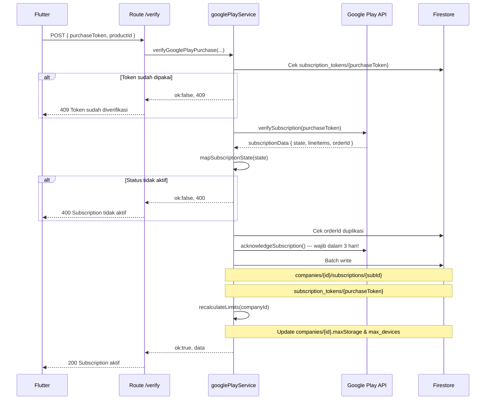

# Google Play Subscription

## Tujuan

Memverifikasi dan mengaktifkan subscription berbayar user yang dibeli melalui Google Play Store. Backend yang menentukan apakah pembelian valid — bukan hanya client.

---

## Endpoint

```
POST /api/subscription/verify
Authorization: Bearer <jwt_token>
```

### Request Body

```json
{
  "purchaseToken": "AEuhN1v...",
  "productId": "vorce_basic"
}
```

| Field | Keterangan |
|---|---|
| `purchaseToken` | Token dari Google Play setelah user selesai checkout |
| `productId` | ID produk (lihat tabel di bawah) |

> `companyId` diambil otomatis dari JWT — tidak perlu dikirim dari client.
> Ini mencegah user mengklaim subscription untuk company lain.

---

## Product IDs

| Product ID | Nama | Storage | Billing |
|---|---|---|---|
| `vorce_basic` | Basic Plan | 1 GB / 12 GB | monthly / yearly |
| `vorce_team` | Team Plan | 3 GB / 36 GB | monthly / yearly |
| `vorce_business` | Business Plan | 10 GB / 120 GB | monthly / yearly |
| `vorce_enterprise` | Enterprise Plan | 30 GB / 360 GB | monthly / yearly |
| `vorce_storage_1` | Storage Addon 3GB | 3 GB / 36 GB | monthly / yearly |
| `vorce_storage_2` | Storage Addon 10GB | 10 GB / 120 GB | monthly / yearly |

---

## Alur Verifikasi



---

## Subscription State Mapping

Google Play mengirimkan state dalam format panjang. Backend memetakannya ke status internal:

| Google Play State | Status Internal | Akses Granted? |
|---|---|---|
| `SUBSCRIPTION_STATE_ACTIVE` | `active` | ✅ |
| `SUBSCRIPTION_STATE_IN_GRACE_PERIOD` | `grace_period` | ✅ |
| `SUBSCRIPTION_STATE_CANCELED` | `cancelled` | ❌ |
| `SUBSCRIPTION_STATE_ON_HOLD` | `on_hold` | ❌ |
| `SUBSCRIPTION_STATE_PAUSED` | `paused` | ❌ |
| `SUBSCRIPTION_STATE_EXPIRED` | `expired` | ❌ |

> Grace period masih dianggap aktif — memberikan waktu user memperbaiki pembayaran yang gagal.

---

## Recalculate Limits

Setelah subscription disimpan, backend menghitung ulang `maxStorage` dan `max_devices` dari **semua subscription aktif**, bukan hanya yang baru dibeli.

```
Ada tier plan?
  YES → maxStorage = tierStorage + addonStorage
  NO  → maxStorage = BASE (100MB) + addonStorage
```

Formula ini memastikan fungsinya **idempotent** — aman dipanggil berkali-kali tanpa efek samping.

---

## RTDN (Real-time Developer Notifications)

Perubahan status subscription oleh Google (renewal, cancel, expire) diterima via **Pub/Sub**, bukan HTTP. Handler-nya ada di `scheduler/rtdn.js` — terpisah dari endpoint ini.

---

## Decision Making

**Kenapa acknowledge wajib?**
Google Play akan otomatis refund pembelian jika tidak di-acknowledge dalam 3 hari. Acknowledge dilakukan di backend (bukan client) untuk keamanan.

**Kenapa ada dua layer fraud check (purchaseToken + orderId)?**
- `purchaseToken` mencegah token dikirim dua kali
- `orderId` mencegah double-hit dari Flutter yang retry karena timeout

**Kenapa `companyId` dari JWT, bukan dari body?**
User tidak bisa mengklaim subscription untuk company lain hanya dengan mengubah request body.
