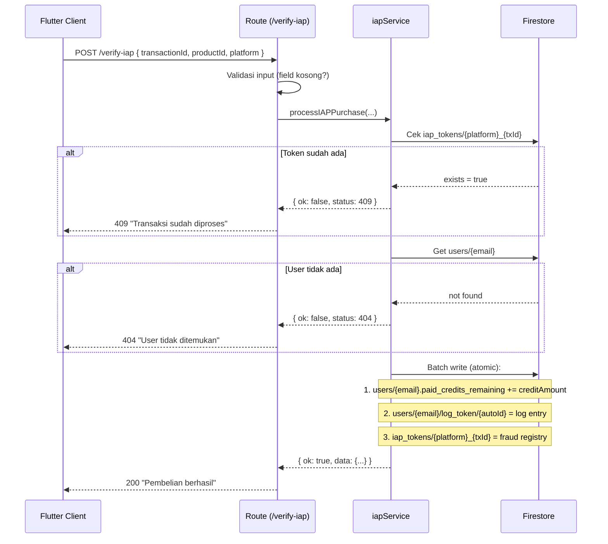

# IAP One-Time Purchase — Mitsu AI Token

## Tujuan Fitur

Memungkinkan user membeli **AI token** (credits) secara satuan (*consumable IAP*),
bukan subscription. Token ini digunakan untuk fitur AI Mitsu dan tersimpan di
akun user pribadi, bukan di company.

Endpoint ini mendukung **Google Play dan Apple** dengan product ID yang sama.

---

## Produk Tersedia

| Product ID | Credits Ditambahkan |
|---|---|
| `mitsu_ai_token_1` | 30.000 |
| `mitsu_ai_token_2` | 100.000 |
| `mitsu_ai_token_3` | 250.000 |
| `mitsu_ai_token_4` | 500.000 |
| `mitsu_ai_token_5` | 1.000.000 |

> Untuk menambah produk baru, cukup edit [`config/products.js`](../../../functions/config/products.js) — tidak perlu ubah kode lainnya.

---

## Endpoint

```
POST /api/subscription/verify-iap
Authorization: Bearer <jwt_token>
```

### Request Body

```json
{
  "transactionId": "AxyKomEyTFXxM2ejq5D4",
  "productId": "mitsu_ai_token_1",
  "platform": "google_play"
}
```

| Field | Type | Required | Keterangan |
|---|---|---|---|
| `transactionId` | string | ✅ | ID transaksi dari Google Play / Apple |
| `productId` | string | ✅ | Salah satu dari `mitsu_ai_token_1` s/d `5` |
| `platform` | string | ❌ | `"google_play"` (default) atau `"apple"` |

### Response — Sukses `200`

```json
{
  "message": "Pembelian token berhasil diproses!",
  "data": {
    "productId": "mitsu_ai_token_1",
    "description": "Mitsu AI Token 1",
    "creditAdded": 30000,
    "transactionId": "AxyKomEyTFXxM2ejq5D4",
    "type": "purchase"
  }
}
```

### Response — Error

| Status | Kondisi |
|---|---|
| `400` | `transactionId` atau `productId` tidak dikirim, atau `productId` tidak dikenali |
| `403` | Token JWT tidak valid atau user tidak ditemukan |
| `404` | User tidak ada di Firestore |
| `409` | `transactionId` sudah pernah diproses sebelumnya (double submit) |
| `500` | Server error |

---

## Alur Logic



---

## Efek di Firestore

### `users/{email}`
Field `paid_credits_remaining` ditambah menggunakan `FieldValue.increment()` — atomic dan safe dari race condition.

Jika field belum ada (user lama), field otomatis **dibuat** karena menggunakan `set(..., { merge: true })`.

### `users/{email}/log_token/{autoId}`

```json
{
  "amount": 30000,
  "createdAt": "Timestamp",
  "receivedTo": "uid-user",
  "timestamp": "Timestamp",
  "transactionId": "AxyKomEyTFXxM2ejq5D4",
  "type": "purchase",
  "productId": "mitsu_ai_token_1",
  "platform": "google_play"
}
```

---

## Decision Making

**Kenapa pakai `set(..., { merge: true })` bukan `update()`?**
`update()` akan throw error jika field `paid_credits_remaining` belum ada di dokumen user. Dengan `merge: true`, field dibuat otomatis jika belum ada.

**Kenapa tidak verifikasi ke Google Play/Apple untuk IAP?**
Consumable IAP tidak memiliki state di server store (berbeda dengan subscription). Verifikasi dilakukan di sisi client (Flutter) sebelum token dikirim ke backend. Fraud prevention di backend menggunakan registry `iap_tokens` untuk mencegah replay attack (token yang sama di-submit dua kali).

**Kenapa product ID sama untuk Google Play dan Apple?**
Untuk menyederhanakan logic di backend. Flutter client tetap kirim `platform` field, yang dipakai untuk membedakan key di `iap_tokens` collection (`google_play_xxx` vs `apple_xxx`).

---

## File yang Terlibat

| File | Peran |
|---|---|
| [`config/products.js`](../../../functions/config/products.js) | Definisi `IAP_PRODUCTS` (product ID + creditAmount) |
| [`helper/iapService.js`](../../../functions/helper/iapService.js) | Business logic: fraud check, Firestore write |
| [`routes/subscription.js`](../../../functions/routes/subscription.js) | Thin router: validasi input, call service |
