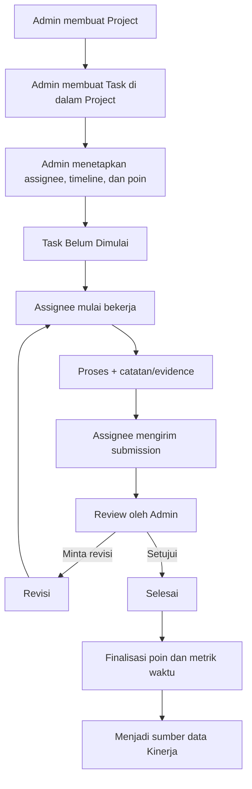

# Vorce — Rancangan Improvement Fitur Tugas

> **Jenis dokumen:** Rancangan implementasi lintas Backend, Frontend, dan UI/UX  
> **Status:** Draft perancangan untuk review tim  
> **Fokus saat ini:** Fondasi Project → Task → Assignment → Evidence → Approval → Poin  
> **Bukan fokus implementasi saat ini:** Perhitungan slip gaji dan sistem kompensasi freelance secara penuh

---

## 1. Ringkasan Eksekutif

Fitur Tugas Vorce perlu berkembang dari daftar tugas sederhana menjadi fondasi penugasan yang dapat digunakan oleh berbagai jenis hubungan kerja di perusahaan: karyawan tetap, karyawan kontrak, pekerja harian, maupun freelancer. Jenis hubungan kerja tetap dikelola oleh modul **Management Karyawan**; fitur Tugas cukup membutuhkan identitas pekerja yang valid dan catatan penugasannya.

Struktur target yang direkomendasikan:

```text
Company
└── Project
    ├── Informasi project dan timeline
    ├── Nilai/anggaran project (khusus admin)
    └── Tasks
        ├── Task details, timeline, dan poin dasar
        ├── Assignments (siapa mengerjakan dan kontribusinya)
        ├── Evidence/submissions
        ├── Activity history
        └── Review dan hasil poin
```

Prinsip penting:

1. **Project dan Task merupakan entitas berbeda.** Satu project dapat memiliki banyak task. Task baru wajib dibuat di dalam project.
2. **Nilai finansial project bukan poin kinerja.** Nilai kontrak/anggaran hanya dapat dibaca admin dan tidak dikirim dalam response untuk karyawan.
3. **Poin adalah indikator kontribusi/kinerja, bukan uang.** Karyawan tetap dapat menerima gaji bulanan tanpa bergantung langsung pada poin task.
4. **Poin hanya difinalisasi setelah hasil kerja disetujui.** Bukti kerja, komentar, revisi, dan waktu penyerahan harus dapat ditelusuri.
5. **Assignment perlu mencatat tiap pekerja secara individual.** Jangan mengandalkan array email saja untuk seluruh status/progres jika satu task dapat dikerjakan beberapa orang.
6. **Riwayat tidak dihapus saat pekerja keluar.** Status hubungan kerja diurus oleh Management Karyawan; histori task dan kontribusi tetap disimpan.
7. **Perubahan API harus kompatibel dengan task lama.** Data lama tidak boleh diberi project atau poin fiktif hanya supaya tampak seragam.

## 2. Tujuan dan Batasan

### 2.1 Tujuan

- Membuat dan mengelola project yang berisi beberapa task.
- Mengelola timeline project dan task: tanggal mulai, deadline, waktu submit, waktu persetujuan, dan tanggal selesai.
- Mendukung penugasan kepada satu atau beberapa pekerja.
- Mendukung bukti pengerjaan dalam bentuk laporan teks dan file/foto.
- Memisahkan status pengerjaan dari status review/persetujuan.
- Mencatat poin task dan hasil poin per assignee setelah review disetujui.
- Mencatat indikator waktu penyelesaian agar nantinya dapat diolah menjadi kinerja.
- Menjaga data project finansial hanya dapat diakses admin.
- Menjaga riwayat penugasan tetap tersedia setelah pekerja resign/terminated.
- Menjadi sumber data yang konsisten untuk fase Kinerja dan Slip Gaji berikutnya.

### 2.2 Di luar scope fase ini

- Menghitung gaji bulanan, PPh 21, BPJS, potongan, atau slip gaji.
- Mengubah poin menjadi rupiah secara otomatis.
- Membayar freelancer atau mengintegrasikan payment gateway.
- Membangun ulang seluruh modul Management Karyawan.
- Membuat sistem timesheet/jam kerja penuh.
- Menggunakan poin task sebagai satu-satunya penilaian karyawan.

## 3. Kondisi Backend Saat Ini (As-Is)

Berdasarkan hasil penelusuran `functions/routes/tugas.js`, `docs/routes/tugas.md`, `functions/helper/employeeService.js`, dan `functions/routes/company.js` yang tersedia pada analisis saat ini.

### 3.1 Tugas

- Route dipasang pada prefix `/api/tugas`.
- Data tersimpan di `companies/{idCompany}/tasks/{taskId}`.
- Task menyimpan `assignedTo`, `assignedToName`, dan `assignedToPhoto` sebagai array.
- Data tugas menyimpan `description`, `status`, `statusCode`, `attachments`, `deadline`, `finishedAt`, `createdAt`, dan `updatedAt`.
- Implementasi create saat ini belum menyimpan field `title` dan `priority`, padahal dokumentasi/helper mengasumsikannya.
- Task belum memiliki `projectId`, poin, tanggal mulai terencana, atau model assignment per pekerja.
- `attachments` disimpan sebagai array di satu dokumen task.
- `GET /api/tugas/list` mengambil seluruh task di company; berdasarkan ringkasan kode, hasilnya belum difilter untuk karyawan berdasarkan assignee.
- `POST /api/tugas/add-attachment` perlu memvalidasi bahwa pemanggil adalah admin atau assignee dari task.
- Proses create mencari setiap pengguna secara berurutan di dalam loop; ini berpotensi menjadi bottleneck untuk penugasan banyak orang.

### 3.2 Status sekarang

| Status sekarang | Makna aktual menurut backend | Masalah |
|---|---|---|
| `Proses` | Task sedang dikerjakan | Cukup jelas, tetapi perlu distandardisasi |
| `Tunda` | Task diserahkan untuk menunggu review admin | Label membingungkan; tidak berarti ditunda |
| `Selesai` | Task disetujui/ditutup | Perlu dipisahkan dari waktu submit dan approval |

### 3.3 Management Karyawan

- Profil global berada pada `users/{email}`.
- Catatan HR perusahaan berada pada `companies/{companyId}/employees/{email}`.
- Data employee tetap disimpan saat offboarding, sementara akses perusahaan pada profil global dilepas.
- Ada endpoint daftar dan detail employee, termasuk agregasi ringkas task.

Konsekuensi desain: sistem tugas tidak boleh bergantung pada asumsi bahwa orang yang pernah mengerjakan task akan selalu berstatus aktif. Pekerja aktif boleh menerima assignment baru; rekam jejak assignment lama tetap dapat dibaca sesuai hak akses.

## 4. Keputusan Desain yang Direkomendasikan

### 4.1 Project wajib untuk task baru

- Alur pembuatan task dimulai dari project yang sudah dibuat atau dibuat terlebih dahulu melalui alur yang jelas.
- Setiap task baru wajib memiliki `projectId`.
- Satu project dapat memiliki banyak task.
- Project tidak langsung dihapus apabila sudah memiliki task atau histori; gunakan status `archived`.
- Task lama tanpa `projectId` tetap dapat dilihat pada grup **Tugas Sebelumnya / Tanpa Project**, sampai dimigrasikan secara eksplisit atau selesai.

### 4.2 Data finansial dipisahkan dari data operasional project

Data nama, deskripsi, timeline, status, penanggung jawab, dan progres project dapat digunakan untuk operasional penugasan. Nilai kontrak/anggaran merupakan data privat admin.

Rekomendasi: simpan informasi finansial di dokumen/koleksi terpisah, misalnya:

```text
companies/{companyId}/projects/{projectId}
companies/{companyId}/projectFinances/{projectId}  // admin-only melalui API
```

Dengan pemisahan ini, response project yang diterima karyawan tidak perlu membawa nominal finansial sama sekali. Menyembunyikan teks nominal di UI saja **tidak cukup** sebagai kontrol akses.

### 4.3 Poin terpisah dari uang

- `basePoints` adalah bobot task yang ditentukan admin.
- Poin bukan nilai kontrak, bukan tarif per jam, dan bukan nominal gaji.
- Karyawan yang menerima gaji tetap tetap dapat mempunyai poin task untuk mengukur kontribusi.
- Jangan membuat asumsi `1 poin = nominal rupiah` pada fase ini.
- Nilai kompensasi task/freelance bukan bagian wajib model inti saat ini. Bila dibutuhkan kemudian, desain kompensasi dibuat terpisah dan tidak dicampur dengan `basePoints`.

### 4.4 Poin percepatan: siap didukung, tetapi bonus default nonaktif

Pengerjaan lebih cepat dapat menjadi salah satu indikator. Namun, pemberian bonus otomatis berdasarkan kecepatan berisiko mendorong pekerja mengirim hasil yang belum berkualitas atau menimbulkan ketidakadilan pada task yang tingkat kesulitannya berbeda.

Rekomendasi untuk fase fondasi:

- Selalu simpan waktu mulai terencana, deadline, waktu submit, jumlah revisi, dan waktu approval.
- Task memiliki `basePoints`.
- Opsional, admin dapat menentukan `earlyCompletionBonusPct` dengan default `0` (nonaktif). Nilai ini adalah **batas persentase bonus maksimum**, bukan poin yang langsung diberikan.
- Bonus hanya dihitung ketika submission yang akhirnya disetujui telah dipilih; poin tidak diberikan saat karyawan sekadar menekan tombol submit.
- Gunakan waktu submission yang disetujui, bukan waktu admin menekan approve, supaya keterlambatan review admin tidak merugikan pekerja.
- Jika task melalui revisi, waktu yang dipakai adalah waktu submission final yang diterima. Riwayat submission sebelumnya tetap tersimpan.
- Perubahan deadline atau aturan poin setelah task mulai dikerjakan harus diaudit. Jangan mengubah hasil poin historis secara diam-diam.

Formula konseptual jika bonus diaktifkan:

```text
plannedWindow = deadline - plannedStartAt
remainingRatio = clamp((deadline - acceptedSubmittedAt) / plannedWindow, 0, 1)
speedBonusPoints = round(basePoints * (earlyCompletionBonusPct / 100) * remainingRatio)
finalPoints = basePointsAwarded + speedBonusPoints
```

Contoh: `basePoints = 20`, bonus maksimum `20%`, dan submission yang akhirnya disetujui dikirim ketika 50% dari rentang waktu terencana masih tersisa. Bonusnya `20 × 20% × 50% = 2`, sehingga total menjadi 22 poin.

Catatan:
- Bonus `0%` berarti tidak ada bonus percepatan, tetapi data timeline tetap dapat dipakai untuk evaluasi kinerja.
- `plannedStartAt` dan `deadline` harus divalidasi (`plannedStartAt < deadline`). Jika rentang waktunya tidak valid atau tidak tersedia, bonus tidak dihitung.
- Jika submission final melewati deadline, bonus percepatan adalah nol; data keterlambatan tetap dicatat.
- Formula ini perlu disetujui sebagai aturan bisnis sebelum FE/BE mengaktifkan bonus. Jangan jadikan bonus sebagai satu-satunya penentu karyawan rajin.
- Jika task dikerjakan oleh banyak orang, nilai poin harus dialokasikan per assignment secara eksplisit agar setiap orang tidak otomatis memperoleh poin penuh yang sama.

### 4.5 Multi-assignment harus mencatat progres secara individual

Data lama menggunakan array `assignedTo`. Untuk fondasi baru, rekomendasinya adalah membuat dokumen assignment tersendiri untuk setiap orang. Dengan begitu, setiap orang dapat memiliki status, waktu mulai, submission, approval, dan perolehan poin sendiri.

Untuk task yang ditugaskan ke beberapa orang:

- `basePoints` adalah bobot total task.
- Admin menentukan pembagian poin per assignee, baik secara persentase maupun poin alokasi.
- Total alokasi harus sama dengan 100% (atau total poin task), tidak boleh melebihi nilai task.
- UI harus memperlihatkan pembagian tersebut sebelum task diterbitkan.
- Bila produk memutuskan bahwa seluruh anggota mendapat poin penuh yang sama, keputusan itu harus dinyatakan sebagai kebijakan eksplisit, bukan efek samping dari array `assignedTo`.

Pilihan paling sederhana untuk UI awal adalah pembagian rata otomatis yang dapat diperiksa admin; pembagian custom dapat disediakan bila memang diperlukan.

## 5. Model Data Target (To-Be)

Nama field di bawah merupakan usulan kontrak data, bukan klaim bahwa field ini sudah ada di repository. Sebelum coding, sesuaikan dengan standar naming yang digunakan pada project.

### 5.1 Project operasional

Path:

```text
companies/{companyId}/projects/{projectId}
```

Field yang disarankan:

| Field | Tipe | Catatan |
|---|---|---|
| `companyId` | string | Company pemilik project; ditentukan dari token/server |
| `title` | string | Wajib |
| `description` | string | Opsional |
| `status` | enum | `Draft`, `Active`, `OnHold`, `Completed`, `Archived` |
| `projectManagerEmail` | string/null | PIC project |
| `plannedStartAt` | Timestamp/null | Tanggal mulai rencana |
| `deadline` | Timestamp/null | Deadline project |
| `createdBy` | string | Email/ID admin pembuat dari token |
| `createdAt` | Timestamp | Server timestamp |
| `updatedAt` | Timestamp | Server timestamp |
| `completedAt` | Timestamp/null | Waktu project ditandai selesai |
| `archivedAt` | Timestamp/null | Waktu project diarsipkan |

Field finansial **tidak** disimpan pada dokumen yang dikirim ke karyawan.

### 5.2 Finansial project — admin-only

Path usulan:

```text
companies/{companyId}/projectFinances/{projectId}
```

| Field | Tipe | Catatan |
|---|---|---|
| `projectId` | string | Referensi project |
| `projectValue` | number/null | Nilai kontrak/nilai project, bila ada |
| `budgetAmount` | number/null | Anggaran internal, bila ada |
| `currency` | string | Default `IDR` untuk penggunaan rupiah |
| `notes` | string/null | Catatan finansial internal |
| `updatedBy` | string | Admin yang memperbarui |
| `updatedAt` | Timestamp | Waktu pembaruan |

`projectValue` dan `budgetAmount` memiliki makna berbeda. Nilai kontrak tidak otomatis sama dengan anggaran internal. Field bisa null karena tidak semua project memiliki kontrak atau anggaran formal.

### 5.3 Task

Path tetap kompatibel dengan struktur sekarang:

```text
companies/{companyId}/tasks/{taskId}
```

Field target yang disarankan:

| Field | Tipe | Catatan |
|---|---|---|
| `companyId` | string | Company dari konteks server |
| `projectId` | string/null | Wajib pada task baru; null hanya untuk legacy |
| `title` | string | Wajib pada task baru |
| `description` | string | Detail instruksi dan kriteria selesai |
| `priority` | enum | Contoh: `Low`, `Medium`, `High`, `Urgent` |
| `status` | enum | Status task agregat |
| `plannedStartAt` | Timestamp/null | Mulai terencana |
| `deadline` | Timestamp/null | Boleh null hanya bila policy perusahaan mengizinkan |
| `basePoints` | number/null | Poin dasar; legacy tetap null/tidak dikonfigurasi |
| `earlyCompletionBonusPct` | number | Default `0`; dibatasi rentang yang ditetapkan produk |
| `createdBy` | string | Diambil dari token |
| `createdAt` | Timestamp | Server timestamp |
| `updatedAt` | Timestamp | Server timestamp |
| `completedAt` | Timestamp/null | Saat seluruh assignment yang diwajibkan selesai/diterima |
| `cancelledAt` | Timestamp/null | Saat dibatalkan |
| `schemaVersion` | number | Opsional; membantu pembacaan legacy vs skema baru |
| `legacy` | boolean | Hanya untuk menandai data lama bila diperlukan |

Field `assignedTo`, `assignedToName`, `assignedToPhoto`, dan `attachments` tetap dapat dibaca sebagai field legacy selama masa kompatibilitas. Jangan menjadikannya sumber utama untuk assignment baru setelah skema baru aktif.

### 5.4 Assignment per pekerja

Path usulan:

```text
companies/{companyId}/tasks/{taskId}/assignments/{assignmentId}
```

Gunakan ID yang stabil/aman untuk assignment; hindari asumsi bahwa email selalu merupakan identitas permanen. Field `userEmail` tetap boleh disimpan untuk kompatibilitas dan tampilan.

| Field | Tipe | Catatan |
|---|---|---|
| `userEmail` | string | Pekerja yang ditugaskan |
| `assignedBy` | string | Admin yang menugaskan |
| `assignedAt` | Timestamp | Waktu penugasan |
| `status` | enum | Status individual assignment |
| `plannedStartAt` | Timestamp/null | Snapshot waktu mulai yang berlaku untuk assignment |
| `deadline` | Timestamp/null | Snapshot deadline saat ditugaskan; revisi harus diaudit |
| `pointSharePct` | number | Persentase alokasi poin; total antar-assignee harus 100% |
| `basePointsSnapshot` | number/null | Bobot poin saat task ditugaskan |
| `earlyCompletionBonusPctSnapshot` | number | Aturan bonus saat assignment dibuat |
| `startedAt` | Timestamp/null | Waktu pekerja mulai |
| `latestSubmittedAt` | Timestamp/null | Submission terbaru |
| `acceptedSubmissionId` | string/null | Submission yang akhirnya disetujui |
| `approvedAt` | Timestamp/null | Waktu review admin |
| `basePointsAwarded` | number/null | Diisi ketika disetujui |
| `speedBonusPoints` | number/null | Diisi ketika disetujui; nol jika tidak berlaku |
| `finalPoints` | number/null | Nilai final untuk perhitungan kinerja |
| `revisionCount` | number | Default 0 |
| `createdAt` | Timestamp | Waktu dokumen dibuat |
| `updatedAt` | Timestamp | Waktu pembaruan |

Saat nilai task/alokasi berubah setelah assignment berjalan, sistem harus menetapkan kebijakan perubahan: perubahan nilai memerlukan persetujuan dan audit log; snapshot untuk assignment yang sudah selesai tidak boleh dihitung ulang diam-diam.

### 5.5 Submission/evidence

Path usulan:

```text
companies/{companyId}/tasks/{taskId}/submissions/{submissionId}
```

Field yang disarankan:

- `assignmentId`, `submittedBy`, `submittedAt`
- `reportText` atau `summary`
- `evidence`: daftar referensi file/metadata yang tervalidasi oleh backend
- `version` atau nomor urut submission
- `status`: `Submitted`, `RevisionRequested`, `Accepted`
- `reviewedBy`, `reviewedAt`, `reviewComment`

Setiap submit ulang membuat submission baru. Jangan menimpa bukti submission sebelumnya; ini menjaga jejak revisi dan penentuan submission yang disetujui.

### 5.6 Aktivitas dan audit

Path usulan:

```text
companies/{companyId}/tasks/{taskId}/activities/{activityId}
```

Catat aktivitas penting seperti task dibuat, assignment berubah, task mulai, submission dikirim, revisi diminta, submission disetujui, deadline/poin diubah, task dibatalkan, dan project diarsipkan. Aktivitas komentar dapat menggunakan struktur ini atau subkoleksi komentar terpisah jika volume membutuhkannya.

Migrasi aktivitas/evidence ke subkoleksi secara bertahap dapat mengurangi pertumbuhan dokumen task yang saat ini menyimpan array `attachments`. Data attachment legacy tetap harus dapat dibaca selama masa transisi.

## 6. Lifecycle dan Status

### 6.1 Status Project

- `Draft`: project sedang disiapkan dan belum dibuka untuk pengerjaan.
- `Active`: project berjalan.
- `OnHold`: project dihentikan sementara; tidak otomatis menghapus atau menutup task.
- `Completed`: pekerjaan project telah ditandai selesai oleh admin.
- `Archived`: project tidak lagi aktif, tetapi riwayat tetap dapat dilihat sesuai akses.

### 6.2 Status Task

| Status target | Makna | Aksi utama |
|---|---|---|
| `Belum Dimulai` | Task sudah ditugaskan, belum dimulai | Assignee memulai task |
| `Proses` | Task sedang dikerjakan | Update progres, tambah bukti, submit |
| `Review` | Hasil dikirim dan menunggu pemeriksaan admin | Admin menyetujui atau meminta revisi |
| `Revisi` | Admin meminta perbaikan | Assignee memperbaiki dan submit versi baru |
| `Selesai` | Hasil sudah disetujui | Tidak bisa diedit sembarangan; histori tetap tersedia |
| `Dibatalkan` | Task tidak jadi dilanjutkan | Admin membatalkan dengan alasan |

Jika nanti diperlukan status `Ditunda`, status tersebut harus berarti pekerjaan ditahan sementara dan berbeda dari `Review`. Jangan menggunakan satu status untuk dua makna.

### 6.3 Alur target



### 6.4 Banyak assignee

Status keseluruhan task perlu dihitung dari assignment, bukan dari satu tombol status yang dipakai seluruh anggota:

- `Belum Dimulai`: belum ada assignment yang mulai.
- `Proses`: setidaknya ada assignment yang masih berjalan.
- `Review`: semua assignment yang diwajibkan telah submit dan menunggu review.
- `Revisi`: setidaknya ada assignment yang memerlukan revisi.
- `Selesai`: semua assignment wajib telah disetujui.

Aturan agregasi final harus konsisten di backend. FE boleh menampilkan hasil agregasi, tetapi jangan menjadi satu-satunya tempat logika status disimpan.

## 7. Rancangan Backend (BE)

### 7.1 Endpoint project yang disarankan

Kontrak endpoint final perlu mengikuti konvensi error response, autentikasi, dan penamaan yang sudah digunakan API Vorce. Path berikut merupakan usulan:

| Method & endpoint | Fungsi | Akses |
|---|---|---|
| `POST /api/projects` | Buat project | Admin |
| `GET /api/projects` | Daftar project dengan filter/pagination | Admin: seluruh project; staff: project yang terkait dengan assignment-nya |
| `GET /api/projects/:projectId` | Detail project operasional | Admin; staff jika memiliki akses melalui assignment |
| `PATCH /api/projects/:projectId` | Edit detail/status project | Admin |
| `GET /api/projects/:projectId/finance` | Baca nilai/anggaran project | Admin saja |
| `PATCH /api/projects/:projectId/finance` | Edit nilai/anggaran project | Admin saja |

Jika struktur API saat ini mengharuskan route di `company.js`, route project dapat ditempatkan di modul yang konsisten dengan pola repository. Hindari menduplikasi business logic di beberapa route.

### 7.2 Endpoint task yang disarankan

| Method & endpoint | Fungsi | Akses |
|---|---|---|
| `POST /api/tugas/create` | Buat task di project | Admin; `projectId` wajib untuk task baru |
| `GET /api/tugas/list` | Daftar task dengan filter project/status/assignee | Admin: sesuai company; staff: hanya task yang ditugaskan kepadanya |
| `GET /api/tugas/:taskId` | Detail task beserta assignment dan status akses | Admin atau assignee terkait |
| `PATCH /api/tugas/:taskId` | Edit metadata task | Admin; field tertentu dikunci setelah mulai |
| `POST /api/tugas/:taskId/start` | Mulai assignment | Assignee yang sesuai |
| `POST /api/tugas/:taskId/submit` | Kirim laporan dan evidence untuk review | Assignee yang sesuai |
| `POST /api/tugas/:taskId/review` | Approve atau minta revisi | Admin |
| `POST /api/tugas/:taskId/activities` | Tambah komentar/aktivitas | Admin atau assignee yang berhak |
| `DELETE /api/tugas/delete/:taskId` | Pertahankan hanya untuk task draft yang aman dihapus; selain itu gunakan cancel/archive | Admin |

Endpoint lama seperti `POST /api/tugas/update-status` dan `POST /api/tugas/add-attachment` dapat dipertahankan sebagai wrapper kompatibilitas sementara. Semua jalur lama tetap wajib melewati validasi izin yang sama.

### 7.3 Validasi wajib pada backend

1. Ambil `companyId`, email/uid, dan role dari token/session server. Jangan mempercayai `companyId` dari body untuk menentukan ruang data.
2. Pastikan project yang dirujuk benar-benar berada di company yang sama.
3. Saat assign, validasi pekerja berasal dari company yang benar dan layak menerima penugasan baru. Periksa dokumen HR dan status aktif yang relevan, bukan hanya keberadaan akun global.
4. Karyawan hanya boleh membaca task yang ditugaskan kepadanya. Detail evidence, aktivitas, dan submission mengikuti aturan akses yang sama.
5. `add-attachment`/activities/submission harus memvalidasi bahwa pemanggil adalah admin atau assignee terkait. Mengetahui `taskId` saja tidak boleh cukup.
6. Nilai finansial project hanya dapat dibaca/diubah admin dan tidak dimasukkan dalam response umum project/task untuk staff.
7. Review final dan pemberian poin hanya boleh dilakukan admin melalui backend.
8. Validasi poin: angka finite, tidak negatif, dan memiliki batas maksimum yang jelas; validasi pembagian poin pada multi-assignee.
9. Validasi timeline: jika kedua tanggal ada, `plannedStartAt < deadline`. Perubahan deadline setelah pengerjaan dimulai harus tercatat.
10. Jangan menghapus histori task atau employee ketika assignee resign/terminated.
11. Gunakan server timestamp untuk waktu yang memengaruhi audit dan perhitungan poin. Timestamp dari device tidak boleh menjadi satu-satunya sumber kebenaran.
12. Gunakan transaksi/batch jika perubahan status task memerlukan pembaruan beberapa assignment, task, submission, dan audit event secara konsisten.
13. Hindari query user satu per satu secara sekuensial saat menerima banyak assignee; gunakan batch read yang sesuai pola helper yang sudah tersedia.
14. Terapkan pagination/filter yang terkontrol agar daftar task/project tidak membaca seluruh koleksi tanpa batas pada skala besar.

### 7.4 Perbaikan keamanan dan bug yang harus masuk acceptance criteria

- [ ] `GET /api/tugas/list`: staff tidak dapat melihat task rekan kerja yang bukan assignment-nya.
- [ ] `POST /api/tugas/add-attachment`: hanya admin/assignee terkait yang dapat menambah komentar atau lampiran.
- [ ] Endpoint task detail dan submission menerapkan aturan akses yang sama dengan list.
- [ ] Endpoint finansial project tidak dapat diakses staff, termasuk saat memanggil API secara langsung.
- [ ] Endpoint update status tidak mengizinkan karyawan menyetujui task sendiri atau menetapkan `Selesai` tanpa review admin.
- [ ] Task milik company A tidak dapat dibaca/diedit lewat token company B.
- [ ] Setelah pekerja offboarding, assignment historis tetap ada, tetapi akses ke company/task baru mengikuti status dan hak akses saat itu.

### 7.5 Notifikasi

FCM belum menjadi syarat untuk menyelesaikan fondasi data, tetapi event berikut sebaiknya dirancang agar mudah ditambahkan:

- Task baru/assignment baru.
- Perubahan deadline atau task dibatalkan.
- Submission menunggu review.
- Admin meminta revisi.
- Submission disetujui.

Jika notifikasi ditambahkan pada fase ini, pastikan tidak mengirim nilai finansial project kepada karyawan. Kegagalan pengiriman notifikasi tidak boleh membatalkan penyimpanan task.

## 8. Rancangan Frontend (FE)

Asumsi UI utama menggunakan aplikasi Flutter Vorce; jika sebagian modul tugas saat ini berada pada client lain, struktur layar dan state tetap mengikuti prinsip yang sama.

### 8.1 Area Admin

**A. Halaman Daftar Project**

- Daftar project dengan nama, status, periode, PIC, progres task, dan deadline.
- Filter status dan pencarian.
- Tombol `Buat Project`.
- Indikator keterlambatan project jika deadline lewat dan belum selesai.
- Nominal nilai/anggaran hanya dirender untuk admin setelah mendapat response endpoint finansial yang terotorisasi.

**B. Form Buat/Edit Project**

- Nama project (wajib).
- Deskripsi/tujuan.
- PIC project.
- Tanggal mulai dan deadline.
- Status sesuai izin dan state transition.
- Bagian `Nilai Project & Anggaran` yang hanya tersedia untuk admin.
- Penjelasan visual bahwa nilai kontrak dan anggaran internal adalah dua angka berbeda.
- Validasi tanggal serta konfirmasi saat deadline diubah ketika task aktif sudah ada.

**C. Halaman Detail Project**

- Ringkasan project dan timeline.
- Progres project berdasarkan task.
- Daftar task, status, assignee, deadline, poin, dan indikator overdue.
- Aksi membuat task, membuka detail task, mengedit metadata, atau mengarsipkan project.
- Nilai/anggaran di panel admin terpisah dari ringkasan yang boleh ditampilkan pada staff.

**D. Form Buat/Edit Task**

- Judul (wajib) dan deskripsi/instruksi.
- Project tujuan (wajib; bila form dibuka dari detail project, terisi otomatis).
- Prioritas.
- Tanggal mulai terencana dan deadline.
- Poin dasar.
- Bonus percepatan maksimum dalam persen, default 0% dan diberi deskripsi bahwa bonus baru final setelah review disetujui.
- Pemilihan assignee dari daftar pekerja yang boleh menerima assignment.
- Jika beberapa assignee dipilih, tampilkan alokasi poin per orang dan pastikan total alokasi valid.
- Ringkasan sebelum menyimpan: jumlah assignee, timeline, poin, serta aturan bonus.

**E. Task Review**

- Laporan hasil dan evidence dipisah per assignment.
- Admin dapat preview/download bukti sesuai jenis file.
- Tombol `Setujui` dan `Minta Revisi` dengan alasan revisi.
- Konfirmasi nilai poin final sebelum approval bila kebijakan mengharuskannya.
- Tampilkan base points, bonus (jika aktif), serta perhitungan yang dapat dijelaskan.
- Catat siapa yang menyetujui dan kapan.

### 8.2 Area Karyawan/Assignee

**A. Tugas Saya**

- Hanya menampilkan task yang ditugaskan kepada pengguna.
- Filter berdasarkan status, project, dan deadline.
- Badge status: Belum Dimulai, Proses, Menunggu Review, Perlu Revisi, Selesai.
- Tampilkan poin task yang relevan dengan assignment pengguna; tidak menampilkan nilai/anggaran project.

**B. Detail Task**

- Judul, tujuan/instruksi, kriteria selesai, timeline, prioritas, dan nama project.
- Nama anggota lain pada task bila kebijakan perusahaan memperbolehkannya.
- Poin/alokasi pengguna dan ketentuan bonus yang berlaku.
- Riwayat aktivitas, komentar, serta status submission.
- Aksi `Mulai`, `Kirim untuk Review`, `Tambahkan Bukti`, atau `Perbaiki dan Kirim Ulang` sesuai status.
- Bukti dapat berupa laporan teks dan/atau file/foto sesuai kebijakan task.
- Setelah disetujui, hasil dan poin tampil sebagai data final read-only.

### 8.3 Kompatibilitas task lama

- Task yang tidak memiliki `projectId` ditampilkan di grup terpisah `Tugas Sebelumnya / Tanpa Project`.
- Jika task lama tidak memiliki judul, gunakan fallback tampilan dari field `title`, `judul`, atau ringkasan awal `description`; fallback UI tidak menggantikan migrasi data.
- Jika task lama tidak memiliki poin, tampilkan `Belum dinilai` alih-alih `0 poin`. Angka nol dapat disalahartikan sebagai hasil penilaian yang disengaja.
- Status legacy `Tunda` dapat ditampilkan sebagai `Menunggu Review` sesuai makna aktual di backend. Jangan tampilkan label `Tunda` untuk task legacy yang memang sedang menunggu approval.
- Lampiran lama dari field `attachments` tetap ditampilkan; task baru menggunakan API/subkoleksi baru.

### 8.4 State UI yang wajib ada

- Loading/skeleton.
- Empty state: belum ada project, project belum mempunyai task, atau pengguna belum memiliki assignment.
- Error state dengan opsi retry.
- Permission denied.
- Validasi form yang spesifik, bukan hanya snackbar generik.
- Konfirmasi untuk membatalkan task, mengarsipkan project, atau mengubah deadline yang berdampak.
- Pagination/load more jika daftar membesar.

## 9. Arahan UI/UX

### 9.1 Prinsip informasi

- Gunakan hirarki **Project → Task → Assignment** secara konsisten di navigasi, breadcrumb, dan detail.
- Tempatkan nama project sebagai konteks, judul task sebagai fokus, lalu status/deadline sebagai metadata utama.
- Bedakan informasi finansial admin dari informasi penugasan umum.
- Hindari menaruh seluruh detail project, assignee, evidence, komentar, timeline, dan poin dalam satu form panjang tanpa pengelompokan.

### 9.2 Label bahasa

| Label lama | Label yang direkomendasikan |
|---|---|
| `Tunda` (ketika menunggu approval) | `Menunggu Review` |
| Perubahan status kembali ke `Proses` setelah review | `Perlu Revisi` lalu `Proses` saat pengerjaan dilanjutkan |
| `Selesai` sebelum review | Jangan digunakan; gunakan `Menunggu Review` |
| Task tanpa judul | Tampilkan fallback sementara dan tandai sebagai task lama |

### 9.3 Timeline dan overdue

- Tampilkan tanggal mulai dan deadline dengan zona waktu lokal yang konsisten.
- Beri indikator terlambat jika deadline berlalu dan assignment/task belum disetujui selesai.
- Bedakan `terlambat submit` dari `menunggu review admin`; approval yang terlambat karena admin bukan keterlambatan pekerja.
- Jika deadline berubah, tampilkan riwayat perubahan pada aktivitas task.

### 9.4 Poin

- Selalu tampilkan `Poin dasar` secara terpisah dari `Bonus percepatan`.
- Bila bonus nonaktif, jangan menampilkan janji bahwa poin otomatis bertambah karena cepat.
- Jika bonus aktif, jelaskan maksimum bonus dan statusnya (perkiraan vs final).
- Poin final hanya menjadi angka resmi setelah hasil disetujui.
- Jangan menjadikan badge poin sebagai indikator tunggal produktivitas; data ini nantinya digabung dengan kualitas hasil, revisi, konsistensi, dan konteks pekerjaan di fitur Kinerja.

## 10. Rancangan Perhitungan Waktu dan Poin

### 10.1 Metrik yang sebaiknya direkam sejak awal

Per assignment:

- `assignedAt`
- `plannedStartAt`
- `deadline`
- `startedAt`
- `latestSubmittedAt`
- waktu submission yang disetujui
- `approvedAt`
- `revisionCount`
- status akhir
- poin dasar dan poin final

Metrik turunan:

- Durasi dari waktu mulai aktual hingga submission yang disetujui.
- Sisa waktu menuju deadline pada submission yang disetujui.
- Apakah submit tepat waktu.
- Selisih waktu dari deadline (jika terlambat).
- Jumlah revisi.
- Bonus percepatan, jika policy aktif.

### 10.2 Apa yang tidak boleh dilakukan

- Jangan memberi bonus hanya karena karyawan lebih cepat menekan tombol `Selesai` tanpa review.
- Jangan memakai waktu approval admin untuk mengukur kecepatan pekerja.
- Jangan mengubah poin historis ketika deadline atau aturan poin diedit setelahnya.
- Jangan memberi seluruh poin task kepada semua assignee secara tidak sengaja.
- Jangan menyimpulkan `task selesai` sama dengan `kompensasi sudah dibayarkan`.

## 11. Strategi Migrasi dan Kompatibilitas

Migrasi perlu dilakukan bertahap karena data lama masih digunakan aplikasi dan memiliki bentuk yang berbeda dari target.

### Tahap A — Backend kompatibel

1. Tambahkan pembacaan model baru tanpa menghilangkan dukungan terhadap field legacy.
2. Buat route project dan route akses finansial admin.
3. Perbaiki otorisasi list dan attachment sebelum memperluas akses data.
4. Tambahkan dukungan `title`, `projectId`, timeline, poin, dan assignment baru pada API.
5. Untuk task baru, server mewajibkan `projectId` setelah FE siap mengirimkannya.
6. Pertahankan route lama sebagai wrapper sementara agar versi app lama tidak langsung rusak.

### Tahap B — Frontend

1. Rilis daftar project dan form project.
2. Rilis form task baru dari dalam project.
3. Rilis detail task, assignment, evidence/submission, dan review.
4. Pastikan FE tidak menganggap field finance selalu tersedia pada response umum.
5. Tambahkan penanganan task legacy tanpa memaksa data lama berubah di sisi client.

### Tahap C — Backfill opsional dan terukur

- Jalankan script backfill dalam mode dry-run terlebih dahulu.
- Untuk task historis, jangan mengarang `basePoints`, nilai project, tanggal mulai, atau bukti yang tidak ada.
- Task lama dapat tetap tanpa project dan poin, atau dimigrasikan melalui keputusan bisnis terpisah.
- Bila membuat assignment documents dari array `assignedTo` lama, pastikan script idempotent dan tidak menggandakan assignment ketika dijalankan ulang.
- Pertahankan array lama sementara sebagai fallback baca; hentikan penulisan ke field lama hanya setelah versi FE yang relevan sudah menggunakan struktur baru.
- Log jumlah dokumen berhasil, dilewati, dan gagal; siapkan prosedur rollback.

### Tahap D — Penghentian field/endpoint legacy

Hanya dilakukan setelah monitoring memastikan seluruh client yang didukung tidak memerlukan bentuk lama. Buat rencana deprecation terpisah; jangan menghapus data legacy sebagai bagian dari rilis UI.

## 12. Urutan Implementasi yang Disarankan

### P0 — Keamanan dan kontrak data

- Perbaiki filter list staff.
- Perbaiki otorisasi add-attachment dan detail task.
- Standardisasi aturan akses berbasis company dan role.
- Sepakati enum status target dan kontrak error response.

### P1 — Project

- Model project operasional.
- Model finansial project admin-only.
- Endpoint project dan finance.
- UI daftar, form, dan detail project.

### P2 — Task baru dalam project

- Field judul, prioritas, timeline, dan projectId.
- Status task yang jelas.
- Form task dari project.
- Dukungan task legacy di UI.

### P3 — Assignment dan bukti pengerjaan

- Assignment individual dan alokasi poin.
- Submission/evidence serta aktivitas terpisah.
- Submit, review, revisi, dan approval.
- Poin final hanya setelah approval.

### P4 — Poin percepatan dan kesiapan Kinerja

- Rekam seluruh timestamp dan revision count.
- Mulai dengan bonus percepatan default `0%`.
- Aktifkan bonus hanya setelah aturan bisnis dan UX disetujui.
- Pastikan hasil poin final/snapshot dapat dibaca oleh modul Kinerja.

Urutan ini sengaja mendahulukan keamanan dan data sebelum memperindah UI. Tidak semua P0–P4 harus dirilis bersamaan; namun dependency dan kontrak API perlu disepakati sebelum implementasi FE dimulai.

## 13. Kriteria Penerimaan (Acceptance Criteria)

### Project

- [ ] Admin dapat membuat, melihat, mengedit, dan mengarsipkan project.
- [ ] Project memiliki status, PIC, timeline, dan daftar task.
- [ ] Task baru tidak dapat dibuat tanpa project yang valid dari company yang sama.
- [ ] Project yang telah memiliki histori tidak dihapus secara fisik melalui alur normal.
- [ ] Staff hanya dapat melihat project yang terkait dengan assignment yang boleh diaksesnya.
- [ ] Nominal project/anggaran tidak terkandung pada response project umum untuk staff.
- [ ] Endpoint finance menolak request non-admin.

### Task dan assignment

- [ ] Task baru mempunyai judul, project, instruksi, status, timeline, dan poin dasar.
- [ ] Admin dapat menugaskan task kepada satu atau beberapa pekerja yang valid.
- [ ] Sistem menyimpan status/time/submission per assignee, bukan hanya mengandalkan array email.
- [ ] Pembagian poin multi-assignee tervalidasi dan terlihat sebelum penugasan diterbitkan.
- [ ] Task detail/list menerapkan permission yang sama.
- [ ] Perubahan penting memiliki histori/audit.

### Evidence dan review

- [ ] Assignee dapat mengirim laporan teks dan bukti file/foto sesuai policy.
- [ ] Setiap submission ulang tersimpan sebagai versi baru.
- [ ] Admin dapat menyetujui atau meminta revisi dengan catatan.
- [ ] Task tidak menjadi `Selesai` hanya karena karyawan mengirim hasil.
- [ ] Poin final diberikan hanya setelah submission disetujui.
- [ ] Evidence dan aktivitas baru tidak terus memperbesar satu dokumen task tanpa batas.

### Poin dan timeline

- [ ] Task tanpa poin historis tampil sebagai `Belum dinilai`, bukan `0 poin`.
- [ ] Sistem merekam waktu submit dan approval secara terpisah.
- [ ] Perhitungan bonus (jika aktif) memakai submission yang disetujui, tidak memakai waktu approval admin.
- [ ] Bonus percepatan default nonaktif sampai policy ditetapkan.
- [ ] Editing deadline atau poin setelah task berjalan tidak mengubah hasil historis tanpa audit.
- [ ] Perolehan poin dapat diambil sebagai input modul Kinerja tanpa membaca/menebak dari teks deskripsi.

### Data lama dan offboarding

- [ ] Task lama tetap dapat ditampilkan meskipun tidak memiliki project/title/points.
- [ ] Status legacy `Tunda` ditangani sebagai status review sesuai makna yang saat ini diimplementasikan.
- [ ] Lampiran lama tetap dapat dibuka selama masa kompatibilitas.
- [ ] Resign/termination tidak menghapus task, submission, atau assignment historis.
- [ ] Script migrasi aman dijalankan ulang dan menghasilkan laporan dry-run.

## 14. Test Plan Minimum

1. Admin membuat project dan task; staff tidak dapat membaca nominal project.
2. Staff A mencoba membuka task milik Staff B menggunakan URL/taskId langsung; hasil harus `403` atau `404` sesuai standar API.
3. Staff A mencoba menambahkan attachment ke task Staff B; request ditolak.
4. Task dengan dua assignee: masing-masing hanya mengubah status/submission assignment yang menjadi haknya.
5. Admin meminta revisi; submission lama tetap ada dan assignment kembali dapat dikerjakan.
6. Submission final disetujui; poin dasar/bonus final tersimpan satu kali dan tidak terhitung ganda jika endpoint approval terpanggil ulang.
7. Waktu approval admin terlambat, tetapi submission dikirim sebelum deadline; status ketepatan waktu tetap berdasarkan submission yang disetujui.
8. Deadline diubah setelah task berjalan; aktivitas perubahan tercatat dan perhitungan historis tidak berubah diam-diam.
9. Karyawan di-offboard; assignment lama masih bisa dilihat admin pada histori, tetapi pekerja tidak otomatis mendapat akses ke data company setelah aksesnya dicabut.
10. Task lama tanpa `title`, `projectId`, dan `basePoints` tetap tampil tanpa merusak halaman daftar/detail.
11. Backfill dijalankan dua kali; tidak terbentuk assignment atau aktivitas duplikat.
12. Project dari company lain dikirim sebagai `projectId`; backend menolak pembuatan task.

## 15. Dependency ke Fitur Berikutnya

### Kinerja

Fitur Kinerja dapat menggunakan data task yang sudah disetujui, poin final, jumlah revisi, ketepatan waktu, dan konteks assignment. Penilaian tidak sebaiknya hanya menjumlahkan poin; kualitas hasil, jenis pekerjaan, tingkat kesulitan, dan konteks penugasan juga perlu dipertimbangkan.

### Slip Gaji

Fitur Tugas tidak menetapkan bahwa poin adalah uang. Modul slip gaji kelak harus menggabungkan sumber terpisah sesuai kebijakan perusahaan: gaji tetap, tunjangan, potongan, bonus/insentif, dan—bila kelak diputuskan—kompensasi freelance. Hasil task dapat menjadi salah satu sumber data, bukan kalkulator gaji itu sendiri.

### Management Karyawan

Management Karyawan tetap menjadi sumber data hubungan kerja, status aktif, jabatan, dan riwayat offboarding. Project/Task merujuk pekerja yang mengerjakan pekerjaan; modul ini tidak perlu mengulang status kontrak atau menyimpan salinan profil HR lengkap. Pada assignment, simpan snapshot identitas minimum yang diperlukan untuk menjaga histori bila nama/jabatan berubah.

## 16. Hal yang Harus Diputuskan Sebelum Coding

Keputusan produk berikut perlu disepakati tim. Default rekomendasi di kolom kanan dapat dipakai agar implementasi tidak menunggu terlalu lama.

| Keputusan | Default yang disarankan |
|---|---|
| Apakah seluruh task baru harus masuk project? | Ya; projectId wajib untuk task baru |
| Apakah task lama langsung dimigrasi ke project? | Tidak otomatis; tampilkan di grup legacy sampai ada keputusan terpisah |
| Siapa yang dapat melihat nilai project? | Admin saja; pisahkan dokumen finance dan route API |
| Apakah poin adalah uang? | Tidak |
| Apakah poin task langsung final saat submit? | Tidak; final setelah approval |
| Apakah bonus percepatan langsung aktif? | Tidak; default 0%, metrik waktu tetap direkam |
| Multi-assignee mendapat poin penuh masing-masing? | Tidak secara implisit; wajib ada alokasi poin yang terlihat dan tervalidasi |
| Apakah `Tunda` tetap menjadi status review? | Tidak pada skema baru; gunakan `Review`, dan sediakan status `Ditunda` terpisah hanya bila diperlukan |
| Apakah bukti/komentar tetap ditaruh dalam array task? | Untuk skema baru gunakan subkoleksi; field array lama tetap dibaca sementara |
| Apakah task lama dihapus ketika pekerja keluar? | Tidak; histori tetap disimpan |
| Apakah task yang selesai bisa dihapus permanen? | Secara normal tidak; gunakan arsip atau pembatalan dengan histori |

## 17. Ringkasan Tanggung Jawab Tim

| Area | Tanggung jawab utama |
|---|---|
| **BE** | Skema project/task/assignment, API, validasi, permission, status transition, audit log, penyimpanan evidence, point snapshot, migrasi kompatibel, test keamanan |
| **FE** | Navigasi Project → Task, daftar/form/detail, filter/status, upload evidence, submission, revisi, review UI admin, pemisahan finance, state loading/error/empty, kompatibilitas task lama |
| **UI/UX** | Information architecture, user flow admin dan assignee, wireframe list/detail/form/review, hierarchy timeline/status/poin, finance visibility, state/error/empty, aturan multi-assignee dan penjelasan bonus |
| **QA** | Permission cross-company, akses task orang lain, alur multi-assignee, revisi/approval, timestamp/bonus, backfill, regresi client lama |
| **Product/Owner** | Menyetujui kebijakan poin, alokasi poin multi-assignee, siapa yang berhak melihat nilai project, serta aturan perubahan deadline setelah task berjalan |

## 18. Deliverable Desain Sebelum Implementasi

Sebelum coding penuh dimulai, hasil perancangan yang sebaiknya disiapkan:

1. **BE:** kontrak API final, skema field final, status transition, matriks permission, migration/rollback plan, dan test cases.
2. **FE:** daftar screen/state, state management yang digunakan, mapping status API ke UI, dan penanganan legacy.
3. **UI/UX:** user flow Admin (buat project → buat task → review), user flow Assignee (lihat task → mulai → submit bukti → revisi/selesai), wireframe daftar project, detail project, form task, detail task, dan panel review.
4. **Lintas tim:** definisi final poin dasar/bonus, perilaku multi-assignee, serta response finance yang hanya bisa diakses admin.

**Rekomendasi penutup:** prioritas pertama bukan langsung menambah field poin, tetapi membetulkan batas akses data dan menetapkan model Project–Task–Assignment. Setelah fondasi ini stabil, evidence, review, dan poin final dapat menjadi sumber yang dapat dipercaya untuk membangun Kinerja, lalu Slip Gaji tanpa mencampur poin dengan uang.
